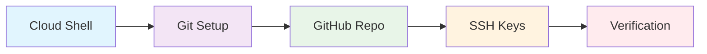
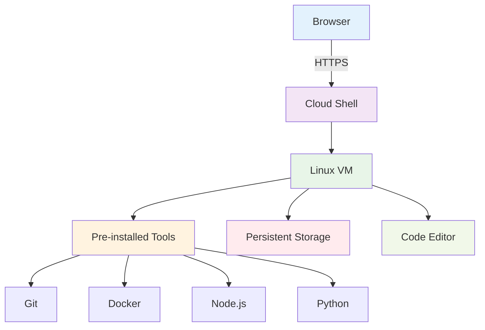
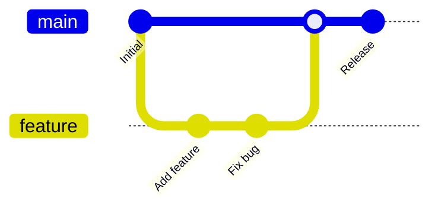
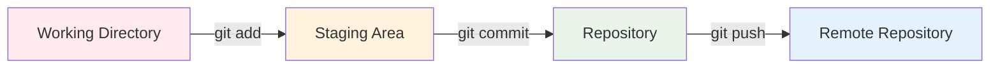
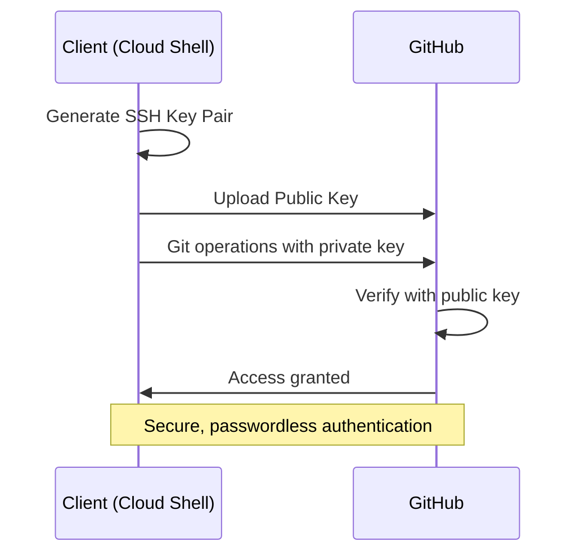
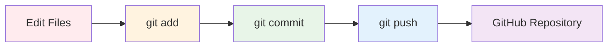

# Cloud Computing
## Week 1: Environment Setup & GitHub Integration

<div class="pt-12">
  <span @click="$slidev.nav.next" class="px-2 py-1 rounded cursor-pointer" hover="bg-white bg-opacity-10">
    <carbon:arrow-right class="inline"/>
  </span>
</div>

<div class="abs-br m-6 flex gap-2">
  <button @click="$slidev.nav.openInEditor()" title="Open in Editor" class="text-xl slidev-icon-btn opacity-50 !border-none !hover:text-white">
    <carbon:edit />
  </button>
  <a href="https://github.com/slidevjs/slidev" target="_blank" alt="GitHub" title="Open in GitHub"
    class="text-xl slidev-icon-btn opacity-50 !border-none !hover:text-white">
    <carbon-logo-github />
  </a>
</div>

---
transition: fade-out
---

# Learning Objectives
*Tujuan Pembelajaran*

<v-clicks>

- **Setup Development Environment** 🛠️
  - Cloud Shell configuration dan akses
- **Master Git Workflow** 🔄
  - Git commands dan best practices
- **GitHub Integration** 🐙
  - Repository management dan collaboration
- **SSH Key Management** 🔐
  - Secure authentication setup
- **Environment Verification** ✅
  - Testing dan validation procedures

</v-clicks>

<br>
<br>

<style>
h1 {
  background-color: #2B90B6;
  background-image: linear-gradient(45deg, #4EC5D4 10%, #146b8c 20%);
  background-size: 100%;
  -webkit-background-clip: text;
  -moz-background-clip: text;
  -webkit-text-fill-color: transparent;
  -moz-text-fill-color: transparent;
}
</style>

---
layout: default
---

# Course Overview
*Gambaran Mata Kuliah*

<div class="grid grid-cols-2 gap-4">

<div v-click="1">

## 🎯 **Focus Areas**
- Cloud Infrastructure
- DevOps Practices  
- Containerization
- CI/CD Pipelines
- Monitoring & Security

</div>

<div v-click="2">

## 📚 **Prerequisites**
- Basic Linux commands
- Programming fundamentals
- Network concepts
- Version control basics

</div>

</div>

<v-click at="3">

## 🏆 **Week 1 Deliverables**



</v-click>

---
transition: slide-up
level: 2
---

# Development Environment Options
*Pilihan Environment Development*

<div class="grid grid-cols-3 gap-4 mt-8">

<v-click>
<div class="text-center p-4 border rounded-lg">
  <div class="text-4xl mb-2">☁️</div>
  <h3 class="font-bold text-blue-600">Cloud Shell</h3>
  <ul class="text-sm mt-2">
    <li>✅ Pre-configured</li>
    <li>✅ No installation needed</li>
    <li>✅ 5GB persistent storage</li>
    <li>✅ Built-in editor</li>
  </ul>
</div>
</v-click>

<v-click>
<div class="text-center p-4 border rounded-lg">
  <div class="text-4xl mb-2">💻</div>
  <h3 class="font-bold text-green-600">Local Environment</h3>
  <ul class="text-sm mt-2">
    <li>✅ Full control</li>
    <li>✅ Offline access</li>
    <li>❌ Setup complexity</li>
    <li>❌ Compatibility issues</li>
  </ul>
</div>
</v-click>

<v-click>
<div class="text-center p-4 border rounded-lg">
  <div class="text-4xl mb-2">🐳</div>
  <h3 class="font-bold text-purple-600">Container-based</h3>
  <ul class="text-sm mt-2">
    <li>✅ Consistent environment</li>
    <li>✅ Easy deployment</li>
    <li>❌ Docker knowledge needed</li>
    <li>❌ Resource overhead</li>
  </ul>
</div>
</v-click>

</div>

<v-click>
<div class="mt-8 p-4 bg-blue-50 rounded-lg">
<h4 class="font-bold text-blue-800">💡 Recommendation for This Course</h4>
<p class="text-sm">We'll use <span class="font-bold text-blue-600">Cloud Shell</span> as primary environment with local setup as backup</p>
</div>
</v-click>

---
layout: two-cols
layoutClass: gap-16
---

# What is Cloud Shell?
*Apa itu Cloud Shell?*

<v-click>

Cloud Shell adalah **browser-based terminal** yang menyediakan akses ke environment Linux yang sudah dikonfigurasi dengan tools development yang lengkap.

</v-click>

<v-clicks>

## ✨ **Key Features**
- **5GB persistent storage** di `$HOME`
- **Pre-installed tools**: git, docker, kubectl, etc.
- **Built-in code editor** (VS Code-like)
- **Secure access** melalui browser
- **No setup required** - langsung pakai!

</v-clicks>

::right::

<v-click>



</v-click>

---
transition: slide-left
---

# Cloud Shell Access Methods
*Cara Mengakses Cloud Shell*

<div class="grid grid-cols-2 gap-8 mt-4">

<div v-click="1">

## 🌐 **Method 1: Web Console**

```bash
# Navigate to
https://console.cloud.google.com
# Click "Activate Cloud Shell" icon
```

<div class="mt-4 p-3 bg-gray-100 rounded">
<h4 class="text-sm font-bold">Steps:</h4>
<ol class="text-xs">
<li>Open Google Cloud Console</li>
<li>Click terminal icon (>_)</li>
<li>Wait for initialization</li>
<li>Start coding!</li>
</ol>
</div>

</div>

<div v-click="2">

## 🚀 **Method 2: Direct URL**

```bash
# Direct access
https://shell.cloud.google.com
# Instant terminal access
```

<div class="mt-4 p-3 bg-blue-50 rounded">
<h4 class="text-sm font-bold text-blue-800">💡 Pro Tip:</h4>
<p class="text-xs">Bookmark direct URL untuk akses cepat!</p>
</div>

</div>

</div>

<v-click at="3">

## 🔧 **Initial Setup Commands**

````md magic-move
```bash
# Check environment
whoami
pwd
ls -la
```

```bash
# Verify pre-installed tools
git --version
docker --version
gcloud --version
```

```bash
# Setup workspace
mkdir ~/cloud-computing
cd ~/cloud-computing
echo "Welcome to Cloud Computing!" > README.md
```
````

</v-click>

---
layout: default
---

# Git Fundamentals Review
*Review Dasar-dasar Git*

<v-click>

Git adalah **distributed version control system** yang melacak perubahan dalam source code selama development.

</v-click>

<div class="grid grid-cols-2 gap-8 mt-6">

<div v-click="2">

## 🔄 **Git Workflow**



</div>

<div v-click="3">

## 📈 **Git States**



</div>

</div>

<v-click at="4">

## 🎯 **Essential Commands**

<div class="grid grid-cols-3 gap-4 mt-4">
<div class="p-3 bg-red-50 rounded text-center">
<strong class="text-red-600">Working Directory</strong><br>
<code class="text-xs">git status<br>git diff</code>
</div>
<div class="p-3 bg-yellow-50 rounded text-center">
<strong class="text-yellow-600">Staging Area</strong><br>
<code class="text-xs">git add<br>git reset</code>
</div>
<div class="p-3 bg-green-50 rounded text-center">
<strong class="text-green-600">Repository</strong><br>
<code class="text-xs">git commit<br>git log</code>
</div>
</div>

</v-click>

---
transition: fade
---

# Git Configuration Setup
*Konfigurasi Awal Git*

<v-click>

Sebelum menggunakan Git, kita perlu mengkonfigurasi **identity** dan **preferences**.

</v-click>

## 👤 **User Identity Configuration**

````md magic-move {at:2}
```bash
# Set your name and email
git config --global user.name "Your Full Name"
git config --global user.email "your.email@example.com"
```

```bash
# Example dengan data mahasiswa
git config --global user.name "Ahmad Pratama"
git config --global user.email "ahmad.pratama@student.university.ac.id"

# Verify configuration
git config --list
```

```bash
# Additional useful configurations
git config --global init.defaultBranch main
git config --global core.editor "nano"
git config --global pull.rebase false

# Check all configurations
git config --global --list
```
````

<v-click at="5">

## ⚙️ **Advanced Settings**

<div class="grid grid-cols-2 gap-4 mt-4">
<div class="p-4 bg-blue-50 rounded">
<h4 class="font-bold text-blue-800">🎨 Output Formatting</h4>
<pre class="text-xs"><code>git config --global color.ui auto
git config --global alias.lg "log --oneline --graph"</code></pre>
</div>
<div class="p-4 bg-green-50 rounded">
<h4 class="font-bold text-green-800">🔒 Security Settings</h4>
<pre class="text-xs"><code>git config --global credential.helper store
git config --global push.default simple</code></pre>
</div>
</div>

</v-click>

---
layout: two-cols
layoutClass: gap-16
---

# GitHub Account Setup
*Setup Akun GitHub*

<v-click>

GitHub adalah **cloud-based Git repository hosting service** yang menyediakan platform untuk collaboration dan project management.

</v-click>

<v-clicks>

## 📝 **Account Creation Steps**
1. **Visit** [github.com](https://github.com)
2. **Click** "Sign up" 
3. **Choose** username (permanent!)
4. **Verify** email address
5. **Setup** profile information

</v-clicks>

<v-click>

## 🎓 **Student Benefits**
- **GitHub Pro** gratis dengan Student Pack
- **Private repositories** unlimited
- **GitHub Copilot** access
- **Codespaces** hours

</v-click>

::right::

<v-click>

## 📋 **Profile Best Practices**

```markdown
# README.md template
## Hi there 👋

- 🔭 I'm currently working on Cloud Computing
- 🌱 I'm currently learning DevOps
- 👯 I'm looking to collaborate on Open Source
- 💬 Ask me about Git & GitHub
- 📫 How to reach me: email@domain.com
- ⚡ Fun fact: Love automation!
```

</v-click>

<v-click>

## 🏷️ **Username Guidelines**
- **Professional** & memorable
- **Consistent** across platforms  
- **Avoid** numbers if possible
- **Examples**: 
  - `ahmad-pratama`
  - `pratamadev`
  - `ahmad_coding`

</v-click>

---
transition: slide-up
---

# Creating Your First Repository
*Membuat Repository Pertama*

<div class="grid grid-cols-2 gap-8">

<div v-click="1">

## 🆕 **GitHub Web Interface**

<div class="space-y-2 text-sm">
<div class="p-2 bg-gray-100 rounded flex items-center">
<span class="w-6 h-6 bg-green-500 text-white rounded-full text-center text-xs mr-2">1</span>
Click "New repository" button
</div>
<div class="p-2 bg-gray-100 rounded flex items-center">
<span class="w-6 h-6 bg-green-500 text-white rounded-full text-center text-xs mr-2">2</span>
Repository name: <code>cloud-computing-week1</code>
</div>
<div class="p-2 bg-gray-100 rounded flex items-center">
<span class="w-6 h-6 bg-green-500 text-white rounded-full text-center text-xs mr-2">3</span>
Description: "Week 1 assignments"
</div>
<div class="p-2 bg-gray-100 rounded flex items-center">
<span class="w-6 h-6 bg-green-500 text-white rounded-full text-center text-xs mr-2">4</span>
✅ Initialize with README
</div>
<div class="p-2 bg-gray-100 rounded flex items-center">
<span class="w-6 h-6 bg-green-500 text-white rounded-full text-center text-xs mr-2">5</span>
Add .gitignore (optional)
</div>
</div>

</div>

<div v-click="2">

## 💻 **Command Line Alternative**

````md magic-move
```bash
# Create local directory
mkdir cloud-computing-week1
cd cloud-computing-week1
```

```bash
# Initialize Git repository
git init
echo "# Cloud Computing Week 1" > README.md
git add README.md
git commit -m "Initial commit"
```

```bash
# Connect to GitHub (create repo first)
git remote add origin https://github.com/username/cloud-computing-week1.git
git branch -M main
git push -u origin main
```
````

</div>

</div>

<v-click at="5">

## 📁 **Repository Structure Recommendation**

```
cloud-computing-week1/
├── README.md
├── assignments/
├── labs/
├── notes/
└── resources/
```

</v-click>

---
layout: center
class: text-center
---

# SSH Key Authentication
*Autentikasi dengan SSH Key*

<v-click>

SSH keys provide **secure authentication** without passwords untuk akses repository.

</v-click>

<v-click>



</v-click>

<v-click>

## 🔐 **Benefits of SSH Keys**
- **No passwords** untuk Git operations
- **Enhanced security** dengan public-key cryptography  
- **Automation-friendly** untuk scripts & CI/CD
- **Multiple keys** untuk different services

</v-click>

---
transition: slide-left
---

# Generating SSH Keys
*Membuat SSH Key*

## 🔑 **Step-by-Step Process**

````md magic-move
```bash
# Generate new SSH key pair
ssh-keygen -t ed25519 -C "your.email@example.com"
```

```bash
# Full generation process
ssh-keygen -t ed25519 -C "ahmad.pratama@student.university.ac.id"

# When prompted:
# - File location: Press Enter (default: ~/.ssh/id_ed25519)
# - Passphrase: Enter secure passphrase (recommended)
# - Confirm passphrase: Re-enter same passphrase
```

```bash
# Start SSH agent and add key
eval "$(ssh-agent -s)"
ssh-add ~/.ssh/id_ed25519

# Verify keys are loaded
ssh-add -l
```

```bash
# Display public key for copying
cat ~/.ssh/id_ed25519.pub

# Example output:
# ssh-ed25519 AAAAC3NzaC1lZDI1NTE5AAAAIGqL... your.email@example.com
```
````

<v-click at="5">

## ⚠️ **Security Best Practices**
- **Always use passphrase** untuk private key
- **Never share** private key (`id_ed25519`)
- **Only share** public key (`id_ed25519.pub`)  
- **Use ed25519** algorithm (modern & secure)

</v-click>

---
layout: two-cols
layoutClass: gap-16
---

# Adding SSH Key to GitHub
*Menambahkan SSH Key ke GitHub*

<v-clicks>

## 📋 **Steps in GitHub**

1. **Navigate** to Settings → SSH and GPG keys
2. **Click** "New SSH key" 
3. **Title**: "Cloud Shell Key"
4. **Key type**: Authentication Key
5. **Paste** public key content
6. **Click** "Add SSH key"
7. **Confirm** with password

</v-clicks>

<v-click>

## 🧪 **Testing Connection**

```bash
# Test SSH connection
ssh -T git@github.com

# Expected output:
# Hi username! You've successfully authenticated,
# but GitHub does not provide shell access.
```

</v-click>

::right::

<v-click>

## 🔄 **Update Remote URL**

````md magic-move
```bash
# Check current remote
git remote -v
```

```bash
# Change from HTTPS to SSH
git remote set-url origin git@github.com:username/repo.git

# Verify change
git remote -v
```
````

</v-click>

<v-click>

## ✅ **Verification Test**

```bash
# Test with actual push
echo "SSH test" > test-ssh.txt
git add test-ssh.txt
git commit -m "Test SSH authentication"
git push

# Should work without password prompt!
```

</v-click>

<v-click>

## 🎯 **Common Issues**
- **Permission denied**: Check key format
- **Wrong passphrase**: Re-add key to agent
- **Host key verification**: Accept GitHub's fingerprint

</v-click>

---
transition: fade
---

# Basic Git Workflow
*Alur Kerja Dasar Git*

<v-click>

Mari praktek **complete workflow** dari development hingga deployment.

</v-click>

## 🔄 **The Standard Workflow**

````md magic-move {at:2}
```bash
# 1. Check status
git status
```

```bash
# 2. Create and edit files
echo "# Assignment 1" > assignment1.md
echo "This is my first assignment" >> assignment1.md

# Check what changed
git status
git diff
```

```bash
# 3. Stage changes
git add assignment1.md

# Or stage all changes
git add .

# Check staging area
git status
```

```bash
# 4. Commit changes
git commit -m "Add assignment 1 documentation"

# View commit history
git log --oneline
```

```bash
# 5. Push to remote
git push origin main

# Or just
git push
```
````

<v-click at="7">

## 📊 **Workflow Visualization**



</v-click>

---
layout: default
---

# Advanced Git Operations
*Operasi Git Lanjutan*

<div class="grid grid-cols-2 gap-8">

<div v-click="1">

## 🌿 **Branching Strategy**

````md magic-move
```bash
# Create and switch to new branch
git checkout -b feature/assignment2
```

```bash
# Work on the branch
echo "Assignment 2 content" > assignment2.md
git add assignment2.md
git commit -m "Add assignment 2"
```

```bash
# Switch back to main and merge
git checkout main
git merge feature/assignment2
git push origin main
```
````

</div>

<div v-click="4">

## 🔍 **Inspection Commands**

```bash
# View commit history
git log --oneline --graph --all

# Show specific commit
git show <commit-hash>

# Compare branches
git diff main..feature/assignment2

# Check file history
git log --follow assignment1.md
```

</div>

</div>

<v-click at="5">

## 🛠️ **Useful Git Aliases**

```bash
# Setup helpful aliases
git config --global alias.co checkout
git config --global alias.br branch  
git config --global alias.ci commit
git config --global alias.st status
git config --global alias.lg "log --oneline --graph --all"

# Usage
git st  # Same as git status
git lg  # Pretty log output
```

</v-click>

<v-click at="6">

## 🔄 **Sync with Remote**

```bash
# Get latest changes
git fetch origin
git pull origin main

# Force sync (careful!)
git reset --hard origin/main
```

</v-click>

---
transition: slide-up
---

# Environment Verification
*Verifikasi Environment*

<v-click>

Mari pastikan semua komponen sudah dikonfigurasi dengan benar melalui **comprehensive testing**.

</v-click>

## ✅ **Verification Checklist**

<div class="grid grid-cols-2 gap-6 mt-4">

<div v-click="2">

### 🔧 **System Check**

```bash
# Cloud Shell environment
echo "Cloud Shell: $(hostname)"
echo "User: $(whoami)"
echo "Home: $HOME"
echo "Shell: $SHELL"

# Available tools
which git docker gcloud kubectl
```

</div>

<div v-click="3">

### 👤 **Git Configuration**

```bash
# Check Git setup
git config --list | grep user
git config --get user.name
git config --get user.email

# Test Git functionality
git --version
```

</div>

<div v-click="4">

### 🔐 **SSH Authentication**

```bash
# Test SSH key
ssh -T git@github.com

# Check loaded keys
ssh-add -l

# Verify GitHub connection
```

</div>

<div v-click="5">

### 📁 **Repository Access**

```bash
# Clone test
git clone git@github.com:username/cloud-computing-week1.git

# Test push
cd cloud-computing-week1
echo "Verification test" > verification.txt
git add verification.txt
git commit -m "Environment verification"
git push
```

</div>

</div>

---
layout: center
---

# Troubleshooting Common Issues
*Mengatasi Masalah Umum*

<div class="grid grid-cols-2 gap-8 mt-8">

<div v-click="1">

## 🚫 **Authentication Problems**

<div class="space-y-4">
<div class="p-4 bg-red-50 rounded">
<h4 class="font-bold text-red-800">Problem: Permission denied (publickey)</h4>
<pre class="text-xs mt-2"><code># Solution
ssh-add ~/.ssh/id_ed25519
ssh -T git@github.com</code></pre>
</div>

<div class="p-4 bg-yellow-50 rounded">
<h4 class="font-bold text-yellow-800">Problem: HTTPS vs SSH URL</h4>
<pre class="text-xs mt-2"><code># Check and fix
git remote -v
git remote set-url origin git@github.com:user/repo.git</code></pre>
</div>
</div>

</div>

<div v-click="2">

## ⚠️ **Configuration Issues**

<div class="space-y-4">
<div class="p-4 bg-blue-50 rounded">
<h4 class="font-bold text-blue-800">Problem: Missing user info</h4>
<pre class="text-xs mt-2"><code># Solution
git config --global user.name "Your Name"
git config --global user.email "email@domain.com"</code></pre>
</div>

<div class="p-4 bg-green-50 rounded">
<h4 class="font-bold text-green-800">Problem: Merge conflicts</h4>
<pre class="text-xs mt-2"><code># Solution
git status
# Edit conflicted files
git add .
git commit -m "Resolve conflict"</code></pre>
</div>
</div>

</div>

</div>

<v-click at="3">

## 🛠️ **Quick Diagnostic Script**

```bash
#!/bin/bash
echo "=== Environment Diagnostic ==="
echo "Git version: $(git --version)"
echo "User: $(git config user.name) <$(git config user.email)>"
echo "SSH connection test:"
ssh -T git@github.com 2>&1 | head -1
echo "Current directory: $(pwd)"
echo "Git status: $(git status --porcelain | wc -l) changed files"
```

</v-click>

---
layout: default
---

# Hands-on Exercise
*Latihan Praktik*

<v-click>

Sekarang saatnya **hands-on practice** untuk mengkonsolidasikan semua yang sudah dipelajari!

</v-click>

## 🎯 **Exercise: Complete Workflow**

<v-clicks>

**Task**: Membuat project struktur untuk Cloud Computing course

1. **Setup Repository**
   - Create new GitHub repository: `cloud-computing-exercises`
   - Clone menggunakan SSH
   - Setup project structure

2. **Create Content**
   - Week 1 assignment folder
   - README dengan course information
   - .gitignore file untuk common files

3. **Practice Git Workflow**
   - Multiple commits dengan meaningful messages
   - Create feature branch untuk weekly assignments
   - Merge branch ke main

4. **Verification**
   - Push semua changes ke GitHub
   - Verify melalui GitHub web interface
   - Test clone di environment baru

</v-clicks>

<v-click>

## 📋 **Expected Deliverables**
- ✅ Repository dengan proper structure
- ✅ SSH authentication working
- ✅ Clean commit history
- ✅ Documentation in README

</v-click>

---
transition: slide-left
---

# Week 1 Deliverables Summary
*Ringkasan Deliverables Week 1*

<div class="grid grid-cols-2 gap-8">

<div v-click="1">

## 📦 **Technical Deliverables**

<div class="space-y-3">
<div class="flex items-center space-x-2">
<span class="w-6 h-6 bg-green-500 text-white rounded-full text-center text-sm">✓</span>
<span>Cloud Shell environment setup</span>
</div>
<div class="flex items-center space-x-2">
<span class="w-6 h-6 bg-green-500 text-white rounded-full text-center text-sm">✓</span>
<span>Git configuration completed</span>
</div>
<div class="flex items-center space-x-2">
<span class="w-6 h-6 bg-green-500 text-white rounded-full text-center text-sm">✓</span>
<span>GitHub repository created</span>
</div>
<div class="flex items-center space-x-2">
<span class="w-6 h-6 bg-green-500 text-white rounded-full text-center text-sm">✓</span>
<span>SSH key authentication</span>
</div>
<div class="flex items-center space-x-2">
<span class="w-6 h-6 bg-green-500 text-white rounded-full text-center text-sm">✓</span>
<span>Environment verification passed</span>
</div>
</div>

</div>

<div v-click="2">

## 📝 **Documentation Requirements**

```markdown
# Required Documentation
└── cloud-computing-week1/
    ├── README.md (course info)
    ├── SETUP.md (environment setup steps)
    ├── assignments/
    │   └── week1-verification.md
    └── screenshots/
        ├── cloud-shell-access.png
        ├── git-config.png
        └── ssh-test.png
```

</div>

</div>

<v-click at="3">

## 🎯 **Assessment Criteria**

<div class="grid grid-cols-3 gap-4 mt-6">
<div class="p-4 bg-blue-50 rounded text-center">
<h4 class="font-bold text-blue-800">Environment Setup</h4>
<p class="text-sm">Cloud Shell access & configuration</p>
<div class="text-2xl font-bold text-blue-600">30%</div>
</div>
<div class="p-4 bg-green-50 rounded text-center">
<h4 class="font-bold text-green-800">Git & GitHub</h4>
<p class="text-sm">Repository, commits, SSH setup</p>
<div class="text-2xl font-bold text-green-600">40%</div>
</div>
<div class="p-4 bg-purple-50 rounded text-center">
<h4 class="font-bold text-purple-800">Documentation</h4>
<p class="text-sm">Clear documentation & screenshots</p>
<div class="text-2xl font-bold text-purple-600">30%</div>
</div>
</div>

</v-click>

---
layout: default
---

# Best Practices & Tips
*Best Practices & Tips*

<div class="grid grid-cols-2 gap-8">

<div v-click="1">

## 🎯 **Git Best Practices**

<div class="space-y-3 text-sm">
<div class="p-3 bg-green-50 rounded">
<h4 class="font-bold text-green-800">✅ DO</h4>
<ul class="space-y-1">
<li>• Write descriptive commit messages</li>
<li>• Commit frequently with logical chunks</li>
<li>• Use branches for features</li>
<li>• Pull before pushing</li>
<li>• Keep repositories organized</li>
</ul>
</div>

<div class="p-3 bg-red-50 rounded">
<h4 class="font-bold text-red-800">❌ DON'T</h4>
<ul class="space-y-1">
<li>• Commit directly to main/master</li>
<li>• Use vague commit messages</li>
<li>• Commit binary files unnecessarily</li>
<li>• Ignore .gitignore</li>
<li>• Force push to shared branches</li>
</ul>
</div>
</div>

</div>

<div v-click="2">

## 💡 **Productivity Tips**

```bash
# Useful aliases
alias gs='git status'
alias ga='git add'
alias gc='git commit'
alias gp='git push'
alias gl='git log --oneline'

# Quick commands
alias ll='ls -la'
alias ..='cd ..'
alias cls='clear'

# Cloud Shell shortcuts
alias ccd='cd ~/cloud-computing'
alias edit='cloudshell edit'
```

</div>

</div>

<v-click at="3">

## 🔒 **Security Reminders**

<div class="grid grid-cols-3 gap-4 mt-4">
<div class="p-3 bg-yellow-50 rounded text-center">
<h4 class="font-bold text-yellow-800">SSH Keys</h4>
<p class="text-xs">Never share private keys</p>
</div>
<div class="p-3 bg-blue-50 rounded text-center">
<h4 class="font-bold text-blue-800">Credentials</h4>
<p class="text-xs">Don't commit passwords/tokens</p>
</div>
<div class="p-3 bg-purple-50 rounded text-center">
<h4 class="font-bold text-purple-800">Access</h4>
<p class="text-xs">Log out from shared computers</p>
</div>
</div>

</v-click>

---
layout: center
class: text-center
---

# Next Week Preview
*Preview Week 2*

<v-click>

## 🚀 **Week 2: Containerization with Docker**

</v-click>

<div class="grid grid-cols-3 gap-8 mt-8">

<v-click>
<div class="p-6 bg-blue-50 rounded-lg">
<div class="text-4xl mb-4">🐳</div>
<h3 class="font-bold text-blue-800">Docker Fundamentals</h3>
<p class="text-sm mt-2">Images, containers, registries</p>
</div>
</v-click>

<v-click>
<div class="p-6 bg-green-50 rounded-lg">
<div class="text-4xl mb-4">📦</div>
<h3 class="font-bold text-green-800">Application Packaging</h3>
<p class="text-sm mt-2">Dockerfile, multi-stage builds</p>
</div>
</v-click>

<v-click>
<div class="p-6 bg-purple-50 rounded-lg">
<div class="text-4xl mb-4">🔧</div>
<h3 class="font-bold text-purple-800">Container Orchestration</h3>
<p class="text-sm mt-2">Docker Compose, networking</p>
</div>
</v-click>

</div>

<v-click>

## 📚 **Preparation Tasks**
- Install Docker Desktop (optional for local development)
- Review Dockerfile syntax
- Explore Docker Hub registry

</v-click>

<v-click>

*See you next week! 👋*

</v-click>

---
layout: end
class: text-center
---

# Questions & Discussion
*Pertanyaan & Diskusi*

<div class="grid grid-cols-2 gap-8 mt-8">

<div v-click="1">

## 💬 **Discussion Topics**
- Environment setup challenges?
- Git workflow questions?
- SSH authentication issues?
- Repository organization preferences?
- Cloud Shell vs local development?

</div>

<div v-click="2">

## 📧 **Get Help**
- **Office Hours**: Monday 14:00-16:00
- **Email**: instructor@university.ac.id
- **Forum**: course-forum.university.ac.id
- **GitHub Issues**: For technical problems
- **Study Groups**: Form with classmates

</div>

</div>

<v-click at="3">

## 🎯 **Action Items**
1. Complete environment setup by **Friday**
2. Submit verification screenshots to **LMS**
3. Join course **GitHub organization**
4. Prepare for next week's **Docker session**

</v-click>

<div class="pt-12">
  <span class="px-2 py-1 rounded cursor-pointer" hover="bg-white bg-opacity-10">
    Thank you! Happy coding! 🚀
  </span>
</div>

<style>
.end {
  background-color: #2B90B6;
  background-image: linear-gradient(45deg, #4EC5D4 10%, #146b8c 20%);
  color: white;
}
</style>