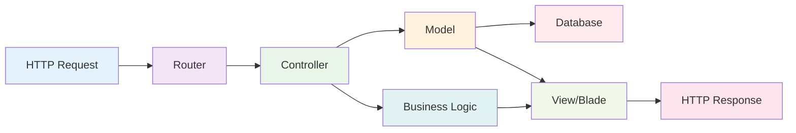
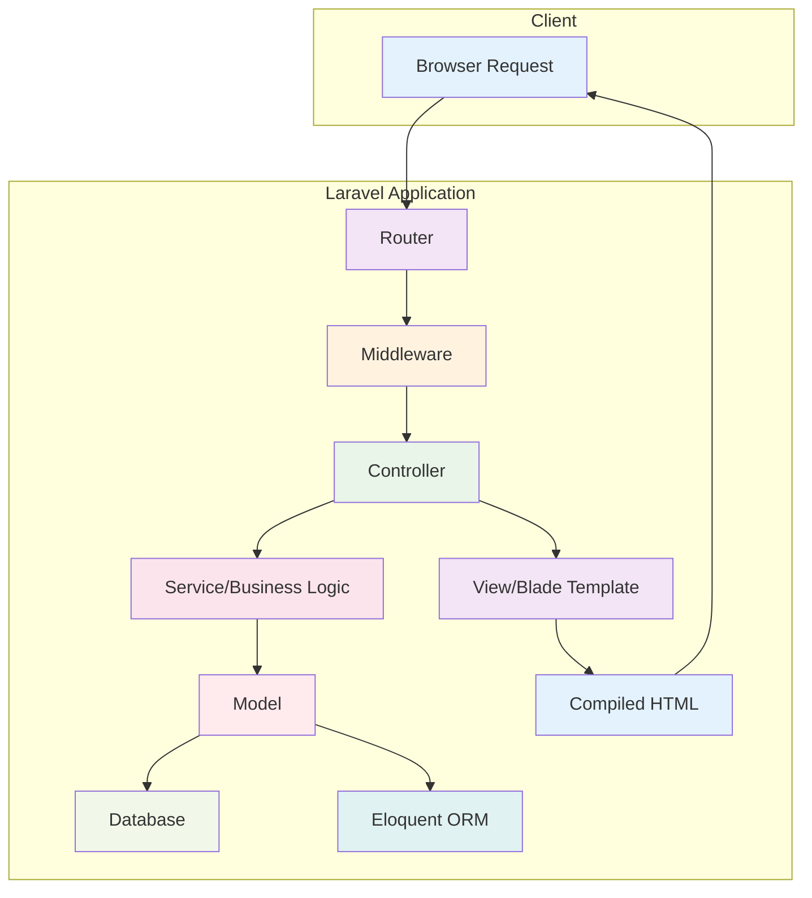
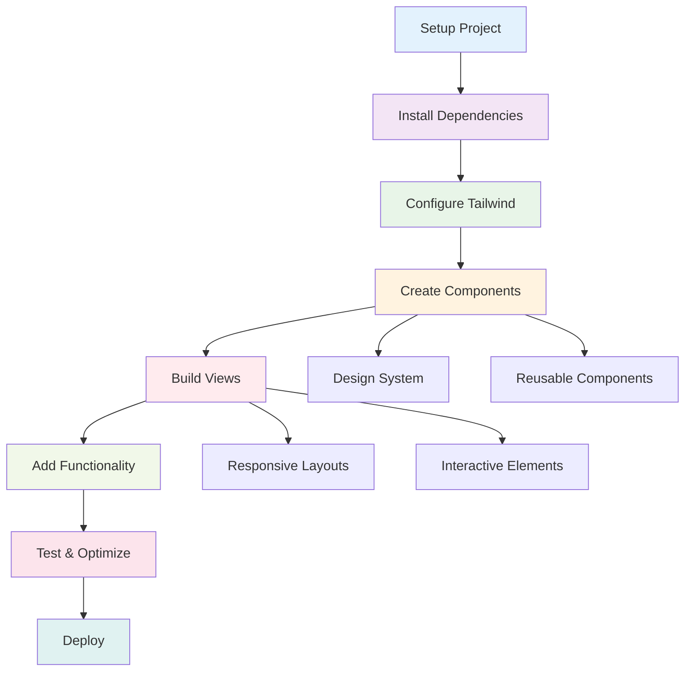

# Cloud Computing
## Week 2: Laravel Installation & Tailwind CSS Setup

<div class="pt-12">
  <span @click="$slidev.nav.next" class="px-2 py-1 rounded cursor-pointer" hover="bg-white bg-opacity-10">
    <carbon:arrow-right class="inline"/>
  </span>
</div>

<div class="abs-br m-6 flex gap-2">
  <button @click="$slidev.nav.openInEditor()" title="Open in Editor" class="text-xl slidev-icon-btn opacity-50 !border-none !hover:text-white">
    <carbon:edit />
  </button>
  <a href="https://github.com/aidilsaputrakirsan" target="_blank" alt="GitHub" title="Open in GitHub"
    class="text-xl slidev-icon-btn opacity-50 !border-none !hover:text-white">
    <carbon-logo-github />
  </a>
</div>

---
transition: fade-out
---

# Learning Objectives
*Tujuan Pembelajaran*

<v-clicks>

- **Laravel Installation** 🚀
  - Setup Laravel 10 application dengan Composer
- **Tailwind CSS Integration** 🎨
  - Modern CSS framework untuk rapid development
- **Vite Build System** ⚡
  - Fast development server dan bundling
- **Custom UI Components** 🧩
  - Membuat reusable component dengan Laravel Blade
- **Development Workflow** 🔧
  - Best practices untuk Laravel + Tailwind workflow

</v-clicks>

<style>
h1 {
  background-color: #F56565;
  background-image: linear-gradient(45deg, #FF6B6B 10%, #EE5A24 20%);
  background-size: 100%;
  -webkit-background-clip: text;
  -moz-background-clip: text;
  -webkit-text-fill-color: transparent;
  -moz-text-fill-color: transparent;
}
</style>

---
layout: default
---

# What is Laravel?
*Apa itu Laravel?*

<v-click>

Laravel adalah <span v-mark.circle.red="1">**PHP web framework**</span> yang elegant dan powerful, dirancang untuk membuat web development menjadi <span v-mark.underline.blue="2">**enjoyable dan creative**</span>.

</v-click>

<v-clicks>

### ✨ **Key Features**
- **Eloquent ORM** - Database interaction yang mudah
- **Blade Templates** - Simple yet powerful templating
- **Artisan CLI** - Built-in command line tools
- **MVC Architecture** - Clean separation of concerns
- **Built-in Security** - Authentication & authorization

</v-clicks>

<v-click>



</v-click>

---
layout: default
---

# Why Laravel?
*Mengapa Memilih Laravel?*

<div class="grid grid-cols-2 gap-8 mt-6">

<div v-click="1">

## 🚀 **Developer Experience**

<v-clicks>

- <span v-mark.highlight.yellow="3">**Rapid Development**</span> - Build faster with less code
- **Expressive Syntax** - Clean and readable code
- **Rich Ecosystem** - Thousands of packages
- **Great Documentation** - Comprehensive guides
- **Active Community** - Large support network

</v-clicks>

</div>

<div v-click="7">

## 🏢 **Enterprise Ready**

<v-clicks>

- **Scalable Architecture** - Handle millions of users
- <span v-mark.circle.red="9">**Security First**</span> - CSRF, XSS, SQL injection protection
- **Testing Support** - Built-in testing tools
- **Performance** - Caching, queue jobs, optimization
- **Deployment** - Easy deployment to cloud platforms

</v-clicks>

</div>

</div>

<v-click at="13">

### 📊 **Laravel Popularity**

<div class="grid grid-cols-3 gap-4 mt-6">
<div class="p-4 bg-red-50 rounded text-center">
<h4 class="font-bold text-red-600 text-2xl">70k+</h4>
<p class="text-sm">GitHub Stars</p>
</div>
<div class="p-4 bg-orange-50 rounded text-center">
<h4 class="font-bold text-orange-600 text-2xl">#1</h4>
<p class="text-sm">PHP Framework</p>
</div>
<div class="p-4 bg-blue-50 rounded text-center">
<h4 class="font-bold text-blue-600 text-2xl">500k+</h4>
<p class="text-sm">Websites Built</p>
</div>
</div>

</v-click>

---
layout: default
---

# Prerequisites
*Persyaratan Sebelum Memulai*

<div class="grid grid-cols-2 gap-8 mt-6">

<div v-click="1">

## 💻 **System Requirements**

<v-clicks>

- <span v-mark.underline.blue="3">**PHP 8.1+**</span> dengan extensions yang diperlukan
- **Composer** - PHP dependency manager
- **Node.js 16+** - untuk frontend tooling
- **Git** - version control (sudah ada dari Week 1)
- **Database** - MySQL, PostgreSQL, atau SQLite

</v-clicks>

</div>

<div v-click="7">

## 🧠 **Knowledge Requirements**

<v-clicks>

- **Basic PHP** - Variables, functions, OOP
- **HTML/CSS** - Web fundamentals
- **Command Line** - Basic terminal usage
- <span v-mark.circle.green="11">**HTTP concepts**</span> - Request/Response cycle
- **MVC Pattern** - Understanding of architecture

</v-clicks>

</div>

</div>

<v-click at="13">

## ✅ **Quick Environment Check**

````md magic-move {at:14}
```bash
# Check PHP version
php --version
```

```bash
# Check Composer
composer --version

# Check Node.js
node --version
npm --version
```

```bash
# Install PHP extensions (if needed)
sudo apt-get install php-mbstring php-xml php-curl php-zip
```
````

</v-click>

---
layout: default
---

# Laravel Installation Methods
*Cara Install Laravel*

<div class="grid grid-cols-2 gap-8 mt-6">

<div v-click="1">

## 🎯 **Method 1: Laravel Installer**

<v-clicks>

```bash
# Install Laravel installer globally
composer global require laravel/installer

# Create new project
laravel new my-project
```

**Pros:**
- ✅ <span v-mark.highlight.green="4">Faster for multiple projects</span>
- ✅ Latest Laravel version
- ✅ Clean installation

</v-clicks>

</div>

<div v-click="5">

## 📦 **Method 2: Composer Create-Project**

<v-clicks>

```bash
# Create project with Composer
composer create-project laravel/laravel my-project

# Or specify version
composer create-project laravel/laravel:^10.0 my-project
```

**Pros:**
- ✅ No global installation needed
- ✅ <span v-mark.circle.blue="9">Version control</span>
- ✅ Works on any system

</v-clicks>

</div>

</div>

---
layout: default
---

# Laravel Installation Methods II
*Cara Install Laravel*

<v-click>

## 🐳 **Method 3: Laravel Sail (Docker)**

<div class="grid grid-cols-2 gap-4 mt-4">
<div class="p-4 bg-blue-50 rounded">
<h4 class="font-bold text-blue-800">For Development</h4>
<pre class="text-xs"><code>curl -s https://laravel.build/my-project | bash
cd my-project && ./vendor/bin/sail up</code></pre>
</div>
<div class="p-4 bg-green-50 rounded">
<h4 class="font-bold text-green-800">Benefits</h4>
<p class="text-xs">✅ Consistent environment<br>✅ Database included<br>✅ Easy team setup</p>
</div>
</div>

</v-click>

---
transition: slide-left
---

# Laravel Installation Demo
*Demo Instalasi Laravel*

<v-click>

Mari praktek <span v-mark.highlight.yellow="1">**step-by-step installation**</span> Laravel 10 di Cloud Shell.

</v-click>

## 🚀 **Live Installation Process**

````md magic-move {at:2}
```bash
# Step 1: Navigate to workspace
cd ~/cloud-computing
```

```bash
# Step 2: Create Laravel project
composer create-project laravel/laravel week2-laravel

# This will take a few minutes...
# Laravel will be downloaded and dependencies installed
```

```bash
# Step 3: Navigate to project directory
cd week2-laravel

# Step 4: Check Laravel installation
php artisan --version
```

```bash
# Step 5: Start development server
php artisan serve --host=0.0.0.0 --port=8080

# Laravel development server started: http://0.0.0.0:8080
```

```bash
# Step 6: Verify installation
curl http://localhost:8080
# Should see Laravel welcome page HTML
```
````

<v-click at="7">

## ⚡ **Expected Output**

<div class="p-4 bg-green-50 rounded mt-4">
<h4 class="font-bold text-green-800">✅ Success Indicators</h4>
<ul class="text-sm">
<li>• Laravel installation completed without errors</li>
<li>• Development server starts successfully</li>
<li>• <span v-mark.underline.green="8">Welcome page accessible</span> via browser</li>
<li>• Artisan commands working properly</li>
</ul>
</div>

</v-click>

---
layout: default
---

# Laravel Project Structure
*Struktur Project Laravel*

<div class="grid grid-cols-2 gap-8">

<div v-click="1">

## 📁 **Key Directories**

<v-motion
  :initial="{ x: -50, opacity: 0 }"
  :enter="{ x: 0, opacity: 1 }"
  :duration="600">

```
laravel-project/
├── app/                # Application logic
│   ├── Http/Controllers/   # Controllers
│   ├── Models/            # Eloquent models
│   └── Providers/         # Service providers
├── config/            # Configuration files
├── database/          # Migrations, seeders
├── public/            # Web server document root
├── resources/         # Views, raw assets
│   ├── css/              # CSS files
│   ├── js/               # JavaScript files
│   └── views/            # Blade templates
├── routes/            # Route definitions
├── storage/           # Logs, cache, uploads
└── vendor/            # Composer dependencies
```

</v-motion>

</div>

<div v-click="2">

### 🎯 **Important Files**

<v-clicks>

- <span v-mark.circle.red="3">**`.env`**</span> - Environment configuration
- **`composer.json`** - PHP dependencies
- **`package.json`** - Node.js dependencies
- <span v-mark.highlight.blue="6">**`artisan`**</span> - Laravel CLI tool
- **`vite.config.js`** - Frontend build configuration

</v-clicks>

<v-click>

### 🔧 **Quick Commands**
```bash
# Generate app key
php artisan key:generate

# Run migrations
php artisan migrate

# Clear caches
php artisan cache:clear
php artisan config:clear
```

</v-click>

</div>

</div>

---
layout: two-cols
layoutClass: gap-16
---

# What is Tailwind CSS?
*Apa itu Tailwind CSS?*

<v-click>

Tailwind CSS adalah <span v-mark.circle.blue="1">**utility-first CSS framework**</span> yang menyediakan low-level utility classes untuk membangun custom designs dengan cepat.

</v-click>

<v-clicks>

## 💡 **Philosophy**
- <span v-mark.highlight.yellow="3">**Utility-first**</span> - Build designs with utility classes
- **Component-friendly** - Easy to extract components
- **Customizable** - Configure to match your design
- **Responsive** - Mobile-first responsive design
- **Modern** - CSS Grid, Flexbox, modern features

</v-clicks>

::right::

<v-click>

## 🆚 **Traditional vs Tailwind**

**Traditional CSS:**
```html
<div class="card">
  <h2 class="card-title">Title</h2>
  <p class="card-text">Content</p>
</div>

<style>
.card {
  background: white;
  border-radius: 8px;
  padding: 1.5rem;
  box-shadow: 0 4px 6px rgba(0,0,0,0.1);
}
</style>
```

</v-click>

<v-click>

**Tailwind CSS:**
```html
<div class="bg-white rounded-lg p-6 shadow-lg">
  <h2 class="text-xl font-semibold mb-2">Title</h2>
  <p class="text-gray-600">Content</p>
</div>
```

</v-click>

---
layout: default
---

# Tailwind CSS Benefits
*Keuntungan Menggunakan Tailwind*

<div class="grid grid-cols-3 gap-6 mt-6">

<v-click>
<div class="text-center p-4 border rounded-lg bg-blue-50">
  <div class="text-4xl mb-2">⚡</div>
  <h3 class="font-bold text-blue-600">Faster Development</h3>
  <ul class="text-xs mt-2">
    <li>• No context switching</li>
    <li>• <span v-mark.underline.blue="2">Rapid prototyping</span></li>
    <li>• Less CSS to write</li>
    <li>• Consistent spacing</li>
  </ul>
</div>
</v-click>

<v-click>
<div class="text-center p-4 border rounded-lg bg-green-50">
  <div class="text-4xl mb-2">📱</div>
  <h3 class="font-bold text-green-600">Responsive Design</h3>
  <ul class="text-xs mt-2">
    <li>• <span v-mark.circle.green="3">Mobile-first approach</span></li>
    <li>• Breakpoint prefixes</li>
    <li>• Responsive utilities</li>
    <li>• Container queries</li>
  </ul>
</div>
</v-click>

<v-click>
<div class="text-center p-4 border rounded-lg bg-purple-50">
  <div class="text-4xl mb-2">🎨</div>
  <h3 class="font-bold text-purple-600">Design System</h3>
  <ul class="text-xs mt-2">
    <li>• Consistent color palette</li>
    <li>• Typography scale</li>
    <li>• <span v-mark.highlight.purple="4">Spacing system</span></li>
    <li>• Component variants</li>
  </ul>
</div>
</v-click>

</div>

<v-click at="5">

### 🆚 **Tailwind vs Traditional CSS**
<div class="grid grid-cols-2 gap-4 mt-1">
<div class="p-4 bg-red-50 rounded">
<h4 class="font-bold text-red-800">Traditional CSS Problems</h4>
<ul class="text-sm space-y-1">
<li>❌ <span v-mark.strikethrough.red="6">Growing CSS file size</span></li>
<li>❌ Naming class conflicts</li>
<li>❌ Unused CSS accumulation</li>
<li>❌ Inconsistent design tokens</li>
</ul>
</div>
<div class="p-4 bg-green-50 rounded">
<h4 class="font-bold text-green-800">Tailwind Solutions</h4>
<ul class="text-sm space-y-1">
<li>✅ <span v-mark.circle.green="7">Purged CSS</span> (smaller bundles)</li>
<li>✅ Atomic CSS methodology</li>
<li>✅ Only used styles included</li>
<li>✅ Consistent design system</li>
</ul>
</div>
</div>

</v-click>

---
layout: default
---

# Tailwind CSS Installation
*Instalasi Tailwind di Laravel*

<v-click>

Laravel 10 sudah <span v-mark.highlight.green="1">**pre-configured**</span> dengan Tailwind CSS melalui Laravel Breeze atau manual installation.

</v-click>

## 🎯 **Installation Methods**

<div class="grid grid-cols-2 gap-8 mt-4">

<div v-click="2">

### Method 1: Laravel Breeze (Recommended)

````md magic-move {at:3}
```bash
# Install Breeze starter kit
composer require laravel/breeze --dev
```

```bash
# Install Breeze with Blade + Tailwind
php artisan breeze:install blade

# This installs:
# - Tailwind CSS
# - Authentication views
# - Basic layouts
```

```bash
# Install frontend dependencies
npm install

# Build assets
npm run dev
```
````

</div>

<div v-click="6">

### Method 2: Manual Installation

````md magic-move {at:7}
```bash
# Install Tailwind via npm
npm install -D tailwindcss postcss autoprefixer
```

```bash
# Generate Tailwind config
npx tailwindcss init -p

# Creates:
# - tailwind.config.js
# - postcss.config.js
```

```bash
# Configure Tailwind paths
# Edit tailwind.config.js
content: [
  "./resources/**/*.blade.php",
  "./resources/**/*.js",
  "./resources/**/*.vue",
],
```
````

</div>

</div>

---
layout: center
---

# Laravel MVC Architecture
*Arsitektur MVC Laravel*

<v-click>



</v-click>

---
transition: slide-up
---

# Vite Build System
*Sistem Build Vite*

<v-click>

Laravel menggunakan <span v-mark.circle.blue="1">**Vite**</span> sebagai frontend build tool yang menggantikan Laravel Mix untuk performa yang lebih baik.

</v-click>

<div class="grid grid-cols-2 gap-8 mt-6">

<div v-click="2">

## ⚡ **Why Vite?**

<v-clicks>

- <span v-mark.highlight.yellow="4">**Lightning Fast**</span> - Instant hot module replacement
- **Modern** - ESM, TypeScript, modern JS support
- **Optimized** - Tree-shaking, code splitting
- **Simple Config** - Minimal configuration needed
- **Laravel Integration** - Built-in Laravel plugin

</v-clicks>

</div>

<div v-click="8">

## 🔧 **Vite Configuration**

```js
// vite.config.js
import { defineConfig } from 'vite';
import laravel from 'laravel-vite-plugin';

export default defineConfig({
    plugins: [
        laravel({
            input: [
                'resources/css/app.css',
                'resources/js/app.js'
            ],
            refresh: true,
        }),
    ],
});
```

</div>

</div>

---
transition: slide-up
---

<v-click>

## 🚀 **Development Commands**

<div class="grid grid-cols-3 gap-4 mt-4">
<div class="p-3 bg-blue-50 rounded text-center">
<strong class="text-blue-600">Development</strong><br>
<code class="text-xs">npm run dev</code>
</div>
<div class="p-3 bg-green-50 rounded text-center">
<strong class="text-green-600">Production</strong><br>
<code class="text-xs">npm run build</code>
</div>
<div class="p-3 bg-purple-50 rounded text-center">
<strong class="text-purple-600">Preview</strong><br>
<code class="text-xs">npm run preview</code>
</div>
</div>

</v-click>

---
layout: default
---

# Creating Custom UI Components
*Membuat Komponen UI Custom*


## 🧩 **Blade Components**

<v-click>

Laravel Blade memungkinkan kita membuat <span v-mark.circle.green="2">**reusable UI components**</span> yang dikombinasikan dengan Tailwind CSS.

</v-click>

<v-clicks>

```bash
# Generate component
php artisan make:component Button

# Creates:
# - app/View/Components/Button.php
# - resources/views/components/button.blade.php
```

</v-clicks>

---
layout: default
---
<v-click>

## 🎨 Component Example

````md magic-move {at:2}
```php
// app/View/Components/Button.php
<?php
class Button extends Component
{
    public function __construct(
        public string $variant = 'primary',
        public string $size = 'md'
    ) {}
}
```
```html
<!-- resources/views/components/button.blade.php -->
@props(['variant' => 'primary', 'size' => 'md'])
@php
$classes = [
    'primary' => 'bg-blue-500 hover:bg-blue-600 text-white',
    'secondary' => 'bg-gray-500 hover:bg-gray-600 text-white',
    'success' => 'bg-green-500 hover:bg-green-600 text-white',
][$variant];
$sizes = [
    'sm' => 'px-3 py-1 text-sm',
    'md' => 'px-4 py-2',
    'lg' => 'px-6 py-3 text-lg',
][$size];
@endphp
<button {{ $attributes->merge(['class' => "rounded font-medium transition-colors $classes $sizes"]) }}>
    {{ $slot }}
</button>
```
```html
<!-- Usage in views -->
<x-button variant="primary" size="lg" class="w-full">
    Save Changes
</x-button>
<x-button variant="secondary" size="sm">
    Cancel
</x-button>
<x-button variant="success">
    {{ $buttonText }}
</x-button>
```
````

</v-click>

---
layout: default
---

# Component Library Example
*Contoh Library Komponen*

<v-click>

Mari buat <span v-mark.highlight.blue="1">**component library**</span> sederhana dengan Tailwind CSS untuk aplikasi Laravel.

</v-click>

<div class="grid grid-cols-3 gap-4 mt-6">

<v-click>
<div class="p-4 bg-blue-50 rounded">
<h4 class="font-bold text-blue-800">📝 Form Components</h4>
<ul class="text-xs space-y-1">
<li>• Input fields</li>
<li>• <span v-mark.underline.blue="3">Select dropdowns</span></li>
<li>• Checkboxes</li>
<li>• Text areas</li>
<li>• File uploads</li>
</ul>
</div>
</v-click>

<v-click>
<div class="p-4 bg-green-50 rounded">
<h4 class="font-bold text-green-800">🔘 UI Elements</h4>
<ul class="text-xs space-y-1">
<li>• Buttons</li>
<li>• <span v-mark.circle.green="4">Cards</span></li>
<li>• Modals</li>
<li>• Alerts</li>
<li>• Badges</li>
</ul>
</div>
</v-click>

<v-click>
<div class="p-4 bg-purple-50 rounded">
<h4 class="font-bold text-purple-800">📱 Layout</h4>
<ul class="text-xs space-y-1">
<li>• Navigation</li>
<li>• Sidebars</li>
<li>• <span v-mark.highlight.purple="5">Headers</span></li>
<li>• Footers</li>
<li>• Grid systems</li>
</ul>
</div>
</v-click>

</div>

---
layout: default
---

## 🎨 **Card Component Example**

````md magic-move {at:1}
```bash
# Generate card component
php artisan make:component Card
```

```html
<!-- resources/views/components/card.blade.php -->
@props(['title' => null, 'padding' => true])

<div {{ $attributes->merge(['class' => 'bg-white rounded-lg shadow-md border border-gray-200']) }}>
    @if($title)
        <div class="px-6 py-4 border-b border-gray-200">
            <h3 class="text-lg font-semibold text-gray-800">{{ $title }}</h3>
        </div>
    @endif
    
    <div @class(['p-6' => $padding, 'p-0' => !$padding])>
        {{ $slot }}
    </div>
</div>
```

```html
<!-- Usage -->
<x-card title="User Profile" class="max-w-md">
    <div class="flex items-center space-x-4">
        
        <div>
            <h4 class="font-medium">John Doe</h4>
            <p class="text-gray-600">Developer</p>
        </div>
    </div>
</x-card>
```
````

---
layout: center
---

# Development Workflow
*Alur Kerja Development*

<v-click>



</v-click>

---
layout: default
---

# Best Practices
*Praktik Terbaik*

## 💡 **Development Best Practices**

<div class="grid grid-cols-2 gap-6 mt-4">

<div v-click="1">

### ✅ **DO**
- Use <span v-mark.circle.green="2">Blade components</span> untuk reusability
- Keep Tailwind classes organized
- Utilize Vite for fast development
- Follow mobile-first approach
- <span v-mark.highlight.blue="3">Test across different screen sizes</span>

</div>

<div v-click="4">

### ❌ **DON'T**
- <span v-mark.strikethrough.red="5">Mix traditional CSS</span> dengan Tailwind randomly
- Create overly complex component hierarchies
- Ignore responsive design principles
- Skip CSS purging in production
- Hardcode values instead of using design tokens

</div>

</div>

<v-click at="6">

## 🎯 **Performance Tips**

<div class="grid grid-cols-3 gap-4 mt-4">
<div class="p-3 bg-blue-50 rounded text-center">
<strong class="text-blue-600">CSS Purging</strong><br>
<span class="text-xs">Remove unused styles</span>
</div>
<div class="p-3 bg-green-50 rounded text-center">
<strong class="text-green-600">Component Caching</strong><br>
<span class="text-xs">Cache compiled components</span>
</div>
<div class="p-3 bg-purple-50 rounded text-center">
<strong class="text-purple-600">Asset Optimization</strong><br>
<span class="text-xs">Optimize images & fonts</span>
</div>
</div>

</v-click>

---
layout: end
class: text-center
---

# Questions & Discussion
*Pertanyaan & Diskusi*

<div class="grid grid-cols-2 gap-8 mt-8">

<div v-click="1">

## 💬 **Discussion Topics**
- Laravel installation challenges?
- <span v-mark.circle.blue="2">Tailwind CSS workflow</span> questions?
- Vite build system issues?
- Component design patterns?
- Development environment setup?

</div>

<div v-click="3">

## 📧 **Get Help**
- **Office Hours**: Monday 14:00-16:00
- **Email**: aidil@lecturer.itk.ac.id
- **Course Forum**: studyverse.myst-tech.com
- **GitHub Issues**: For technical problems
- **Study Groups**: Form with classmates

</div>

</div>

<v-click at="4">

## 🎯 **Action Items**
1. Complete <span v-mark.highlight.green="5">Laravel + Tailwind setup</span> by **Friday**
2. Submit working dashboard to **GitHub**
3. Document your component library
4. Prepare for next week's **Docker session**

</v-click>

<div class="pt-12">
  <span class="px-2 py-1 rounded cursor-pointer" hover="bg-white bg-opacity-10">
    Thank you! Happy coding! 🚀
  </span>
</div>

<style>
.end {
  background-color: #F56565;
  background-image: linear-gradient(45deg, #FF6B6B 10%, #EE5A24 20%);
  color: white;
}
</style>