# Database Design & Migration System
## Cloud Computing Week 3

<div class="pt-12">
  <span @click="$slidev.nav.next" class="px-2 py-1 rounded cursor-pointer" hover="bg-white bg-opacity-10">
    Sistem Informasi - Cloud Computing <carbon:arrow-right class="inline"/>
  </span>
</div>

<div class="abs-br m-6 flex gap-2">
  <button @click="$slidev.nav.openInEditor()" title="Open in Editor" class="text-xl slidev-icon-btn opacity-50 !border-none !hover:text-white">
    <carbon:edit />
  </button>
  <a href="https://github.com/aidilsaputrakirsan" target="_blank" alt="GitHub" title="Open in GitHub"
    class="text-xl slidev-icon-btn opacity-50 !border-none !hover:text-white">
    <carbon-logo-github />
  </a>
</div>

<!--
Selamat datang di pertemuan ketiga Cloud Computing tentang Database Design & Migration System.
Hari ini kita akan belajar tentang desain database yang efektif dan sistem migrasi yang robust.
-->

---
layout: default
---

# Learning Objectives
## *Tujuan Pembelajaran Hari Ini*

<div class="grid grid-cols-1 gap-2 pt-2">

<v-click>

### 🎯 <span v-mark.circle.red="1">**Database Schema Design**</span>
Memahami prinsip-prinsip perancangan skema database MySQL yang optimal

</v-click>

<v-click>

### 🔄 <span v-mark.highlight.yellow="2">**Migration System**</span>
Menguasai sistem migrasi database untuk versioning dan deployment

</v-click>

<v-click>

### 🔗 <span v-mark.underline.blue="3">**Model Relationships**</span>
Mengimplementasikan relasi antar model dalam aplikasi cloud

</v-click>

<v-click>

### 🌱 <span v-mark.strikethrough.green="4">**Seeder Data**</span>
Membuat dan mengelola data awal untuk testing dan development

</v-click>

</div>

<v-click>

<div class="absolute bottom-4 right-4">
  <div class="flex items-center gap-2 bg-blue-50 px-4 py-2 rounded-lg">
    <carbon:time class="text-blue-600" />
    <span class="text-sm text-blue-800">Durasi: ~90 menit</span>
  </div>
</div>

</v-click>

<!--
Mari kita mulai dengan tujuan pembelajaran hari ini. 
Kita akan fokus pada empat area utama yang saling berkaitan dalam pengembangan aplikasi cloud.
-->

---
layout: two-cols
---

# Database dalam Cloud Architecture
## *Peran Strategis Database*

<v-click>

### <span v-mark.circle.orange="1">**Scalability Challenges**</span>
- Horizontal vs Vertical scaling
- Read replicas dan load balancing
- Sharding strategies

</v-click>

<v-click>

### <span v-mark.highlight.purple="2">**Data Consistency**</span>
- ACID properties dalam distributed systems
- Eventual consistency trade-offs
- Transaction management

</v-click>

<v-click>

### <span v-mark.underline.green="3">**Performance Optimization**</span>
- Query optimization techniques
- Indexing strategies
- Caching layers

</v-click>

::right::

<v-click>

<v-motion
  :initial="{ x: 50, opacity: 0 }"
  :enter="{ x: 0, opacity: 1 }"
  :duration="800">


</v-motion>

</v-click>

<!--
Database adalah jantung dari aplikasi cloud modern. 
Kita perlu memahami tantangan scalability, consistency, dan performance.
-->

---
layout: center
class: text-center
---

# MySQL Database Schema Design
## *Fondasi Aplikasi yang Solid*

<v-click>

<div class="text-6xl pt-8">
  🏗️
</div>

</v-click>

<v-click>

<div class="pt-4 text-xl text-gray-600">
  <em>"Good database design is the <span v-mark.highlight.yellow="2">foundation</span> of every successful application"</em>
</div>

</v-click>

<!--
Mari kita mulai dengan foundational concept - desain schema database MySQL.
Schema yang baik adalah fondasi dari aplikasi yang sukses.
-->

---
layout: default
---

# Schema Design Principles
## *Prinsip-Prinsip Dasar*

<v-clicks>

- **<span v-mark.circle.red="1">Normalization</span>**: Eliminate data redundancy
- **<span v-mark.highlight.blue="2">Indexing Strategy</span>**: Optimize query performance  
- **<span v-mark.underline.green="3">Data Types</span>**: Choose appropriate column types
- **<span v-mark.strikethrough.orange="4">Constraints</span>**: Maintain data integrity
- **<span v-mark.circle.purple="5">Relationships</span>**: Define clear entity connections

</v-clicks>

<v-click>

### Best Practices ✨

<div class="text-sm mt-4 space-y-2">
  <div>• Use consistent naming conventions</div>
  <div>• Add proper foreign key constraints</div>
  <div>• Include created_at/updated_at timestamps</div>
  <div>• Design for future scalability</div>
</div>

</v-click>

---
layout: default
---

<v-click>
<v-motion
  :initial="{ x: -100, opacity: 0 }"
  :enter="{ x: 0, opacity: 1 }"
  :duration="800">



</v-motion>

</v-click>

<!--

```mermaid
graph LR
    A["User<br/>━━━━━━━<br/>🆔 id (PK)<br/>📧 email (UK)<br/>👤 name"] 
    
    B["Order<br/>━━━━━━━<br/>🆔 id (PK)<br/>👤 user_id (FK)<br/>💰 total<br/>📊 status"]
    
    C["OrderItem<br/>━━━━━━━<br/>🆔 id (PK)<br/>📦 order_id (FK)<br/>🛍️ product_id (FK)<br/>🔢 quantity"]
    
    D["Product<br/>━━━━━━━<br/>🆔 id (PK)<br/>📛 name<br/>💲 price<br/>📦 stock"]
    
    A -->|"places (1:M)"| B
    B -->|"contains (1:M)"| C  
    D -->|"ordered in (1:M)"| C
    
    style A fill:#e3f2fd
    style B fill:#f3e5f5
    style C fill:#e8f5e8
    style D fill:#fff3e0
```

Ini adalah contoh ERD sederhana yang menunjukkan relasi antar tabel.
Perhatikan bagaimana setiap prinsip diterapkan dalam design ini.
-->

---
layout: default
---

# Hands-on: Creating Database Schema
## *Implementasi Praktis dengan MySQL*

````md magic-move {at:1}
```sql
-- Step 1: Create Database
CREATE DATABASE ecommerce_app;
USE ecommerce_app;
```

```sql
-- Step 2: Users Table
CREATE TABLE users (
    id BIGINT PRIMARY KEY AUTO_INCREMENT,
    email VARCHAR(255) UNIQUE NOT NULL,
    name VARCHAR(255) NOT NULL,
    password VARCHAR(255) NOT NULL,
    created_at TIMESTAMP DEFAULT CURRENT_TIMESTAMP
);
```

```sql
-- Step 3: Products Table
CREATE TABLE products (
    id BIGINT PRIMARY KEY AUTO_INCREMENT,
    name VARCHAR(255) NOT NULL,
    price DECIMAL(10,2) NOT NULL,
    stock INT DEFAULT 0,
    created_at TIMESTAMP DEFAULT CURRENT_TIMESTAMP,
    
    INDEX idx_price (price)
);
```

```sql
-- Step 4: Orders & Relations
CREATE TABLE orders (
    id BIGINT PRIMARY KEY AUTO_INCREMENT,
    user_id BIGINT NOT NULL,
    total DECIMAL(10,2) NOT NULL,
    status ENUM('pending', 'completed') DEFAULT 'pending',
    created_at TIMESTAMP DEFAULT CURRENT_TIMESTAMP,
    
    FOREIGN KEY (user_id) REFERENCES users(id)
);

CREATE TABLE order_items (
    order_id BIGINT,
    product_id BIGINT,
    quantity INT NOT NULL,
    
    FOREIGN KEY (order_id) REFERENCES orders(id),
    FOREIGN KEY (product_id) REFERENCES products(id)
);
```
````

<v-click>

<div class="absolute bottom-4 right-4">
  <div class="bg-green-100 text-green-800 px-3 py-1 rounded text-sm">
    <carbon:checkmark class="inline mr-1" /> Schema Ready!
  </div>
</div>

</v-click>

<!--
Mari kita lihat implementasi step-by-step pembuatan schema.
Perhatikan penggunaan indexes, foreign keys, dan constraints.
-->

---
layout: center
---

# Migration System
## *Database Version Control*

<v-click>

<div class="grid grid-cols-3 gap-8 pt-8">
  
  <div class="text-center">
    <div class="text-4xl mb-4">📦</div>
    <h3 class="text-lg font-bold mb-2">Version Control</h3>
    <p class="text-sm text-gray-600">Track database changes over time</p>
  </div>
  
  <div class="text-center">
    <div class="text-4xl mb-4">🔄</div>
    <h3 class="text-lg font-bold mb-2">Rollback Safety</h3>
    <p class="text-sm text-gray-600">Safely revert problematic changes</p>
  </div>
  
  <div class="text-center">
    <div class="text-4xl mb-4">🚀</div>
    <h3 class="text-lg font-bold mb-2">Team Collaboration</h3>
    <p class="text-sm text-gray-600">Sync database changes across teams</p>
  </div>
  
</div>

</v-click>

<v-click>

<div class="mt-8 text-center">
  <div class="inline-block bg-blue-50 px-6 py-3 rounded-lg">
    <span class="text-blue-800 font-semibold">
      <span v-mark.highlight.yellow="2">Migration = Database Git</span> 📚
    </span>
  </div>
</div>

</v-click>

<!--
Migration system adalah Git untuk database - memungkinkan kita track, version, dan rollback changes.
-->

---
layout: two-cols
---

# Migration File Structure
## *Anatomi Migration File*

<v-click>

### <span v-mark.circle.red="1">**File Naming Convention**</span>
```
YYYY_MM_DD_HHMMSS_description.sql
2025_07_23_140000_create_users_table.sql
```

</v-click>

<v-click>

### <span v-mark.highlight.blue="2">**Migration States**</span>
- 🟢 **Up**: Apply changes (CREATE, ALTER, INSERT)
- 🔴 **Down**: Rollback changes (DROP, REVERT)
- 📊 **Status**: Track applied migrations

</v-click>

<v-click>

### <span v-mark.underline.green="3">**Best Practices**</span>
- Never edit applied migrations
- Always include rollback logic
- Test migrations in staging first
- Use descriptive filenames

</v-click>

---
layout: default
---

# Creating Migration Files
## *Implementasi Migration System*

````md magic-move {at:1}
```sql
-- 2025_07_23_140000_create_users_table.sql
-- UP Migration
CREATE TABLE users (
    id BIGINT PRIMARY KEY AUTO_INCREMENT,
    email VARCHAR(255) UNIQUE NOT NULL,
    name VARCHAR(255) NOT NULL,
    password VARCHAR(255) NOT NULL,
    created_at TIMESTAMP DEFAULT CURRENT_TIMESTAMP
);
```

```sql
-- 2025_07_23_140000_create_users_table.sql
-- UP Migration
CREATE TABLE users (
    id BIGINT PRIMARY KEY AUTO_INCREMENT,
    email VARCHAR(255) UNIQUE NOT NULL,
    name VARCHAR(255) NOT NULL,
    password VARCHAR(255) NOT NULL,
    created_at TIMESTAMP DEFAULT CURRENT_TIMESTAMP
);

-- DOWN Migration  
DROP TABLE IF EXISTS users;
```

```sql
-- 2025_07_23_141000_create_products_table.sql
-- UP Migration
CREATE TABLE products (
    id BIGINT PRIMARY KEY AUTO_INCREMENT,
    name VARCHAR(255) NOT NULL,
    price DECIMAL(10,2) NOT NULL,
    stock INT DEFAULT 0,
    created_at TIMESTAMP DEFAULT CURRENT_TIMESTAMP
);

-- DOWN Migration
DROP TABLE IF EXISTS products;
```

```sql
-- 2025_07_23_142000_add_relations.sql
-- UP Migration
ALTER TABLE orders 
ADD FOREIGN KEY (user_id) REFERENCES users(id);

ALTER TABLE order_items 
ADD FOREIGN KEY (order_id) REFERENCES orders(id),
ADD FOREIGN KEY (product_id) REFERENCES products(id);

-- DOWN Migration
ALTER TABLE order_items 
DROP FOREIGN KEY order_items_ibfk_1,
DROP FOREIGN KEY order_items_ibfk_2;

ALTER TABLE orders 
DROP FOREIGN KEY orders_ibfk_1;
```

```bash
# Migration Commands
php artisan migrate        # Run migrations
php artisan migrate:rollback # Rollback last
php artisan migrate:status   # Check status
php artisan migrate:fresh    # Fresh start
```
````

<v-click>

<div class="absolute bottom-4 left-4">
  <div class="bg-yellow-100 text-yellow-800 px-3 py-2 rounded text-sm">
    <carbon:warning class="inline mr-1" /> 
    Always test rollback before production!
  </div>
</div>

</v-click>

<!--
Setiap migration file harus include UP dan DOWN logic.
Commands memudahkan execution dan rollback migrations.
-->

---
layout: center
---

# Model Relationships
## *Menghubungkan Data dengan Elegant*

<v-click>

<div class="text-center pt-8">
  <div class="text-8xl mb-6">🔗</div>
  <div class="text-2xl text-gray-700">
    <span v-mark.highlight.blue="1">**One-to-One**</span> • 
    <span v-mark.highlight.green="2">**One-to-Many**</span> • 
    <span v-mark.highlight.orange="3">**Many-to-Many**</span>
  </div>
</div>

</v-click>

<!--
Model relationships adalah cara kita menghubungkan data antar tabel.
Ada tiga jenis utama: One-to-One, One-to-Many, dan Many-to-Many.
-->

---
layout: two-cols
---

# Types of Relationships
## *Jenis-Jenis Relasi*

<v-click>

### <span v-mark.circle.blue="1">**One-to-One (1:1)**</span>
```php
User → Profile
user_id dalam profiles table
```
*Contoh: User memiliki satu Profile*

</v-click>

<v-click>

### <span v-mark.highlight.green="2">**One-to-Many (1:N)**</span>
```php
User → Orders
user_id dalam orders table
```
*Contoh: User dapat memiliki banyak Orders*

</v-click>

<v-click>

### <span v-mark.underline.orange="3">**Many-to-Many (M:N)**</span>
```php
Product ↔ Category
product_categories pivot table
```
*Contoh: Product dapat masuk beberapa Category*

</v-click>

::right::

<v-click>

<v-motion
  :initial="{ scale: 0.8, opacity: 0 }"
  :enter="{ scale: 1, opacity: 1 }"
  :duration="800">


</v-motion>

</v-click>

<!--
ERD ini menunjukkan berbagai jenis relationships dalam satu sistem.
Perhatikan penggunaan foreign keys dan pivot tables.
-->

---
layout: default
---

# Implementing Model Relationships
## *Code Implementation dengan ORM*

````md magic-move {at:1}
```php
<?php
// User Model
class User extends Model
{
    protected $fillable = ['name', 'email', 'password'];
    
    // One-to-Many: User has many Orders
    public function orders()
    {
        return $this->hasMany(Order::class);
    }
}
```

```php
<?php
// User Model - Multiple Relationships
class User extends Model
{
    protected $fillable = ['name', 'email', 'password'];
    
    public function orders()
    {
        return $this->hasMany(Order::class);
    }
    
    public function profile()
    {
        return $this->hasOne(Profile::class);
    }
}
```

```php
<?php
// Order Model
class Order extends Model
{
    protected $fillable = ['user_id', 'total', 'status'];
    
    public function user()
    {
        return $this->belongsTo(User::class);
    }
    
    public function items()
    {
        return $this->hasMany(OrderItem::class);
    }
}
```

```php
<?php
// Product Model
class Product extends Model
{
    protected $fillable = ['name', 'price', 'stock'];
    
    // Many-to-Many through OrderItems
    public function categories()
    {
        return $this->belongsToMany(Category::class);
    }
    
    public function orders()
    {
        return $this->belongsToMany(Order::class, 'order_items')
                    ->withPivot('quantity');
    }
}
```
````

<v-click>

<div class="absolute bottom-4 right-4">
  <div class="bg-purple-100 text-purple-800 px-3 py-2 rounded text-sm flex items-center gap-2">
    <carbon:magic-wand class="text-lg" />
    <span>ORM Magic!</span>
  </div>
</div>

</v-click>

<!--
ORM memudahkan definisi relationships dengan method yang ekspresif.
Perhatikan penggunaan hasMany, belongsTo, dan belongsToMany.
-->

---
layout: two-cols
---

# Using Relationships in Queries
## *Query dengan Relationship*

<v-click>

### <span v-mark.circle.red="1">**Eager Loading**</span>
```php
// Load user dengan orders
$users = User::with('orders')->get();
```

</v-click>

<v-click>

### <span v-mark.highlight.blue="2">**Lazy Loading**</span>
```php
// Load on demand
$user = User::find(1);
$orders = $user->orders;
```

</v-click>

<v-click>

### <span v-mark.underline.green="3">**Conditional Loading**</span>
```php
// Load berdasarkan kondisi
$users = User::with(['orders' => function($q) {
    $q->where('status', 'completed');
}])->get();
```

</v-click>

::right::

<v-click>

<v-motion
  :initial="{ y: 30, opacity: 0 }"
  :enter="{ y: 0, opacity: 1 }"
  :duration="600">

```php
<?php
// Advanced Query Examples

// Count relationships
$users = User::withCount('orders')->get();
echo $users[0]->orders_count;

// Filter by relationship
$activeUsers = User::whereHas('orders', function($q) {
    $q->where('created_at', '>', now()->subMonth());
})->get();

// Aggregate functions
$products = Product::withAvg('reviews', 'rating')
    ->withCount('orders')
    ->get();

// Complex joins
$topProducts = Product::join('order_items', 
    'products.id', '=', 'order_items.product_id')
    ->groupBy('products.id')
    ->orderByDesc(DB::raw('SUM(quantity)'))
    ->get();
```

</v-motion>

</v-click>

<v-click>

<div class="absolute bottom-4 left-4">
  <div class="bg-green-100 text-green-800 px-3 py-2 rounded text-sm">
    <carbon:lightning class="inline mr-1" /> 
    Eager loading prevents N+1 queries!
  </div>
</div>

</v-click>

<!--
Relationship queries memungkinkan kita fetch related data secara efisien.
Eager loading sangat penting untuk menghindari N+1 query problem.
-->

---
layout: center
---

# Seeder Data System
## *Populate Database dengan Smart Data*

<v-click>

<div class="grid grid-cols-2 gap-12 pt-8">
  
  <div class="text-center">
    <div class="text-6xl mb-4">🌱</div>
    <h3 class="text-xl font-bold mb-2"><span v-mark.highlight.green="1">Development Seeds</span></h3>
    <p class="text-gray-600">Consistent test data for development</p>
  </div>
  
  <div class="text-center">
    <div class="text-6xl mb-4">🏭</div>
    <h3 class="text-xl font-bold mb-2"><span v-mark.highlight.blue="2">Production Seeds</span></h3>
    <p class="text-gray-600">Initial system data and configurations</p>
  </div>
  
</div>

</v-click>

<!--
Seeder system membantu kita populate database dengan data yang konsisten.
Ada dua jenis: development seeds untuk testing dan production seeds untuk data initial.
-->

---
layout: two-cols
---

# Seeder Types & Strategies
## *Jenis dan Strategi Seeder*

<v-click>

### <span v-mark.circle.blue="1">**Factory Pattern**</span>
Generate realistic fake data
```php
User::factory(100)->create();
```

</v-click>

<v-click>

### <span v-mark.highlight.green="2">**Static Seeders**</span>
Fixed system data
```php
Role::create(['name' => 'admin']);
```

</v-click>

<v-click>

### <span v-mark.underline.orange="3">**Relationship Seeders**</span>
Data dengan relasi
```php
User::factory()
    ->has(Order::factory()->count(3))
    ->create();
```

</v-click>

<v-click>

### <span v-mark.strikethrough.red="4">**Conditional Seeders**</span>
Environment-specific
```php
if (app()->environment('local')) {
    // Development only
}
```

</v-click>

::right::

<v-click>

<v-motion
  :initial="{ x: 50, opacity: 0 }"
  :enter="{ x: 0, opacity: 1 }"
  :duration="700">


</v-motion>

</v-click>

<!--
Seeder architecture menggunakan factory pattern untuk generate data yang realistic.
DatabaseSeeder orchestrates semua individual seeders.
-->

---
layout: default
---

# Creating Comprehensive Seeders
## *Implementation Seeder System*

````md magic-move {at:1}
```php
<?php
// UserFactory.php
class UserFactory extends Factory
{
    public function definition()
    {
        return [
            'name' => $this->faker->name(),
            'email' => $this->faker->unique()->safeEmail(),
            'password' => Hash::make('password'),
        ];
    }
}
```

```php
<?php
// UserSeeder.php
class UserSeeder extends Seeder
{
    public function run()
    {
        // Create admin
        User::create([
            'name' => 'Admin',
            'email' => 'admin@example.com',
            'password' => Hash::make('password')
        ]);
        
        // Create test users
        User::factory(20)->create();
    }
}
```

```php
<?php
// ProductSeeder.php
class ProductSeeder extends Seeder
{
    public function run()
    {
        $categories = Category::all();
        
        Product::factory(50)->create()->each(function ($product) use ($categories) {
            // Attach random categories
            $product->categories()->attach(
                $categories->random(2)->pluck('id')
            );
        });
    }
}
```

```php
<?php
// DatabaseSeeder.php
class DatabaseSeeder extends Seeder
{
    public function run()
    {
        $this->call([
            UserSeeder::class,
            CategorySeeder::class,
            ProductSeeder::class,
            OrderSeeder::class,
        ]);
        
        $this->command->info('Database seeded!');
    }
}
```
````

<v-click>

<div class="absolute bottom-4 right-4">
  <div class="bg-blue-100 text-blue-800 px-3 py-2 rounded text-sm">
    <carbon:data-base class="inline mr-1" /> 
    php artisan db:seed
  </div>
</div>

</v-click>

<!--
Comprehensive seeder system dengan factories, relationships, dan proper ordering.
DatabaseSeeder koordinates semua seeders dengan urutan yang benar.
-->

---
layout: center
---

# Integration & Best Practices
## *Menggabungkan Semua Komponen*

<v-click>

<div class="text-center">
  <div class="text-7xl mb-6">⚙️</div>
  <div class="text-xl text-gray-700 mb-8">
    <span v-mark.highlight.blue="1">Schema</span> + 
    <span v-mark.highlight.green="2">Migration</span> + 
    <span v-mark.highlight.orange="3">Relationships</span> + 
    <span v-mark.highlight.purple="4">Seeders</span>
  </div>
  <div class="text-2xl font-bold">
    = <span v-mark.circle.red="5">Robust Database System</span>
  </div>
</div>

</v-click>

<!--
Mari kita lihat bagaimana semua komponen ini bekerja bersama dalam sistem yang terintegrasi.
-->

---
layout: default
---

# Complete Workflow Example
## *Workflow Lengkap Database Development*

````md magic-move {at:1}
```bash
# Step 1: Create Migration
php artisan make:migration create_users_table
```

```bash
# Step 2: Create Model
php artisan make:model User

# Define relationships dalam User.php
```

```bash  
# Step 3: Create Factory & Seeder
php artisan make:factory UserFactory
php artisan make:seeder UserSeeder
```

```bash
# Step 4: Run Migration & Seed
php artisan migrate
php artisan db:seed --class=UserSeeder
```

```bash
# Development Commands
php artisan migrate:fresh --seed  # Fresh start
php artisan migrate:rollback      # Rollback
php artisan migrate:status        # Check status
```
````

<v-click>

<div class="grid grid-cols-3 gap-4 mt-8">
  <div class="bg-blue-50 p-4 rounded-lg text-center">
    <carbon:data-base class="text-blue-600 text-2xl mx-auto mb-2" />
    <div class="text-sm font-semibold text-blue-800">Schema Design</div>
  </div>
  <div class="bg-green-50 p-4 rounded-lg text-center">
    <carbon:arrows-horizontal class="text-green-600 text-2xl mx-auto mb-2" />
    <div class="text-sm font-semibold text-green-800">Migration Control</div>
  </div>
  <div class="bg-purple-50 p-4 rounded-lg text-center">
    <carbon:growth class="text-purple-600 text-2xl mx-auto mb-2" />
    <div class="text-sm font-semibold text-purple-800">Data Population</div>
  </div>
</div>

</v-click>

<!--
Workflow lengkap dari design schema sampai populate data.
Setiap step memiliki command artisan yang memudahkan development.
-->

---
layout: default
class: 'text-base' # Mengatur ukuran font dasar untuk slide ini
---

# Key Takeaways
## *Poin-Poin Penting*

<div class="grid grid-cols-2 gap-4 pt-4 text-sm">

<v-click>

<div class="bg-blue-50 p-3 rounded-lg">
  <div class="text-2xl mb-1.5">🏗️</div>
  <h3 class="font-bold mb-1"><span v-mark.highlight.blue="1">Schema Design</span></h3>
  <ul class="space-y-0.5">
    <li>Follow normalization principles</li>
    <li>Use appropriate data types</li>
    <li>Add proper indexes and constraints</li>
  </ul>
</div>

</v-click>

<v-click>

<div class="bg-green-50 p-3 rounded-lg">
  <div class="text-2xl mb-1.5">🔄</div>
  <h3 class="font-bold mb-1"><span v-mark.highlight.green="2">Migration System</span></h3>
  <ul class="space-y-0.5">
    <li>Version control for database changes</li>
    <li>Always include rollback logic</li>
    <li>Test thoroughly before production</li>
  </ul>
</div>

</v-click>

<v-click>

<div class="bg-orange-50 p-3 rounded-lg">
  <div class="text-2xl mb-1.5">🔗</div>
  <h3 class="font-bold mb-1"><span v-mark.highlight.orange="3">Model Relationships</span></h3>
  <ul class="space-y-0.5">
    <li>Define clear entity connections</li>
    <li>Use eager loading to prevent N+1</li>
    <li>Leverage ORM relationship methods</li>
  </ul>
</div>

</v-click>

<v-click>

<div class="bg-purple-50 p-3 rounded-lg">
  <div class="text-2xl mb-1.5">🌱</div>
  <h3 class="font-bold mb-1"><span v-mark.highlight.purple="4">Seeder Data</span></h3>
  <ul class="space-y-0.5">
    <li>Consistent development environment</li>
    <li>Use factories for realistic data</li>
    <li>Environment-specific configurations</li>
  </ul>
</div>

</v-click>

</div>

<!--
Empat komponen utama database system yang harus dikuasai untuk development cloud application yang solid.
-->

---
layout: center
class: text-center
---

# Questions & Discussion
## *Mari Berdiskusi!*

<div class="pt-8">
  <div class="text-6xl mb-8">❓</div>
  
  <div class="text-xl text-gray-600 mb-8">
    Ada pertanyaan tentang <span v-mark.highlight.blue="1">Database Design</span>, 
    <span v-mark.highlight.green="2">Migration System</span>, 
    <span v-mark.highlight.orange="3">Model Relationships</span>, 
    <span v-mark.highlight.purple="4">Seeder Data</span>?
  </div>
  
  <div class="grid grid-cols-2 gap-8 max-w-md mx-auto">
    <div class="bg-blue-50 p-4 rounded-lg">
      <carbon:chat class="text-blue-600 text-2xl mx-auto mb-2" />
      <div class="text-sm font-semibold text-blue-800">Discussion</div>
    </div>
    <div class="bg-green-50 p-4 rounded-lg">
      <carbon:code class="text-green-600 text-2xl mx-auto mb-2" />
      <div class="text-sm font-semibold text-green-800">Live Coding</div>
    </div>
  </div>
</div>

<div class="absolute bottom-4 right-4">
  <div class="text-sm text-gray-500">
    <carbon:time class="inline mr-1" />
    Thank you for your attention! 🙏
  </div>
</div>

<!--
Waktu untuk pertanyaan dan diskusi. 
Silakan tanyakan apapun tentang materi hari ini atau implementasi dalam project kalian.
-->