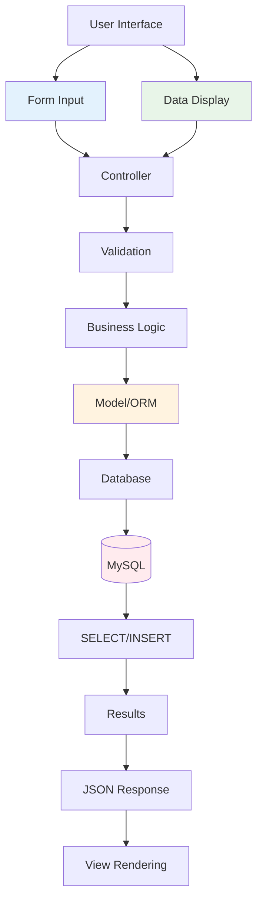

# CRUD Operations
## Create & Read Operations

<div class="pt-12">
  <span @click="$slidev.nav.next" class="px-2 py-1 rounded cursor-pointer" hover="bg-white bg-opacity-10">
    Cloud Computing Week 4 <carbon:arrow-right class="inline"/>
  </span>
</div>

<div class="abs-br m-6 flex gap-2">
  <button @click="$slidev.nav.openInEditor()" title="Open in Editor" class="text-xl slidev-icon-btn opacity-50 !border-none !hover:text-white">
    <carbon:edit />
  </button>
  <a href="https://github.com/slidevjs/slidev" target="_blank" alt="GitHub" title="Open in GitHub"
    class="text-xl slidev-icon-btn opacity-50 !border-none !hover:text-white">
    <carbon-logo-github />
  </a>
</div>

<!--
Selamat datang di pertemuan keempat Cloud Computing.
Hari ini kita akan fokus pada implementasi CRUD Operations, khususnya Create dan Read.
-->

---
layout: default
---

# Learning Objectives
## *Tujuan Pembelajaran Hari Ini*

<div class="grid grid-cols-1 gap-4 pt-4">

<v-click>

### 📝 <span v-mark.circle.red="1">**Post Creation System**</span>
Membangun sistem pembuatan konten yang robust dan user-friendly

</v-click>

<v-click>

### 🗂️ <span v-mark.highlight.yellow="2">**Data Management**</span>
Mengelola data dengan validasi, sanitasi, dan storage yang aman

</v-click>

<v-click>

### 📋 <span v-mark.underline.blue="3">**Data Listing Views**</span>
Membuat tampilan daftar data yang efisien dan informatif

</v-click>

<v-click>

### 🔍 <span v-mark.strikethrough.green="4">**Search & Filter**</span>
Implementasi pencarian dan filtering untuk user experience yang optimal

</v-click>

</div>

<v-click>

<div class="absolute bottom-4 right-4">
  <div class="flex items-center gap-2 bg-green-50 px-4 py-2 rounded-lg">
    <carbon:data-base class="text-green-600" />
    <span class="text-sm text-green-800">CRUD Foundation</span>
  </div>
</div>

</v-click>

<!--
Hari ini kita akan membangun fondasi CRUD operations yang solid.
Focus pada Create dan Read sebagai operasi fundamental dalam aplikasi web.
-->

---
layout: center
class: text-center
---

# What is CRUD?
## *Understanding CRUD Operations*

<v-click>

<div class="text-8xl pt-8 mb-8">
  🔄
</div>

</v-click>

<v-click>

<div class="grid grid-cols-4 gap-8 pt-4">
  
  <div class="text-center">
    <div class="text-4xl mb-4 text-blue-600">📝</div>
    <h3 class="text-lg font-bold mb-2"><span v-mark.highlight.blue="2">**CREATE**</span></h3>
    <p class="text-sm text-gray-600">Add new data</p>
  </div>
  
  <div class="text-center">
    <div class="text-4xl mb-4 text-green-600">👁️</div>
    <h3 class="text-lg font-bold mb-2"><span v-mark.highlight.green="3">**READ**</span></h3>
    <p class="text-sm text-gray-600">Retrieve data</p>
  </div>
  
  <div class="text-center opacity-50">
    <div class="text-4xl mb-4 text-orange-600">✏️</div>
    <h3 class="text-lg font-bold mb-2">UPDATE</h3>
    <p class="text-sm text-gray-600">Modify existing data</p>
  </div>
  
  <div class="text-center opacity-50">
    <div class="text-4xl mb-4 text-red-600">🗑️</div>
    <h3 class="text-lg font-bold mb-2">DELETE</h3>
    <p class="text-sm text-gray-600">Remove data</p>
  </div>
  
</div>

</v-click>

<v-click>

<div class="mt-8 text-xl text-gray-700">
  Today's Focus: <span v-mark.circle.purple="4">**CREATE + READ**</span>
</div>

</v-click>

<!--
CRUD adalah four basic operations pada data: Create, Read, Update, Delete.
Hari ini kita fokus pada CREATE dan READ sebagai foundation.
-->

---
layout: two-cols
---

# CRUD in Web Applications
## *Peran CRUD dalam Aplikasi Web*

<v-click>

### <span v-mark.circle.blue="1">**Database Layer**</span>
- INSERT statements untuk Create
- SELECT statements untuk Read
- Data persistence dan integrity

</v-click>

<v-click>

### <span v-mark.highlight.green="2">**Business Logic Layer**</span>
- Validation dan sanitization
- Business rules enforcement
- Data transformation

</v-click>

<v-click>

### <span v-mark.underline.orange="3">**Presentation Layer**</span>
- Forms untuk input data
- Lists dan tables untuk display
- User interaction handling

</v-click>

::right::

<v-click>

<v-motion
  :initial="{ x: 50, opacity: 0 }"
  :enter="{ x: 0, opacity: 1 }"
  :duration="800">



</v-motion>

</v-click>

<!--
CRUD operations melibatkan tiga layer utama dalam arsitektur web application.
Setiap layer memiliki responsibility yang jelas dan terpisah.
-->

---
layout: center
---

# Create Operations
## *Building Data Creation System*

<v-click>

<div class="grid grid-cols-3 gap-8 pt-8">
  
  <div class="text-center">
    <div class="text-5xl mb-4">📝</div>
    <h3 class="text-xl font-bold mb-2"><span v-mark.highlight.blue="1">Form Design</span></h3>
    <p class="text-gray-600">User-friendly input interfaces</p>
  </div>
  
  <div class="text-center">
    <div class="text-5xl mb-4">✅</div>
    <h3 class="text-xl font-bold mb-2"><span v-mark.highlight.green="2">Validation</span></h3>
    <p class="text-gray-600">Data integrity and security</p>
  </div>
  
  <div class="text-center">
    <div class="text-5xl mb-4">💾</div>
    <h3 class="text-xl font-bold mb-2"><span v-mark.highlight.orange="3">Storage</span></h3>
    <p class="text-gray-600">Database insertion and feedback</p>
  </div>
  
</div>

</v-click>

<!--
Create operations terdiri dari tiga komponen utama yang harus bekerja bersama.
-->

---
layout: default
---

# HTML Form for Data Creation
## *Frontend Form Implementation*

````md magic-move {at:1}
```html
<!-- Basic Form -->
<form method="POST" action="/posts">
    @csrf
    <input type="text" name="title" placeholder="Post Title" required>
    <textarea name="content" placeholder="Content" required></textarea>
    <button type="submit">Create Post</button>
</form>
```

```html
<!-- Enhanced Form -->
<form method="POST" action="/posts">
    @csrf
    <input type="text" name="title" value="{{ old('title') }}" 
           placeholder="Post Title" required>
    
    <select name="category_id" required>
        <option value="">Select Category</option>
        @foreach($categories as $category)
            <option value="{{ $category->id }}">{{ $category->name }}</option>
        @endforeach
    </select>
    
    <textarea name="content" required>{{ old('content') }}</textarea>
    <button type="submit">Create Post</button>
</form>
```

```html
<!-- Complete Form with File Upload -->
<form method="POST" action="/posts" enctype="multipart/form-data">
    @csrf
    <input type="text" name="title" value="{{ old('title') }}" required>
    <select name="category_id" required>
        <option value="">Select Category</option>
        @foreach($categories as $category)
            <option value="{{ $category->id }}">{{ $category->name }}</option>
        @endforeach
    </select>
    <input type="file" name="featured_image" accept="image/*">
    <textarea name="content" required>{{ old('content') }}</textarea>
    
    <button type="submit">Create Post</button>
    <a href="/posts">Cancel</a>
</form>
```
````

<v-click>

<div class="absolute bottom-4 right-4">
  <div class="bg-blue-100 text-blue-800 px-3 py-1 rounded text-sm">
    <carbon:cloud-upload class="inline mr-1" /> Frontend Ready!
  </div>
</div>

</v-click>

<!--
Form HTML development dari basic sampai advanced dengan file upload.
Perhatikan progressive enhancement pada setiap step.
-->

---
layout: default
---

# Backend Create Controller
## *Server-side Data Processing*

````md magic-move {at:1}
```php
<?php
// Basic Create Controller
class PostController extends Controller
{
    public function store(Request $request)
    {
        Post::create([
            'title' => $request->title,
            'content' => $request->content,
            'user_id' => auth()->id()
        ]);
        
        return redirect('/posts');
    }
}
```

```php
<?php
// Controller with Validation
class PostController extends Controller
{
    public function store(Request $request)
    {
        $validated = $request->validate([
            'title' => 'required|min:5|max:255',
            'content' => 'required|min:10',
            'category_id' => 'required|exists:categories,id'
        ]);
        
        $validated['user_id'] = auth()->id();
        Post::create($validated);
        
        return redirect('/posts')
               ->with('success', 'Post created!');
    }
}
```

```php
<?php
// Advanced with File Upload
class PostController extends Controller
{
    public function store(Request $request)
    {
        $validated = $request->validate([
            'title' => 'required|min:5|max:255',
            'content' => 'required|min:10',
            'category_id' => 'required|exists:categories,id',
            'featured_image' => 'nullable|image|max:2048'
        ]);
        
        if ($request->hasFile('featured_image')) {
            $validated['featured_image'] = $request
                ->file('featured_image')
                ->store('posts', 'public');
        }
        
        $validated['user_id'] = auth()->id();
        Post::create($validated);
        
        return redirect('/posts')->with('success', 'Post created!');
    }
}
```
````

<v-click>

<div class="absolute bottom-4 left-4">
  <div class="bg-green-100 text-green-800 px-3 py-2 rounded text-sm">
    <carbon:checkmark class="inline mr-1" /> 
    Always validate user input!
  </div>
</div>

</v-click>

<!--
Backend controller development dengan progressive complexity.
Validation dan file handling adalah komponen essential.
-->

---
layout: two-cols
---

# Data Validation Strategies
## *Ensuring Data Quality*

<v-click>

### <span v-mark.circle.red="1">**Client-side**</span>
```html
<input type="email" required 
       pattern="[a-z0-9._%+-]+@[a-z0-9.-]+\.[a-z]{2,}$">
```
*Fast feedback, tidak secure*

</v-click>

<v-click>

### <span v-mark.highlight.blue="2">**Server-side**</span>
```php
$request->validate([
    'email' => 'required|email|unique:users',
    'title' => 'required|min:5|max:255'
]);
```
*Secure, authoritative*

</v-click>

<v-click>

### <span v-mark.underline.green="3">**Database Constraints**</span>
```sql
ALTER TABLE posts 
ADD CONSTRAINT check_title_length 
CHECK (LENGTH(title) >= 5);
```
*Final data integrity layer*

</v-click>

::right::

<v-click>

<v-motion
  :initial="{ y: 30, opacity: 0 }"
  :enter="{ y: 0, opacity: 1 }"
  :duration="600">

```php
<?php
// Custom Validation Rules
class PostRequest extends FormRequest
{
    public function rules()
    {
        return [
            'title' => 'required|string|min:5|max:255',
            'content' => 'required|string|min:10',
            'category_id' => 'required|exists:categories,id',
            'featured_image' => 'nullable|image|max:2048'
        ];
    }
    
    public function messages()
    {
        return [
            'title.required' => 'Title is required.',
            'featured_image.max' => 'Image must be less than 2MB.'
        ];
    }
}

// Usage in Controller
public function store(PostRequest $request)
{
    $validated = $request->validated();
    $validated['user_id'] = auth()->id();
    
    Post::create($validated);
    
    return redirect('/posts')->with('success', 'Post created!');
}
```

</v-motion>

</v-click>

<!--
Multi-layer validation strategy untuk data quality yang maksimal.
Client-side untuk UX, server-side untuk security, database untuk integrity.
-->

---
layout: center
---

# Read Operations
## *Displaying Data Effectively*

<v-click>

<div class="grid grid-cols-3 gap-8 pt-8">
  
  <div class="text-center">
    <div class="text-5xl mb-4">📋</div>
    <h3 class="text-xl font-bold mb-2"><span v-mark.highlight.blue="1">Data Listing</span></h3>
    <p class="text-gray-600">Efficient data retrieval and display</p>
  </div>
  
  <div class="text-center">
    <div class="text-5xl mb-4">🔍</div>
    <h3 class="text-xl font-bold mb-2"><span v-mark.highlight.green="2">Search & Filter</span></h3>
    <p class="text-gray-600">User-driven data discovery</p>
  </div>
  
  <div class="text-center">
    <div class="text-5xl mb-4">📄</div>
    <h3 class="text-xl font-bold mb-2"><span v-mark.highlight.orange="3">Pagination</span></h3>
    <p class="text-gray-600">Performance optimization</p>
  </div>
  
</div>

</v-click>

<!--
Read operations melibatkan tiga aspek utama untuk user experience yang optimal.
-->

---
layout: default
---

# Data Listing Controller
## *Retrieving and Displaying Data*

````md magic-move {at:1}
```php
<?php
// Basic Listing
class PostController extends Controller
{
    public function index()
    {
        $posts = Post::latest()->get();
        
        return view('posts.index', compact('posts'));
    }
}
```

```php
<?php
// Listing with Relationships
class PostController extends Controller
{
    public function index()
    {
        $posts = Post::with(['user', 'category'])
                    ->latest()
                    ->paginate(10);
        
        return view('posts.index', compact('posts'));
    }
}
```

```php
<?php
// Advanced with Search & Filter
class PostController extends Controller
{
    public function index(Request $request)
    {
        $posts = Post::with(['user:id,name', 'category:id,name'])
            ->when($request->search, function($query, $search) {
                $query->where('title', 'like', '%' . $search . '%');
            })
            ->when($request->category, function($query, $category) {
                $query->where('category_id', $category);
            })
            ->latest()
            ->paginate(10);
            
        $categories = Category::all();
        
        return view('posts.index', compact('posts', 'categories'));
    }
}
```
````

<v-click>

<div class="absolute bottom-4 right-4">
  <div class="bg-purple-100 text-purple-800 px-3 py-2 rounded text-sm">
    <carbon:data-view class="inline mr-1" /> 
    Efficient Data Retrieval
  </div>
</div>

</v-click>

<!--
Data listing controller development dari basic sampai advanced features.
Eager loading dan pagination penting untuk performance.
-->

---
layout: default
---

# Data Listing View
## *Frontend Display Templates*

````md magic-move {at:1}
```html
<!-- Basic Post Listing -->
<div class="posts-container">
    <h1>All Posts</h1>
    
    @forelse($posts as $post)
        <div class="post-card">
            <h3>{{ $post->title }}</h3>
            <p>{{ Str::limit($post->content, 150) }}</p>
            <small>Posted {{ $post->created_at->diffForHumans() }}</small>
        </div>
    @empty
        <p>No posts found.</p>
    @endforelse
</div>
```

```html
<!-- Enhanced with Search -->
<div class="posts-container">
    <div class="posts-header">
        <h1>All Posts</h1>
        <form method="GET" class="search-form">
            <input type="text" name="search" value="{{ request('search') }}" 
                   placeholder="Search posts...">
            <button type="submit">Search</button>
        </form>
    </div>
    
    @forelse($posts as $post)
        <div class="post-card">
            <h3><a href="/posts/{{ $post->id }}">{{ $post->title }}</a></h3>
            <div class="meta">
                <span>By {{ $post->user->name }}</span>
                <span>{{ $post->created_at->format('M d, Y') }}</span>
            </div>
            <p>{{ Str::limit($post->content, 150) }}</p>
        </div>
    @empty
        <p>No posts found.</p>
    @endforelse
</div>
```

```html
<!-- Complete with Filters & Pagination -->
<div class="posts-container">
    <!-- Search & Filter -->
    <form method="GET" class="filters-form">
        <input type="text" name="search" value="{{ request('search') }}" 
               placeholder="Search posts...">
        <select name="category">
            <option value="">All Categories</option>
            @foreach($categories as $category)
                <option value="{{ $category->id }}" 
                        {{ request('category') == $category->id ? 'selected' : '' }}>
                    {{ $category->name }}
                </option>
            @endforeach
        </select>
        <button type="submit">Filter</button>
    </form>
    
    <!-- Posts Grid -->
    @forelse($posts as $post)
        <div class="post-card">
            <h3><a href="/posts/{{ $post->id }}">{{ $post->title }}</a></h3>
            <div class="meta">
                <span>{{ $post->user->name }}</span>
                <span>{{ $post->category->name }}</span>
                <span>{{ $post->created_at->format('M d') }}</span>
            </div>
            <p>{{ Str::limit($post->content, 120) }}</p>
        </div>
    @empty
        <p>No posts found. Try adjusting your search.</p>
    @endforelse
    
    <!-- Pagination -->
    {{ $posts->appends(request()->query())->links() }}
</div>
```
````

<!--
Frontend view development dengan progressive enhancement.
Search, filters, dan pagination untuk user experience yang optimal.
-->

---
layout: two-cols
---

# Search Implementation
## *Advanced Search Features*

<v-click>

### <span v-mark.circle.red="1">**Basic Search**</span>
```php
$posts = Post::where('title', 'like', '%' . $search . '%')
             ->orWhere('content', 'like', '%' . $search . '%')
             ->get();
```

</v-click>

<v-click>

### <span v-mark.highlight.blue="2">**Multi-field Search**</span>
```php
$posts = Post::where(function($q) use ($search) {
    $q->where('title', 'like', '%' . $search . '%')
      ->orWhere('content', 'like', '%' . $search . '%')
      ->orWhereHas('user', function($q) use ($search) {
          $q->where('name', 'like', '%' . $search . '%');
      });
})->get();
```

</v-click>

<v-click>

### <span v-mark.underline.green="3">**With Filters**</span>
```php
$query = Post::query();

if ($request->search) {
    $query->search($request->search);
}
if ($request->category) {
    $query->where('category_id', $request->category);
}

$posts = $query->paginate(10);
```

</v-click>

::right::

<v-click>

<v-motion
  :initial="{ x: 50, opacity: 0 }"
  :enter="{ x: 0, opacity: 1 }"
  :duration="700">

```php
<?php
// Search Scope in Model
class Post extends Model
{
    public function scopeSearch($query, $search)
    {
        return $query->where(function($q) use ($search) {
            $q->where('title', 'like', '%' . $search . '%')
              ->orWhere('content', 'like', '%' . $search . '%')
              ->orWhereHas('user', function($q2) use ($search) {
                  $q2->where('name', 'like', '%' . $search . '%');
              });
        });
    }
    
    public function scopeFilter($query, $filters)
    {
        return $query->when($filters['category'] ?? null, 
            fn($q, $cat) => $q->where('category_id', $cat)
        )->when($filters['user'] ?? null,
            fn($q, $user) => $q->where('user_id', $user)
        );
    }
}

// Usage in Controller
$posts = Post::search($request->search)
             ->filter($request->only(['category', 'user']))
             ->latest()
             ->paginate(10);
```

</v-motion>

</v-click>

<!--
Search implementation dari basic sampai advanced dengan scopes.
Model scopes memudahkan reusability dan maintainability.
-->

---
layout: center
---

# Performance Optimization
## *Efficient Data Operations*

<v-click>

<div class="grid grid-cols-2 gap-12 pt-8">
  
  <div class="text-center">
    <div class="text-6xl mb-4">⚡</div>
    <h3 class="text-xl font-bold mb-2"><span v-mark.highlight.blue="1">Query Optimization</span></h3>
    <p class="text-gray-600">Eager loading, indexing, efficient queries</p>
  </div>
  
  <div class="text-center">
    <div class="text-6xl mb-4">📄</div>
    <h3 class="text-xl font-bold mb-2"><span v-mark.highlight.green="2">Pagination</span></h3>
    <p class="text-gray-600">Memory management, faster loading</p>
  </div>
  
</div>

</v-click>

<!--
Performance optimization adalah kunci untuk aplikasi yang scalable.
-->

---
layout: two-cols
---

# Query Optimization Tips
## *Database Performance*

<v-click>

### <span v-mark.circle.red="1">**Eager Loading**</span>
```php
// ❌ N+1 Problem
$posts = Post::all();
foreach($posts as $post) {
    echo $post->user->name; // Query per post
}

// ✅ Efficient
$posts = Post::with('user')->get();
```

</v-click>

<v-click>

### <span v-mark.highlight.blue="2">**Selective Fields**</span>
```php
// Only get needed fields
$posts = Post::select('id', 'title', 'created_at')
             ->with('user:id,name')
             ->get();
```

</v-click>

<v-click>

### <span v-mark.underline.green="3">**Database Indexes**</span>
```sql
-- Add indexes for search columns
CREATE INDEX idx_posts_title ON posts(title);
CREATE INDEX idx_posts_created_at ON posts(created_at);
```

</v-click>

::right::

<v-click>

<v-motion
  :initial="{ y: 30, opacity: 0 }"
  :enter="{ y: 0, opacity: 1 }"
  :duration="600">

```php
<?php
// Optimized Controller
class PostController extends Controller
{
    public function index(Request $request)
    {
        $posts = Post::select([
                'id', 'title', 'content', 'user_id', 
                'category_id', 'created_at'
            ])
            ->with([
                'user:id,name',
                'category:id,name'
            ])
            ->when($request->search, fn($q, $search) => 
                $q->search($search)
            )
            ->when($request->category, fn($q, $cat) => 
                $q->where('category_id', $cat)
            )
            ->latest('created_at')
            ->paginate(12);
            
        return view('posts.index', [
            'posts' => $posts,
            'categories' => Cache::remember('categories', 3600, 
                fn() => Category::select('id', 'name')->get()
            )
        ]);
    }
}
```

</v-motion>

</v-click>

<!--
Query optimization techniques untuk performance yang optimal.
Selective loading, caching, dan proper indexing.
-->

---
layout: default
---

# Complete CRUD Example
## *Putting It All Together*

````md magic-move {at:1}
```php
<?php
// Routes
Route::get('/posts', [PostController::class, 'index'])->name('posts.index');
Route::get('/posts/create', [PostController::class, 'create'])->name('posts.create');
Route::post('/posts', [PostController::class, 'store'])->name('posts.store');
```

```php
<?php
// Complete Controller
class PostController extends Controller
{
    public function index(Request $request)
    {
        $posts = Post::with(['user:id,name', 'category:id,name'])
            ->when($request->search, fn($q, $search) => $q->search($search))
            ->when($request->category, fn($q, $cat) => $q->where('category_id', $cat))
            ->latest()
            ->paginate(10);
            
        return view('posts.index', [
            'posts' => $posts,
            'categories' => Category::all()
        ]);
    }
    
    public function create()
    {
        return view('posts.create', [
            'categories' => Category::all()
        ]);
    }
    
    public function store(Request $request)
    {
        $validated = $request->validate([
            'title' => 'required|min:5|max:255',
            'content' => 'required|min:10',
            'category_id' => 'required|exists:categories,id',
            'featured_image' => 'nullable|image|max:2048'
        ]);
        
        if ($request->hasFile('featured_image')) {
            $validated['featured_image'] = $request->file('featured_image')
                ->store('posts', 'public');
        }
        
        $validated['user_id'] = auth()->id();
        
        Post::create($validated);
        
        return redirect()->route('posts.index')
               ->with('success', 'Post created successfully!');
    }
}
```
````

<v-click>

<div class="grid grid-cols-2 gap-4 mt-8">
  <div class="bg-blue-50 p-4 rounded-lg text-center">
    <carbon:add class="text-blue-600 text-2xl mx-auto mb-2" />
    <div class="text-sm font-semibold text-blue-800">CREATE Ready</div>
  </div>
  <div class="bg-green-50 p-4 rounded-lg text-center">
    <carbon:view class="text-green-600 text-2xl mx-auto mb-2" />
    <div class="text-sm font-semibold text-green-800">READ Ready</div>
  </div>
</div>

</v-click>

<!--
Complete implementation dari CREATE dan READ operations.
Routes, controller methods, dan best practices terintegrasi.
-->

---
layout: center
---

# Error Handling & UX
## *Robust User Experience*

<v-click>

<div class="grid grid-cols-3 gap-8 pt-8">
  
  <div class="text-center">
    <div class="text-5xl mb-4">⚠️</div>
    <h3 class="text-xl font-bold mb-2"><span v-mark.highlight.red="1">Validation Errors</span></h3>
    <p class="text-gray-600">Clear feedback for user input issues</p>
  </div>
  
  <div class="text-center">
    <div class="text-5xl mb-4">✅</div>
    <h3 class="text-xl font-bold mb-2"><span v-mark.highlight.green="2">Success Messages</span></h3>
    <p class="text-gray-600">Confirmation of successful operations</p>
  </div>
  
  <div class="text-center">
    <div class="text-5xl mb-4">🔄</div>
    <h3 class="text-xl font-bold mb-2"><span v-mark.highlight.blue="3">Loading States</span></h3>
    <p class="text-gray-600">Visual feedback during processing</p>
  </div>
  
</div>

</v-click>

<!--
Error handling dan UX considerations untuk aplikasi yang user-friendly.
-->

---
layout: two-cols
---

# Error Handling Implementation
## *User-Friendly Error Messages*

<v-click>

### <span v-mark.circle.red="1">**Validation Display**</span>
```html
@if($errors->any())
    <div class="alert alert-danger">
        @foreach($errors->all() as $error)
            <li>{{ $error }}</li>
        @endforeach
    </div>
@endif
```

</v-click>

<v-click>

### <span v-mark.highlight.green="2">**Success Messages**</span>
```html
@if(session('success'))
    <div class="alert alert-success">
        {{ session('success') }}
    </div>
@endif
```

</v-click>

<v-click>

### <span v-mark.underline.blue="3">**Field-specific Errors**</span>
```html
<input type="text" name="title" 
       class="@error('title') is-invalid @enderror">
@error('title')
    <div class="invalid-feedback">{{ $message }}</div>
@enderror
```

</v-click>

::right::

<v-click>

<v-motion
  :initial="{ x: 50, opacity: 0 }"
  :enter="{ x: 0, opacity: 1 }"
  :duration="600">

```javascript
// Form Enhancement
document.addEventListener('DOMContentLoaded', function() {
    // Auto-hide success messages
    const alerts = document.querySelectorAll('.alert-success');
    alerts.forEach(alert => {
        setTimeout(() => {
            alert.style.opacity = '0';
            setTimeout(() => alert.remove(), 300);
        }, 3000);
    });
    
    // Form submission loading state
    const forms = document.querySelectorAll('form');
    forms.forEach(form => {
        form.addEventListener('submit', function(e) {
            const submitBtn = form.querySelector('[type="submit"]');
            submitBtn.disabled = true;
            submitBtn.innerHTML = 'Processing...';
        });
    });
    
    // Real-time validation
    const titleInput = document.getElementById('title');
    if (titleInput) {
        titleInput.addEventListener('input', function() {
            const feedback = this.nextElementSibling;
            if (this.value.length < 5 && this.value.length > 0) {
                feedback.textContent = 'Title must be at least 5 characters';
                feedback.style.display = 'block';
            } else {
                feedback.style.display = 'none';
            }
        });
    }
});
```

</v-motion>

</v-click>

<!--
Error handling implementation dengan Progressive Enhancement.
Server-side validation + client-side enhancements untuk UX yang optimal.
-->

---
layout: center
---

# Best Practices Summary
## *Key Points to Remember*

<div class="grid grid-cols-2 gap-8 pt-8">

<v-click>

<div class="bg-blue-50 p-6 rounded-lg">
  <div class="text-3xl mb-4">📝</div>
  <h3 class="font-bold mb-2"><span v-mark.highlight.blue="1">CREATE Operations</span></h3>
  <ul class="text-sm space-y-1">
    <li>• Always validate user input</li>
    <li>• Use proper form handling</li>
    <li>• Implement CSRF protection</li>
    <li>• Provide clear user feedback</li>
  </ul>
</div>

</v-click>

<v-click>

<div class="bg-green-50 p-6 rounded-lg">
  <div class="text-3xl mb-4">👁️</div>
  <h3 class="font-bold mb-2"><span v-mark.highlight.green="2">READ Operations</span></h3>
  <ul class="text-sm space-y-1">
    <li>• Use eager loading for relationships</li>
    <li>• Implement pagination for large datasets</li>
    <li>• Add search and filtering capabilities</li>
    <li>• Optimize database queries</li>
  </ul>
</div>

</v-click>

<v-click>

<div class="bg-orange-50 p-6 rounded-lg">
  <div class="text-3xl mb-4">🔒</div>
  <h3 class="font-bold mb-2"><span v-mark.highlight.orange="3">Security</span></h3>
  <ul class="text-sm space-y-1">
    <li>• Validate all input server-side</li>
    <li>• Sanitize data before storage</li>
    <li>• Use parameterized queries</li>
    <li>• Implement proper authentication</li>
  </ul>
</div>

</v-click>

<v-click>

<div class="bg-purple-50 p-6 rounded-lg">
  <div class="text-3xl mb-4">⚡</div>
  <h3 class="font-bold mb-2"><span v-mark.highlight.purple="4">Performance</span></h3>
  <ul class="text-sm space-y-1">
    <li>• Use database indexes strategically</li>
    <li>• Implement caching where appropriate</li>
    <li>• Optimize queries with eager loading</li>
    <li>• Consider lazy loading for large datasets</li>
  </ul>
</div>

</v-click>

</div>

<!--
Best practices summary untuk CREATE dan READ operations yang robust dan secure.
-->

---
layout: center
---

# Next Week Preview
## *Week 5: CRUD Operations - Update & Delete*

<v-click>

<div class="grid grid-cols-2 gap-12 pt-8">
  
  <div class="text-center">
    <div class="text-6xl mb-4">✏️</div>
    <h3 class="text-xl font-bold mb-2">Update Operations</h3>
    <p class="text-gray-600">Edit functionality dengan data validation dan error handling yang comprehensive</p>
  </div>
  
  <div class="text-center">
    <div class="text-6xl mb-4">🗑️</div>
    <h3 class="text-xl font-bold mb-2">Delete Operations</h3>
    <p class="text-gray-600">Safe deletion dengan confirmation, soft deletes, dan data integrity</p>
  </div>
  
</div>

</v-click>

<v-click>

<div class="mt-8 text-center">
  <div class="inline-block bg-gradient-to-r from-orange-500 to-red-600 text-white px-6 py-3 rounded-lg">
    <span class="font-semibold">Complete CRUD mastery! 🎯</span>
  </div>
</div>

</v-click>

<!--
Minggu depan kita akan melengkapi CRUD operations dengan UPDATE dan DELETE.
Foundation CREATE dan READ hari ini akan menjadi base untuk operasi yang lebih complex.
-->

---
layout: center
class: text-center
---

# Questions & Discussion
## *Mari Berdiskusi!*

<div class="pt-8">
  <div class="text-6xl mb-8">❓</div>
  
  <div class="text-xl text-gray-600 mb-8">
    Ada pertanyaan tentang <span v-mark.highlight.blue="1">Post Creation</span>, 
    <span v-mark.highlight.green="2">Data Management</span>, 
    <span v-mark.highlight.orange="3">Data Listing</span>, 
    atau <span v-mark.highlight.purple="4">Search & Filter</span>?
  </div>
  
  <div class="grid grid-cols-2 gap-8 max-w-md mx-auto">
    <div class="bg-blue-50 p-4 rounded-lg">
      <carbon:chat class="text-blue-600 text-2xl mx-auto mb-2" />
      <div class="text-sm font-semibold text-blue-800">Discussion</div>
    </div>
    <div class="bg-green-50 p-4 rounded-lg">
      <carbon:code class="text-green-600 text-2xl mx-auto mb-2" />
      <div class="text-sm font-semibold text-green-800">Live Demo</div>
    </div>
  </div>
</div>

<div class="absolute bottom-4 right-4">
  <div class="text-sm text-gray-500">
    <carbon:time class="inline mr-1" />
    Thank you for your attention! 🙏
  </div>
</div>

<!--
Waktu untuk pertanyaan dan diskusi tentang implementasi CRUD CREATE & READ.
Silakan tanyakan apapun tentang best practices atau troubleshooting.
-->