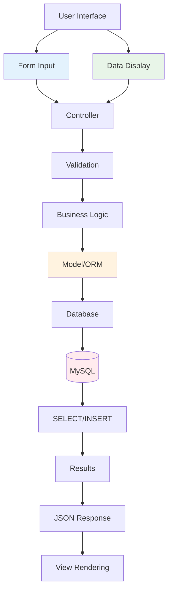

<style>
.scrollable-code {
  max-height: 400px;
  overflow-y: auto;
  font-size: 12px;
}

.compact-code {
  font-size: 11px;
  line-height: 1.2;
}

.large-code {
  font-size: 10px;
  line-height: 1.1;
  max-height: 450px;
  overflow-y: auto;
}

.code-highlight {
  background: linear-gradient(90deg, #fef3c7, #fde68a);
  border-left: 4px solid #f59e0b;
  padding: 1rem;
  border-radius: 0.5rem;
}

.interactive-demo {
  border: 2px dashed #3b82f6;
  border-radius: 8px;
  padding: 1rem;
  background: linear-gradient(45deg, #eff6ff, #dbeafe);
}
</style>

# CRUD Operations
## Create & Read Operations

<div class="pt-12">
  <span @click="$slidev.nav.next" class="px-2 py-1 rounded cursor-pointer" hover="bg-white bg-opacity-10">
    Cloud Computing Week 4 <carbon:arrow-right class="inline"/>
  </span>
</div>

<div class="abs-br m-6 flex gap-2">
  <button @click="$slidev.nav.openInEditor()" title="Open in Editor" class="text-xl slidev-icon-btn opacity-50 !border-none !hover:text-white">
    <carbon:edit />
  </button>
  <a href="https://github.com/aidilsaputrakirsan" target="_blank" alt="GitHub" title="Open in GitHub"
    class="text-xl slidev-icon-btn opacity-50 !border-none !hover:text-white">
    <carbon-logo-github />
  </a>
</div>

<!--
Selamat datang di pertemuan keempat Cloud Computing.
Hari ini kita akan fokus pada implementasi CRUD Operations, khususnya Create dan Read.
-->

---
layout: default
---

# Learning Objectives
## *Tujuan Pembelajaran Hari Ini*

<div class="grid grid-cols-1 gap-4 pt-4">

<v-click>

### 📝 <span v-mark.circle.red="1">**Post Creation System**</span>
<v-motion
  :initial="{ x: -50, opacity: 0 }"
  :enter="{ x: 0, opacity: 1 }"
  :duration="600">
Membangun sistem pembuatan konten yang robust dan user-friendly
</v-motion>

</v-click>

<v-click>

### 🗂️ <span v-mark.highlight.yellow="2">**Data Management**</span>
<v-motion
  :initial="{ x: 50, opacity: 0 }"
  :enter="{ x: 0, opacity: 1 }"
  :duration="600"
  :delay="200">
Mengelola data dengan validasi, sanitasi, dan storage yang aman
</v-motion>

</v-click>

<v-click>

### 📋 <span v-mark.underline.blue="3">**Data Listing Views**</span>
<v-motion
  :initial="{ y: 30, opacity: 0 }"
  :enter="{ y: 0, opacity: 1 }"
  :duration="600"
  :delay="400">
Membuat tampilan daftar data yang efisien dan informatif
</v-motion>

</v-click>

<v-click>

### 🔍 <span v-mark.strikethrough.green="4">**Search & Filter**</span>
<v-motion
  :initial="{ scale: 0.8, opacity: 0 }"
  :enter="{ scale: 1, opacity: 1 }"
  :duration="600"
  :delay="600">
Implementasi pencarian dan filtering untuk user experience yang optimal
</v-motion>

</v-click>

</div>

<v-click>

<div class="absolute bottom-4 right-4">
  <v-motion
    :initial="{ rotate: 0, scale: 0 }"
    :enter="{ rotate: 360, scale: 1 }"
    :duration="800"
    :delay="800">
    <div class="flex items-center gap-2 bg-green-50 px-4 py-2 rounded-lg shadow-lg">
      <carbon:data-base class="text-green-600" />
      <span class="text-sm text-green-800 font-semibold">CRUD Foundation</span>
    </div>
  </v-motion>
</div>

</v-click>

<!--
Hari ini kita akan membangun fondasi CRUD operations yang solid.
Focus pada Create dan Read sebagai operasi fundamental dalam aplikasi web.
-->

---
layout: center
class: text-center
---

# What is CRUD?
## *Understanding CRUD Operations*

<v-click>

<v-motion
  :initial="{ scale: 0, rotate: -180 }"
  :enter="{ scale: 1, rotate: 0 }"
  :duration="1000">
<div class="text-8xl pt-8 mb-8">
  🔄
</div>
</v-motion>

</v-click>

<v-click>

<div class="grid grid-cols-4 gap-8 pt-4">
  
  <v-motion
    :initial="{ y: 50, opacity: 0 }"
    :enter="{ y: 0, opacity: 1 }"
    :duration="600"
    :delay="200">
  <div class="text-center cursor-pointer hover:scale-110 transition-transform">
    <div class="text-4xl mb-4 text-blue-600">📝</div>
    <h3 class="text-lg font-bold mb-2"><span v-mark.highlight.blue="2">**CREATE**</span></h3>
    <p class="text-sm text-gray-600">Add new data</p>
  </div>
  </v-motion>
  
  <v-motion
    :initial="{ y: 50, opacity: 0 }"
    :enter="{ y: 0, opacity: 1 }"
    :duration="600"
    :delay="400">
  <div class="text-center cursor-pointer hover:scale-110 transition-transform">
    <div class="text-4xl mb-4 text-green-600">👁️</div>
    <h3 class="text-lg font-bold mb-2"><span v-mark.highlight.green="3">**READ**</span></h3>
    <p class="text-sm text-gray-600">Retrieve data</p>
  </div>
  </v-motion>
  
  <v-motion
    :initial="{ y: 50, opacity: 0 }"
    :enter="{ y: 0, opacity: 1 }"
    :duration="600"
    :delay="600">
  <div class="text-center opacity-50 cursor-not-allowed">
    <div class="text-4xl mb-4 text-orange-600">✏️</div>
    <h3 class="text-lg font-bold mb-2">UPDATE</h3>
    <p class="text-sm text-gray-600">Modify existing data</p>
  </div>
  </v-motion>
  
  <v-motion
    :initial="{ y: 50, opacity: 0 }"
    :enter="{ y: 0, opacity: 1 }"
    :duration="600"
    :delay="800">
  <div class="text-center opacity-50 cursor-not-allowed">
    <div class="text-4xl mb-4 text-red-600">🗑️</div>
    <h3 class="text-lg font-bold mb-2">DELETE</h3>
    <p class="text-sm text-gray-600">Remove data</p>
  </div>
  </v-motion>
  
</div>

</v-click>

<v-click>

<v-motion
  :initial="{ scale: 0, opacity: 0 }"
  :enter="{ scale: 1, opacity: 1 }"
  :duration="800"
  :delay="1000">
<div class="mt-8 text-xl text-gray-700">
  Today's Focus: <span v-mark.circle.purple="4">**CREATE + READ**</span>
</div>
</v-motion>

</v-click>

<!--
CRUD adalah four basic operations pada data: Create, Read, Update, Delete.
Hari ini kita fokus pada CREATE dan READ sebagai foundation.
-->

---
layout: two-cols
---

# CRUD in Web Applications
## *Peran CRUD dalam Aplikasi Web*

<v-click>

### <span v-mark.circle.blue="1">**Database Layer**</span>
<v-motion
  :initial="{ x: -30, opacity: 0 }"
  :enter="{ x: 0, opacity: 1 }"
  :duration="500">

- INSERT statements untuk Create
- SELECT statements untuk Read  
- Data persistence dan integrity

</v-motion>

</v-click>

<v-click>

### <span v-mark.highlight.green="2">**Business Logic Layer**</span>
<v-motion
  :initial="{ x: -30, opacity: 0 }"
  :enter="{ x: 0, opacity: 1 }"
  :duration="500"
  :delay="200">

- Validation dan sanitization
- Business rules enforcement
- Data transformation

</v-motion>

</v-click>

<v-click>

### <span v-mark.underline.orange="3">**Presentation Layer**</span>
<v-motion
  :initial="{ x: -30, opacity: 0 }"
  :enter="{ x: 0, opacity: 1 }"
  :duration="500"
  :delay="400">

- Forms untuk input data
- Lists dan tables untuk display
- User interaction handling

</v-motion>

</v-click>

::right::

<v-click>

<v-motion
  :initial="{ x: 50, opacity: 0, rotate: 10 }"
  :enter="{ x: 0, opacity: 1, rotate: 0 }"
  :duration="800"
  :delay="600">

  <div class="flex justify-center items-center h-full">
<div style="transform: scale(0.8); transform-origin: center;">



</div>
</div>

</v-motion>

</v-click>

<!--
CRUD operations melibatkan tiga layer utama dalam arsitektur web application.
Setiap layer memiliki responsibility yang jelas dan terpisah.
-->

---
layout: center
---

# Create Operations
## *Building Data Creation System*

<v-click>

<div class="grid grid-cols-3 gap-8 pt-8">
  
  <v-motion
    :initial="{ y: 30, opacity: 0, scale: 0.8 }"
    :enter="{ y: 0, opacity: 1, scale: 1 }"
    :duration="600">
  <div class="text-center p-6 bg-blue-50 rounded-xl hover:shadow-lg transition-all cursor-pointer hover:bg-blue-100">
    <div class="text-5xl mb-4">📝</div>
    <h3 class="text-xl font-bold mb-2"><span v-mark.highlight.blue="1">Form Design</span></h3>
    <p class="text-gray-600">User-friendly input interfaces</p>
  </div>
  </v-motion>
  
  <v-motion
    :initial="{ y: 30, opacity: 0, scale: 0.8 }"
    :enter="{ y: 0, opacity: 1, scale: 1 }"
    :duration="600"
    :delay="200">
  <div class="text-center p-6 bg-green-50 rounded-xl hover:shadow-lg transition-all cursor-pointer hover:bg-green-100">
    <div class="text-5xl mb-4">✅</div>
    <h3 class="text-xl font-bold mb-2"><span v-mark.highlight.green="2">Validation</span></h3>
    <p class="text-gray-600">Data integrity and security</p>
  </div>
  </v-motion>
  
  <v-motion
    :initial="{ y: 30, opacity: 0, scale: 0.8 }"
    :enter="{ y: 0, opacity: 1, scale: 1 }"
    :duration="600"
    :delay="400">
  <div class="text-center p-6 bg-orange-50 rounded-xl hover:shadow-lg transition-all cursor-pointer hover:bg-orange-100">
    <div class="text-5xl mb-4">💾</div>
    <h3 class="text-xl font-bold mb-2"><span v-mark.highlight.orange="3">Storage</span></h3>
    <p class="text-gray-600">Database insertion and feedback</p>
  </div>
  </v-motion>
  
</div>

</v-click>

<!--
Create operations terdiri dari tiga komponen utama yang harus bekerja bersama.
-->

---
layout: two-cols
class: gap-4
---

# HTML Form Evolution
## *Progressive Form Enhancement*

<div class="scrollable-code">

````md magic-move {lines: true, at: 1}
```html {1-6|all}
<!-- Basic Form -->
<form method="POST" action="/posts">
    @csrf
    <input type="text" name="title" placeholder="Post Title" required>
    <textarea name="content" placeholder="Content" required></textarea>
    <button type="submit">Create Post</button>
</form>
```

```html {1-12|all}
<!-- Enhanced Form -->
<form method="POST" action="/posts">
    @csrf
    <input type="text" name="title" value="{{ old('title') }}" 
           placeholder="Post Title" required>
    
    <select name="category_id" required>
        <option value="">Select Category</option>
        @foreach($categories as $category)
            <option value="{{ $category->id }}">{{ $category->name }}</option>
        @endforeach
    </select>
    
    <textarea name="content" required>{{ old('content') }}</textarea>
    <button type="submit">Create Post</button>
</form>
```

```html {1-18|all}
<!-- Complete Form with File Upload -->
<form method="POST" action="/posts" enctype="multipart/form-data" 
      class="space-y-4 p-6 bg-white rounded-lg shadow-lg">
    @csrf
    
    <div class="form-group">
        <label for="title" class="block text-sm font-medium">Title</label>
        <input type="text" name="title" value="{{ old('title') }}" 
               class="w-full px-3 py-2 border rounded-md" required>
    </div>
    
    <div class="form-group">
        <label for="category_id" class="block text-sm font-medium">Category</label>
        <select name="category_id" class="w-full px-3 py-2 border rounded-md" required>
            <option value="">Select Category</option>
            @foreach($categories as $category)
                <option value="{{ $category->id }}">{{ $category->name }}</option>
            @endforeach
        </select>
    </div>
    
    <div class="form-group">
        <label for="featured_image" class="block text-sm font-medium">Featured Image</label>
        <input type="file" name="featured_image" accept="image/*" 
               class="w-full px-3 py-2 border rounded-md">
    </div>
    
    <div class="form-group">
        <label for="content" class="block text-sm font-medium">Content</label>
        <textarea name="content" rows="6" 
                  class="w-full px-3 py-2 border rounded-md" required>{{ old('content') }}</textarea>
    </div>
    
    <div class="flex gap-2">
        <button type="submit" class="bg-blue-600 text-white px-4 py-2 rounded-md hover:bg-blue-700">
            Create Post
        </button>
        <a href="/posts" class="bg-gray-300 text-gray-700 px-4 py-2 rounded-md hover:bg-gray-400">
            Cancel
        </a>
    </div>
</form>
```
````

</div>

::right::

<v-click>

<div class="interactive-demo mt-8">
  <h4 class="font-bold mb-4">🎯 Interactive Form Features:</h4>
  
  <v-clicks>
  
  - **CSRF Protection** untuk security
  - **Old Input Values** untuk UX
  - **File Upload** dengan validation
  - **Styling** dengan Tailwind CSS
  - **Accessibility** dengan labels
  - **User Feedback** yang clear
  
  </v-clicks>
</div>

</v-click>

<v-click>

<v-motion
  :initial="{ scale: 0, rotate: -10 }"
  :enter="{ scale: 1, rotate: 0 }"
  :duration="500"
  :delay="1000">
<div class="absolute bottom-4 right-4">
  <div class="bg-blue-100 text-blue-800 px-3 py-1 rounded text-sm font-semibold shadow-md">
    <carbon:cloud-upload class="inline mr-1" /> Frontend Ready!
  </div>
</div>
</v-motion>

</v-click>

<!--
Form HTML development dari basic sampai advanced dengan file upload.
Perhatikan progressive enhancement pada setiap step.
-->

---
layout: default
---

# Backend Create Controller
## *Server-side Data Processing*

<div class="large-code">

````md magic-move {lines: true, at: 1}
```php {1-12|1-3|4-8|9-12|all}
<?php
// Basic Create Controller
class PostController extends Controller
{
    public function store(Request $request)
    {
        Post::create([
            'title' => $request->title,
            'content' => $request->content,
            'user_id' => auth()->id()
        ]);
        
        return redirect('/posts');
    }
}
```

```php {1-20|5-10|12-15|all}
<?php
// Controller with Validation
class PostController extends Controller
{
    public function store(Request $request)
    {
        $validated = $request->validate([
            'title' => 'required|min:5|max:255',
            'content' => 'required|min:10',
            'category_id' => 'required|exists:categories,id'
        ]);
        
        $validated['user_id'] = auth()->id();
        Post::create($validated);
        
        return redirect('/posts')
               ->with('success', 'Post created!');
    }
}
```

```php {1-35|5-11|13-17|19-22|all}
<?php
// Advanced with File Upload & Error Handling
class PostController extends Controller
{
    public function store(Request $request)
    {
        $validated = $request->validate([
            'title' => 'required|min:5|max:255',
            'content' => 'required|min:10',
            'category_id' => 'required|exists:categories,id',
            'featured_image' => 'nullable|image|max:2048'
        ]);
        
        // Handle file upload
        if ($request->hasFile('featured_image')) {
            $validated['featured_image'] = $request
                ->file('featured_image')
                ->store('posts', 'public');
        }
        
        // Add user ID
        $validated['user_id'] = auth()->id();
        $validated['slug'] = Str::slug($validated['title']);
        
        try {
            $post = Post::create($validated);
            
            return redirect()
                ->route('posts.show', $post)
                ->with('success', 'Post created successfully!');
                
        } catch (Exception $e) {
            return back()
                ->withInput()
                ->with('error', 'Failed to create post. Please try again.');
        }
    }
}
```
````

</div>

<v-clicks>

<div class="absolute bottom-4 left-4">
  <div class="bg-green-100 text-green-800 px-3 py-2 rounded text-sm font-semibold shadow-md">
    <carbon:checkmark class="inline mr-1" /> 
    Always validate user input!
  </div>
</div>

<div class="absolute bottom-4 right-4">
  <div class="bg-purple-100 text-purple-800 px-3 py-2 rounded text-sm font-semibold shadow-md">
    <carbon:security class="inline mr-1" /> 
    Error Handling Essential!
  </div>
</div>

</v-clicks>

<!--
Backend controller development dengan progressive complexity.
Validation dan file handling adalah komponen essential.
-->

---
layout: two-cols
---

# Data Validation Strategies
## *Multi-layer Security Approach*

<v-click>

### <span v-mark.circle.red="1">**Client-side Validation**</span>
<v-motion
  :initial="{ x: -20, opacity: 0 }"
  :enter="{ x: 0, opacity: 1 }"
  :duration="500">

```html
<input type="email" required 
       pattern="[a-z0-9._%+-]+@[a-z0-9.-]+\.[a-z]{2,}$"
       title="Please enter a valid email">
```
<div class="text-sm text-red-600 mt-1">⚡ Fast feedback, tapi tidak secure</div>

</v-motion>

</v-click>

<v-click>

### <span v-mark.highlight.blue="2">**Server-side Validation**</span>
<v-motion
  :initial="{ x: -20, opacity: 0 }"
  :enter="{ x: 0, opacity: 1 }"
  :duration="500"
  :delay="200">

```php
$request->validate([
    'email' => 'required|email|unique:users',
    'title' => 'required|min:5|max:255'
]);
```
<div class="text-sm text-blue-600 mt-1">🔒 Secure, authoritative</div>

</v-motion>

</v-click>

<v-click>

### <span v-mark.underline.green="3">**Database Constraints**</span>
<v-motion
  :initial="{ x: -20, opacity: 0 }"
  :enter="{ x: 0, opacity: 1 }"
  :duration="500"
  :delay="400">

```sql
ALTER TABLE posts 
ADD CONSTRAINT check_title_length 
CHECK (LENGTH(title) >= 5);
```
<div class="text-sm text-green-600 mt-1">🛡️ Final data integrity layer</div>

</v-motion>

</v-click>

::right::

<v-click>

<v-motion
  :initial="{ y: 30, opacity: 0 }"
  :enter="{ y: 0, opacity: 1 }"
  :duration="600"
  :delay="600">

<div class="compact-code">

```php
<?php
// Custom Validation Rules dengan Form Request
class PostRequest extends FormRequest
{
    public function authorize()
    {
        return auth()->check();
    }
    
    public function rules()
    {
        return [
            'title' => 'required|string|min:5|max:255',
            'content' => 'required|string|min:10',
            'category_id' => 'required|exists:categories,id',
            'featured_image' => 'nullable|image|max:2048',
            'tags' => 'nullable|array|max:5',
            'tags.*' => 'string|max:50',
            'published_at' => 'nullable|date|after:now'
        ];
    }
    
    public function messages()
    {
        return [
            'title.required' => 'Title wajib diisi.',
            'title.min' => 'Title minimal 5 karakter.',
            'featured_image.max' => 'Gambar maksimal 2MB.',
            'tags.max' => 'Maksimal 5 tags.',
        ];
    }
    
    protected function prepareForValidation()
    {
        $this->merge([
            'slug' => Str::slug($this->title),
        ]);
    }
}

// Usage in Controller
public function store(PostRequest $request)
{
    $validated = $request->validated();
    $validated['user_id'] = auth()->id();
    
    $post = Post::create($validated);
    
    // Handle tags if present
    if ($request->has('tags')) {
        $post->tags()->attach($request->tags);
    }
    
    return redirect()
        ->route('posts.show', $post)
        ->with('success', 'Post berhasil dibuat!');
}
```

</div>

</v-motion>

</v-click>

<!--
Multi-layer validation strategy untuk data quality yang maksimal.
Client-side untuk UX, server-side untuk security, database untuk integrity.
-->

---
layout: center
---

# Read Operations
## *Displaying Data Effectively*

<v-click>

<div class="grid grid-cols-3 gap-8 pt-8">
  
  <v-motion
    :initial="{ rotateY: -90, opacity: 0 }"
    :enter="{ rotateY: 0, opacity: 1 }"
    :duration="800">
  <div class="text-center p-6 bg-blue-50 rounded-xl hover:shadow-lg transition-all cursor-pointer hover:scale-105">
    <div class="text-5xl mb-4">📋</div>
    <h3 class="text-xl font-bold mb-2"><span v-mark.highlight.blue="1">Data Listing</span></h3>
    <p class="text-gray-600">Efficient data retrieval and display</p>
  </div>
  </v-motion>
  
  <v-motion
    :initial="{ rotateY: -90, opacity: 0 }"
    :enter="{ rotateY: 0, opacity: 1 }"
    :duration="800"
    :delay="300">
  <div class="text-center p-6 bg-green-50 rounded-xl hover:shadow-lg transition-all cursor-pointer hover:scale-105">
    <div class="text-5xl mb-4">🔍</div>
    <h3 class="text-xl font-bold mb-2"><span v-mark.highlight.green="2">Search & Filter</span></h3>
    <p class="text-gray-600">User-driven data discovery</p>
  </div>
  </v-motion>
  
  <v-motion
    :initial="{ rotateY: -90, opacity: 0 }"
    :enter="{ rotateY: 0, opacity: 1 }"
    :duration="800"
    :delay="600">
  <div class="text-center p-6 bg-orange-50 rounded-xl hover:shadow-lg transition-all cursor-pointer hover:scale-105">
    <div class="text-5xl mb-4">📄</div>
    <h3 class="text-xl font-bold mb-2"><span v-mark.highlight.orange="3">Pagination</span></h3>
    <p class="text-gray-600">Performance optimization</p>
  </div>
  </v-motion>
  
</div>

</v-click>

<!--
Read operations melibatkan tiga aspek utama untuk user experience yang optimal.
-->

---
layout: default
---

# Data Listing Controller Evolution
## *From Basic to Advanced*

<div class="large-code">

````md magic-move {lines: true, at: 1}
```php {1-10|all}
<?php
// Basic Listing
class PostController extends Controller
{
    public function index()
    {
        $posts = Post::latest()->get();
        
        return view('posts.index', compact('posts'));
    }
}
```

```php {1-15|6-8|all}
<?php
// Listing with Relationships & Pagination
class PostController extends Controller
{
    public function index()
    {
        $posts = Post::with(['user', 'category'])
                    ->latest()
                    ->paginate(10);
        
        return view('posts.index', compact('posts'));
    }
}
```

```php {1-35|6-15|17-20|22-25|all}
<?php
// Advanced with Search, Filter & Performance
class PostController extends Controller
{
    public function index(Request $request)
    {
        $posts = Post::with(['user:id,name,avatar', 'category:id,name,color'])
            ->select(['id', 'title', 'content', 'user_id', 'category_id', 'created_at', 'featured_image'])
            ->when($request->search, function($query, $search) {
                $query->where(function($q) use ($search) {
                    $q->where('title', 'like', '%' . $search . '%')
                      ->orWhere('content', 'like', '%' . $search . '%');
                });
            })
            ->when($request->category, function($query, $category) {
                $query->where('category_id', $category);
            })
            ->when($request->user, function($query, $user) {
                $query->where('user_id', $user);
            })
            ->when($request->date_from, function($query, $date) {
                $query->whereDate('created_at', '>=', $date);
            })
            ->when($request->date_to, function($query, $date) {
                $query->whereDate('created_at', '<=', $date);
            })
            ->latest('created_at')
            ->paginate(12)
            ->withQueryString();
            
        $categories = Cache::remember('categories', 3600, function() {
            return Category::select('id', 'name')->orderBy('name')->get();
        });
        
        return view('posts.index', compact('posts', 'categories'));
    }
}
```
````

</div>

<v-clicks>

<div class="absolute bottom-4 right-4 space-x-2 flex">
  <div class="bg-purple-100 text-purple-800 px-3 py-2 rounded text-sm font-semibold shadow-md">
    <carbon:data-view class="inline mr-1" /> 
    Efficient Queries
  </div>
  <div class="bg-orange-100 text-orange-800 px-3 py-2 rounded text-sm font-semibold shadow-md">
    <carbon:search class="inline mr-1" /> 
    Advanced Search
  </div>
</div>

</v-clicks>

<!--
Data listing controller development dari basic sampai advanced features.
Eager loading, filtering, dan caching untuk performance optimal.
-->

---
layout: two-cols
class: gap-4
---

# Frontend Listing View
## *Interactive User Interface*

<div class="scrollable-code">

````md magic-move {lines: true, at: 1}
```html {1-12|all}
<!-- Basic Post Listing -->
<div class="posts-container">
    <h1>All Posts</h1>
    
    @forelse($posts as $post)
        <div class="post-card">
            <h3>{{ $post->title }}</h3>
            <p>{{ Str::limit($post->content, 150) }}</p>
            <small>Posted {{ $post->created_at->diffForHumans() }}</small>
        </div>
    @empty
        <p>No posts found.</p>
    @endforelse
</div>
```

```html {1-25|5-10|12-22|all}
<!-- Enhanced with Search -->
<div class="posts-container max-w-6xl mx-auto p-6">
    <div class="posts-header mb-8 flex justify-between items-center">
        <h1 class="text-3xl font-bold text-gray-800">All Posts</h1>
        
        <form method="GET" class="search-form flex gap-2">
            <input type="text" name="search" value="{{ request('search') }}" 
                   placeholder="Search posts..." 
                   class="px-4 py-2 border rounded-lg focus:ring-2 focus:ring-blue-500">
            <button type="submit" class="bg-blue-600 text-white px-4 py-2 rounded-lg hover:bg-blue-700">
                <carbon:search class="inline mr-1" /> Search
            </button>
        </form>
    </div>
    
    <div class="grid md:grid-cols-2 lg:grid-cols-3 gap-6">
        @forelse($posts as $post)
            <div class="post-card bg-white rounded-lg shadow-md hover:shadow-lg transition-shadow p-6">
                <h3 class="text-xl font-semibold mb-2">
                    <a href="/posts/{{ $post->id }}" class="text-blue-600 hover:text-blue-800">
                        {{ $post->title }}
                    </a>
                </h3>
                <div class="text-sm text-gray-500 mb-3">
                    <span>By {{ $post->user->name }}</span>
                    <span class="mx-2">•</span>
                    <span>{{ $post->created_at->format('M d, Y') }}</span>
                </div>
                <p class="text-gray-700">{{ Str::limit($post->content, 120) }}</p>
            </div>
        @empty
            <div class="col-span-full text-center py-12">
                <div class="text-6xl mb-4">📝</div>
                <p class="text-gray-500">No posts found.</p>
            </div>
        @endforelse
    </div>
</div>
```

```html {1-60|3-25|27-50|52-55|all}
<!-- Complete with Advanced Filters & Real-time Features -->
<div class="posts-container max-w-7xl mx-auto p-6" x-data="postsFilter()">
    <!-- Advanced Filter Bar -->
    <div class="bg-white rounded-lg shadow-md p-6 mb-8">
        <form method="GET" class="space-y-4">
            <div class="grid md:grid-cols-4 gap-4">
                <input type="text" name="search" x-model="filters.search"
                       value="{{ request('search') }}" 
                       placeholder="Search posts..."
                       class="px-4 py-2 border rounded-lg focus:ring-2 focus:ring-blue-500">
                
                <select name="category" x-model="filters.category" class="px-4 py-2 border rounded-lg">
                    <option value="">All Categories</option>
                    @foreach($categories as $category)
                        <option value="{{ $category->id }}" 
                                {{ request('category') == $category->id ? 'selected' : '' }}>
                            {{ $category->name }}
                        </option>
                    @endforeach
                </select>
                
                <input type="date" name="date_from" value="{{ request('date_from') }}"
                       class="px-4 py-2 border rounded-lg">
                       
                <div class="flex gap-2">
                    <button type="submit" class="bg-blue-600 text-white px-4 py-2 rounded-lg hover:bg-blue-700 flex items-center">
                        <carbon:search class="mr-2" /> Filter
                    </button>
                    <a href="{{ route('posts.index') }}" class="bg-gray-300 text-gray-700 px-4 py-2 rounded-lg hover:bg-gray-400">
                        Clear
                    </a>
                </div>
            </div>
        </form>
        
        <!-- Real-time Filter Stats -->
        <div class="mt-4 text-sm text-gray-600" x-show="hasFilters()">
            <span x-text="getFilterSummary()"></span>
        </div>
    </div>
    
    <!-- Posts Grid with Loading State -->
    <div class="grid md:grid-cols-2 lg:grid-cols-3 gap-6" x-show="!loading">
        @forelse($posts as $post)
            <article class="post-card bg-white rounded-lg shadow-md hover:shadow-xl transition-all duration-300 overflow-hidden group">
                @if($post->featured_image)
                    featured_image) }}" 
                         alt="{{ $post->title }}" 
                         class="w-full h-48 object-cover group-hover:scale-105 transition-transform duration-300">
                @endif
                
                <div class="p-6">
                    <div class="flex items-center gap-2 mb-3">
                        <span class="px-2 py-1 bg-{{ $post->category->color }}-100 text-{{ $post->category->color }}-800 text-xs rounded-full">
                            {{ $post->category->name }}
                        </span>
                        <span class="text-xs text-gray-500">{{ $post->created_at->diffForHumans() }}</span>
                    </div>
                    
                    <h3 class="text-xl font-semibold mb-2 group-hover:text-blue-600 transition-colors">
                        <a href="{{ route('posts.show', $post) }}">{{ $post->title }}</a>
                    </h3>
                    
                    <p class="text-gray-600 mb-4">{{ Str::limit($post->content, 120) }}</p>
                    
                    <div class="flex items-center justify-between">
                        <div class="flex items-center gap-2">
                            @if($post->user->avatar)
                                user->avatar) }}" 
                                     alt="{{ $post->user->name }}" 
                                     class="w-6 h-6 rounded-full">
                            @endif
                            <span class="text-sm text-gray-600">{{ $post->user->name }}</span>
                        </div>
                        <a href="{{ route('posts.show', $post) }}" 
                           class="text-blue-600 hover:text-blue-800 text-sm font-medium">
                            Read more →
                        </a>
                    </div>
                </div>
            </article>
        @empty
            <div class="col-span-full text-center py-16">
                <div class="text-8xl mb-4">🔍</div>
                <h3 class="text-xl font-semibold mb-2">No posts found</h3>
                <p class="text-gray-500 mb-4">Try adjusting your search criteria</p>
                <a href="{{ route('posts.create') }}" class="bg-blue-600 text-white px-6 py-2 rounded-lg hover:bg-blue-700">
                    Create First Post
                </a>
            </div>
        @endforelse
    </div>
    
    <!-- Pagination -->
    <div class="mt-8">
        {{ $posts->appends(request()->query())->links() }}
    </div>
</div>

<script>
function postsFilter() {
    return {
        loading: false,
        filters: {
            search: '{{ request('search') }}',
            category: '{{ request('category') }}'
        },
        
        hasFilters() {
            return this.filters.search || this.filters.category;
        },
        
        getFilterSummary() {
            let parts = [];
            if (this.filters.search) parts.push(`searching for "${this.filters.search}"`);
            if (this.filters.category) parts.push('filtered by category');
            return `Showing results ${parts.join(' and ')}`;
        }
    }
}
</script>
```
````

</div>

::right::

<v-click>

<div class="interactive-demo space-y-4">
  <h4 class="font-bold">🎨 UI/UX Features:</h4>
  
  <v-clicks>
  
  - **Responsive Grid Layout**
  - **Real-time Search Feedback**  
  - **Advanced Filtering Options**
  - **Loading States & Animations**
  - **Empty State Handling**
  - **Pagination with Query String**
  - **Alpine.js for Interactivity**
  
  </v-clicks>
</div>

</v-click>

<v-click>

<v-motion
  :initial="{ y: 20, opacity: 0 }"
  :enter="{ y: 0, opacity: 1 }"
  :duration="500"
  :delay="1200">

<div class="code-highlight mt-4">
  <strong>💡 Pro Tip:</strong> Gunakan Alpine.js untuk interaktivity tanpa complexity JavaScript framework yang besar!
</div>

</v-motion>

</v-click>

<!--
Frontend view development dengan progressive enhancement.
Search, filters, real-time feedback untuk user experience yang optimal.
-->

---
layout: two-cols
---

# Search Implementation Levels
## *From Simple to Advanced*

<v-click>

### <span v-mark.circle.red="1">**Basic Search**</span>
<v-motion
  :initial="{ x: -20, opacity: 0 }"
  :enter="{ x: 0, opacity: 1 }"
  :duration="500">

```php
$posts = Post::where('title', 'like', '%' . $search . '%')
             ->orWhere('content', 'like', '%' . $search . '%')
             ->get();
```

</v-motion>

</v-click>

<v-click>

### <span v-mark.highlight.blue="2">**Multi-field Search**</span>
<v-motion
  :initial="{ x: -20, opacity: 0 }"
  :enter="{ x: 0, opacity: 1 }"
  :duration="500"
  :delay="300">

```php
$posts = Post::where(function($q) use ($search) {
    $q->where('title', 'like', '%' . $search . '%')
      ->orWhere('content', 'like', '%' . $search . '%')
      ->orWhereHas('user', function($q2) use ($search) {
          $q2->where('name', 'like', '%' . $search . '%');
      });
})->get();
```

</v-motion>

</v-click>

<v-click>

### <span v-mark.underline.green="3">**Advanced with Scopes**</span>
<v-motion
  :initial="{ x: -20, opacity: 0 }"
  :enter="{ x: 0, opacity: 1 }"
  :duration="500"
  :delay="600">

```php
$posts = Post::search($request->search)
             ->filter($request->only(['category', 'user']))
             ->latest()
             ->paginate(10);
```

</v-motion>

</v-click>

::right::

<v-click>

<v-motion
  :initial="{ y: 30, opacity: 0, scale: 0.9 }"
  :enter="{ y: 0, opacity: 1, scale: 1 }"
  :duration="700"
  :delay="900">

<div class="compact-code">

```php
<?php
// Advanced Search Scopes in Model
class Post extends Model
{
    public function scopeSearch($query, $search)
    {
        if (!$search) return $query;
        
        return $query->where(function($q) use ($search) {
            // Split search terms
            $terms = explode(' ', $search);
            
            foreach($terms as $term) {
                $q->where(function($q2) use ($term) {
                    $q2->where('title', 'like', '%' . $term . '%')
                       ->orWhere('content', 'like', '%' . $term . '%')
                       ->orWhereHas('user', function($q3) use ($term) {
                           $q3->where('name', 'like', '%' . $term . '%');
                       })
                       ->orWhereHas('tags', function($q3) use ($term) {
                           $q3->where('name', 'like', '%' . $term . '%');
                       });
                });
            }
        });
    }
    
    public function scopeFilter($query, $filters)
    {
        return $query
            ->when($filters['category'] ?? null, 
                fn($q, $cat) => $q->where('category_id', $cat))
            ->when($filters['user'] ?? null,
                fn($q, $user) => $q->where('user_id', $user))
            ->when($filters['status'] ?? null,
                fn($q, $status) => $q->where('status', $status))
            ->when($filters['date_from'] ?? null,
                fn($q, $date) => $q->whereDate('created_at', '>=', $date))
            ->when($filters['date_to'] ?? null,
                fn($q, $date) => $q->whereDate('created_at', '<=', $date));
    }
    
    public function scopePopular($query)
    {
        return $query->withCount('likes')
                    ->orderBy('likes_count', 'desc');
    }
    
    public function scopeRecent($query, $days = 7)
    {
        return $query->where('created_at', '>=', 
                           now()->subDays($days));
    }
}

// Usage Examples:
$posts = Post::search($request->search)
             ->filter($request->only(['category', 'user', 'status']))
             ->when($request->popular, fn($q) => $q->popular())
             ->when($request->recent, fn($q) => $q->recent())
             ->with(['user:id,name', 'category:id,name'])
             ->latest()
             ->paginate(12);
```

</div>

</v-motion>

</v-click>

<!--
Search implementation dari basic sampai advanced dengan model scopes.
Scopes memudahkan reusability dan code organization yang bersih.
-->

---
layout: center
---

# Performance Optimization
## *Database & Query Efficiency*

<v-click>

<div class="grid grid-cols-2 gap-12 pt-8">
  
  <v-motion
    :initial="{ scale: 0, rotate: -10 }"
    :enter="{ scale: 1, rotate: 0 }"
    :duration="800">
  <div class="text-center p-8 bg-yellow-50 rounded-xl hover:shadow-lg transition-all">
    <div class="text-6xl mb-4">⚡</div>
    <h3 class="text-xl font-bold mb-2"><span v-mark.highlight.blue="1">Query Optimization</span></h3>
    <p class="text-gray-600">Eager loading, indexing, efficient queries</p>
  </div>
  </v-motion>
  
  <v-motion
    :initial="{ scale: 0, rotate: 10 }"
    :enter="{ scale: 1, rotate: 0 }"
    :duration="800"
    :delay="400">
  <div class="text-center p-8 bg-green-50 rounded-xl hover:shadow-lg transition-all">
    <div class="text-6xl mb-4">📄</div>
    <h3 class="text-xl font-bold mb-2"><span v-mark.highlight.green="2">Pagination</span></h3>
    <p class="text-gray-600">Memory management, faster loading</p>
  </div>
  </v-motion>
  
</div>

</v-click>

<!--
Performance optimization adalah kunci untuk aplikasi yang scalable.
-->

---
layout: two-cols
---

# Query Optimization Techniques
## *Database Performance Best Practices*

<v-click>

### <span v-mark.circle.red="1">**N+1 Problem Solution**</span>
<v-motion
  :initial="{ x: -20, opacity: 0 }"
  :enter="{ x: 0, opacity: 1 }"
  :duration="500">

```php
// ❌ N+1 Problem (1 + N queries)
$posts = Post::all();
foreach($posts as $post) {
    echo $post->user->name; // Query per post!
}

// ✅ Efficient (2 queries only)
$posts = Post::with('user')->get();
foreach($posts as $post) {
    echo $post->user->name; // No additional queries
}
```

</v-motion>

</v-click>

<v-click>

### <span v-mark.highlight.blue="2">**Selective Field Loading**</span>
<v-motion
  :initial="{ x: -20, opacity: 0 }"
  :enter="{ x: 0, opacity: 1 }"
  :duration="500"
  :delay="300">

```php
// Only get needed fields
$posts = Post::select('id', 'title', 'created_at')
             ->with('user:id,name,avatar')
             ->get();
```

</v-motion>

</v-click>

<v-click>

### <span v-mark.underline.green="3">**Database Indexes**</span>
<v-motion
  :initial="{ x: -20, opacity: 0 }"
  :enter="{ x: 0, opacity: 1 }"
  :duration="500"
  :delay="600">

```sql
-- Add indexes for search columns
CREATE INDEX idx_posts_title ON posts(title);
CREATE INDEX idx_posts_created_at ON posts(created_at);
CREATE INDEX idx_posts_category_user ON posts(category_id, user_id);
```

</v-motion>

</v-click>

::right::

<v-click>

<v-motion
  :initial="{ y: 30, opacity: 0 }"
  :enter="{ y: 0, opacity: 1 }"
  :duration="600"
  :delay="900">

<div class="compact-code">

```php
<?php
// Ultra-Optimized Controller
class PostController extends Controller
{
    public function index(Request $request)
    {
        // Cache categories for 1 hour
        $categories = Cache::remember('categories', 3600, function() {
            return Category::select('id', 'name', 'color')
                          ->orderBy('name')
                          ->get();
        });
        
        // Optimized query with selective loading
        $posts = Post::select([
                'id', 'title', 'content', 'user_id', 
                'category_id', 'created_at', 'featured_image',
                'likes_count', 'comments_count'
            ])
            // Eager load with selected fields only
            ->with([
                'user:id,name,avatar',
                'category:id,name,color'
            ])
            // Conditional queries (only when needed)
            ->when($request->filled('search'), function($q) use ($request) {
                $q->search($request->search);
            })
            ->when($request->filled('category'), function($q) use ($request) {
                $q->where('category_id', $request->category);
            })
            ->when($request->filled('sort'), function($q) use ($request) {
                switch($request->sort) {
                    case 'popular':
                        $q->orderBy('likes_count', 'desc');
                        break;
                    case 'comments':
                        $q->orderBy('comments_count', 'desc');
                        break;
                    default:
                        $q->latest('created_at');
                }
            }, function($q) {
                $q->latest('created_at');
            })
            // Efficient pagination
            ->paginate(12)
            ->withQueryString(); // Preserve query parameters
            
        // Add performance debug info in dev
        if (app()->environment('local')) {
            $posts->addQuery = DB::getQueryLog();
        }
        
        return view('posts.index', compact('posts', 'categories'));
    }
    
    // Cache expensive queries
    private function getCachedStats()
    {
        return Cache::remember('post_stats', 1800, function() {
            return [
                'total_posts' => Post::count(),
                'published_posts' => Post::where('status', 'published')->count(),
                'categories_count' => Category::count(),
                'popular_tags' => Tag::withCount('posts')
                                    ->orderBy('posts_count', 'desc')
                                    ->limit(10)
                                    ->get()
            ];
        });
    }
}
```

</div>

</v-motion>

</v-click>

<!--
Query optimization techniques untuk performance yang maksimal.
Selective loading, caching, dan proper indexing adalah kunci utama.
-->

---
layout: default
---

# Complete CRUD Implementation
## *Production-Ready Code Example*

<div class="large-code">

````md magic-move {lines: true, at: 1}
```php {1-8|all}
<?php
// Routes (routes/web.php)
Route::middleware(['auth'])->group(function () {
    Route::get('/posts', [PostController::class, 'index'])->name('posts.index');
    Route::get('/posts/create', [PostController::class, 'create'])->name('posts.create');
    Route::post('/posts', [PostController::class, 'store'])->name('posts.store');
    Route::get('/posts/{post}', [PostController::class, 'show'])->name('posts.show');
});
```

```php {1-50|5-20|22-30|32-48|all}
<?php
// Complete Production Controller
class PostController extends Controller
{
    public function index(Request $request)
    {
        $posts = Post::with(['user:id,name,avatar', 'category:id,name,color'])
            ->select(['id', 'title', 'content', 'user_id', 'category_id', 'created_at', 'featured_image'])
            ->when($request->search, fn($q, $search) => $q->search($search))
            ->when($request->category, fn($q, $cat) => $q->where('category_id', $cat))
            ->when($request->user, fn($q, $user) => $q->where('user_id', $user))
            ->when($request->sort === 'popular', fn($q) => $q->popular())
            ->when($request->sort === 'oldest', fn($q) => $q->oldest())
            ->unless($request->sort, fn($q) => $q->latest())
            ->paginate(12)
            ->withQueryString();
            
        $categories = Cache::remember('categories', 3600, 
            fn() => Category::select('id', 'name')->orderBy('name')->get()
        );
        
        return view('posts.index', compact('posts', 'categories'));
    }
    
    public function create()
    {
        $categories = Category::select('id', 'name')->orderBy('name')->get();
        
        return view('posts.create', compact('categories'));
    }
    
    public function store(PostRequest $request)
    {
        DB::beginTransaction();
        
        try {
            $validated = $request->validated();
            
            // Handle file upload
            if ($request->hasFile('featured_image')) {
                $validated['featured_image'] = $request
                    ->file('featured_image')
                    ->store('posts', 'public');
            }
            
            // Add additional data
            $validated['user_id'] = auth()->id();
            $validated['slug'] = Str::slug($validated['title']);
            $validated['status'] = 'published';
            
            $post = Post::create($validated);
            
            // Handle tags if present
            if ($request->has('tags')) {
                $tagIds = collect($request->tags)->map(function($tag) {
                    return Tag::firstOrCreate(['name' => $tag])->id;
                });
                $post->tags()->attach($tagIds);
            }
            
            DB::commit();
            
            // Clear relevant caches
            Cache::forget('recent_posts');
            
            return redirect()
                ->route('posts.show', $post)
                ->with('success', 'Post created successfully!');
                
        } catch (Exception $e) {
            DB::rollback();
            
            // Log error for debugging
            Log::error('Post creation failed', [
                'user_id' => auth()->id(),
                'error' => $e->getMessage(),
                'data' => $request->all()
            ]);
            
            return back()
                ->withInput()
                ->with('error', 'Failed to create post. Please try again.');
        }
    }
    
    public function show(Post $post)
    {
        $post->load(['user:id,name,avatar', 'category:id,name', 'tags:id,name']);
        
        // Increment views count
        $post->increment('views_count');
        
        // Get related posts
        $relatedPosts = Post::where('category_id', $post->category_id)
                           ->where('id', '!=', $post->id)
                           ->latest()
                           ->limit(3)
                           ->get(['id', 'title', 'created_at']);
        
        return view('posts.show', compact('post', 'relatedPosts'));
    }
}
```
````

</div>

<v-clicks>

<div class="absolute bottom-4 left-4 flex gap-2">
  <div class="bg-blue-50 p-3 rounded-lg text-center">
    <carbon:add class="text-blue-600 text-xl mx-auto mb-1" />
    <div class="text-xs font-semibold text-blue-800">CREATE Ready</div>
  </div>
  <div class="bg-green-50 p-3 rounded-lg text-center">
    <carbon:view class="text-green-600 text-xl mx-auto mb-1" />
    <div class="text-xs font-semibold text-green-800">READ Ready</div>
  </div>
  <div class="bg-purple-50 p-3 rounded-lg text-center">
    <carbon:security class="text-purple-600 text-xl mx-auto mb-1" />
    <div class="text-xs font-semibold text-purple-800">Production Safe</div>
  </div>
</div>

</v-clicks>

<!--
Complete implementation yang production-ready dengan error handling, caching, dan performance optimization.
-->

---
layout: two-cols
---

# Error Handling & UX
## *Robust User Experience*

<v-click>

### <span v-mark.circle.red="1">**Validation Errors**</span>
<v-motion
  :initial="{ x: -20, opacity: 0 }"
  :enter="{ x: 0, opacity: 1 }"
  :duration="500">

```html
@if($errors->any())
    <div class="alert alert-danger mb-4 p-4 bg-red-50 border border-red-200 rounded-lg">
        <h4 class="font-semibold text-red-800 mb-2">Please fix the following errors:</h4>
        <ul class="list-disc list-inside text-red-700">
            @foreach($errors->all() as $error)
                <li>{{ $error }}</li>
            @endforeach
        </ul>
    </div>
@endif
```

</v-motion>

</v-click>

<v-click>

### <span v-mark.highlight.green="2">**Success Messages**</span>
<v-motion
  :initial="{ x: -20, opacity: 0 }"
  :enter="{ x: 0, opacity: 1 }"
  :duration="500"
  :delay="300">

```html
@if(session('success'))
    <div class="alert alert-success mb-4 p-4 bg-green-50 border border-green-200 rounded-lg"
         x-data="{ show: true }" x-show="show" x-init="setTimeout(() => show = false, 5000)">
        <div class="flex items-center">
            <carbon:checkmark class="text-green-600 mr-2" />
            <span class="text-green-800">{{ session('success') }}</span>
        </div>
    </div>
@endif
```

</v-motion>

</v-click>

::right::

<v-click>

<v-motion
  :initial="{ y: 30, opacity: 0 }"
  :enter="{ y: 0, opacity: 1 }"
  :duration="600"
  :delay="600">

<div class="compact-code">

```javascript
// Enhanced Form Interactions
document.addEventListener('DOMContentLoaded', function() {
    // Auto-hide success messages
    const successAlerts = document.querySelectorAll('.alert-success');
    successAlerts.forEach(alert => {
        setTimeout(() => {
            alert.style.transition = 'opacity 0.5s';
            alert.style.opacity = '0';
            setTimeout(() => alert.remove(), 500);
        }, 4000);
    });
    
    // Form submission enhancements
    const forms = document.querySelectorAll('form[data-async="true"]');
    forms.forEach(form => {
        form.addEventListener('submit', function(e) {
            const submitBtn = form.querySelector('[type="submit"]');
            const originalText = submitBtn.innerHTML;
            
            // Disable button and show loading
            submitBtn.disabled = true;
            submitBtn.innerHTML = `
                <svg class="animate-spin -ml-1 mr-3 h-5 w-5 text-white inline" xmlns="http://www.w3.org/2000/svg" fill="none" viewBox="0 0 24 24">
                    <circle class="opacity-25" cx="12" cy="12" r="10" stroke="currentColor" stroke-width="4"></circle>
                    <path class="opacity-75" fill="currentColor" d="M4 12a8 8 0 018-8V0C5.373 0 0 5.373 0 12h4zm2 5.291A7.962 7.962 0 014 12H0c0 3.042 1.135 5.824 3 7.938l3-2.647z"></path>
                </svg>
                Processing...
            `;
            
            // Reset after timeout (fallback)
            setTimeout(() => {
                submitBtn.disabled = false;
                submitBtn.innerHTML = originalText;
            }, 10000);
        });
    });
    
    // Real-time character count
    const textareas = document.querySelectorAll('textarea[data-counter]');
    textareas.forEach(textarea => {
        const maxLength = textarea.getAttribute('maxlength');
        const counter = document.createElement('div');
        counter.className = 'text-sm text-gray-500 mt-1';
        textarea.parentNode.appendChild(counter);
        
        function updateCounter() {
            const remaining = maxLength - textarea.value.length;
            counter.textContent = `${remaining} characters remaining`;
            counter.className = remaining < 50 ? 'text-sm text-red-500 mt-1' : 'text-sm text-gray-500 mt-1';
        }
        
        textarea.addEventListener('input', updateCounter);
        updateCounter();
    });
    
    // Image preview
    const imageInputs = document.querySelectorAll('input[type="file"][accept*="image"]');
    imageInputs.forEach(input => {
        input.addEventListener('change', function(e) {
            const file = e.target.files[0];
            if (file) {
                const reader = new FileReader();
                reader.onload = function(e) {
                    let preview = input.parentNode.querySelector('.image-preview');
                    if (!preview) {
                        preview = document.createElement('img');
                        preview.className = 'image-preview mt-2 max-w-xs rounded border';
                        input.parentNode.appendChild(preview);
                    }
                    preview.src = e.target.result;
                };
                reader.readAsDataURL(file);
            }
        });
    });
});
```

</div>

</v-motion>

</v-click>

<!--
Error handling dan UX enhancements untuk aplikasi yang user-friendly dan professional.
-->

---
layout: center
---

# Advanced Features Demo
## *Interactive Examples*

<v-click>

<div class="grid grid-cols-2 gap-12 pt-8">
  
  <v-motion
    :initial="{ rotateX: -90, opacity: 0 }"
    :enter="{ rotateX: 0, opacity: 1 }"
    :duration="1000">
  <div class="text-center p-8 bg-gradient-to-br from-blue-50 to-indigo-100 rounded-xl hover:shadow-xl transition-all cursor-pointer"
       @click="$slidev.nav.next">
    <div class="text-6xl mb-4">🚀</div>
    <h3 class="text-xl font-bold mb-2">Live Demo</h3>
    <p class="text-gray-600">See CRUD in action with real data</p>
  </div>
  </v-motion>
  
  <v-motion
    :initial="{ rotateX: -90, opacity: 0 }"
    :enter="{ rotateX: 0, opacity: 1 }"
    :duration="1000"
    :delay="500">
  <div class="text-center p-8 bg-gradient-to-br from-green-50 to-emerald-100 rounded-xl hover:shadow-xl transition-all cursor-pointer">
    <div class="text-6xl mb-4">⚡</div>
    <h3 class="text-xl font-bold mb-2">Performance Metrics</h3>
    <p class="text-gray-600">Query optimization results</p>
  </div>
  </v-motion>
  
</div>

</v-click>

<v-click>

<div class="mt-12 text-center">
  <v-motion
    :initial="{ scale: 0, opacity: 0 }"
    :enter="{ scale: 1, opacity: 1 }"
    :duration="800"
    :delay="1000">
    <div class="inline-block bg-gradient-to-r from-purple-500 to-pink-600 text-white px-8 py-4 rounded-full shadow-lg">
      <span class="font-semibold text-lg">Ready for hands-on practice! 🎯</span>
    </div>
  </v-motion>
</div>

</v-click>

<!--
Saatnya untuk demo interaktif dan hands-on practice dengan CRUD operations.
-->

---
layout: center
---

# Best Practices Summary
## *Key Points to Remember*

<div class="grid grid-cols-4 gap-2 pt-2">

<v-click>

<v-motion
  :initial="{ x: -50, opacity: 0, rotateY: -20 }"
  :enter="{ x: 0, opacity: 1, rotateY: 0 }"
  :duration="800">
<div class="bg-blue-50 p-3 rounded-lg border-l-4 border-blue-500 hover:shadow-lg transition-all">
  <div class="text-3xl mb-3">📝</div>
  <h3 class="font-bold mb-2"><span v-mark.highlight.blue="1">CREATE Operations</span></h3>
  <ul class="text-sm space-y-2">
    <li>• <strong>Always validate</strong> user input server-side</li>
    <li>• <strong>Use Form Requests</strong> untuk clean code</li>
    <li>• <strong>Implement CSRF</strong> protection</li>
    <li>• <strong>Handle file uploads</strong> securely</li>
    <li>• <strong>Provide clear feedback</strong> ke user</li>
  </ul>
</div>
</v-motion>

</v-click>

<v-click>

<v-motion
  :initial="{ x: 50, opacity: 0, rotateY: 20 }"
  :enter="{ x: 0, opacity: 1, rotateY: 0 }"
  :duration="800"
  :delay="200">
<div class="bg-green-50 p-3 rounded-lg border-l-4 border-green-500 hover:shadow-lg transition-all">
  <div class="text-3xl mb-3">👁️</div>
  <h3 class="font-bold mb-2"><span v-mark.highlight.green="2">READ Operations</span></h3>
  <ul class="text-sm space-y-2">
    <li>• <strong>Use eager loading</strong> untuk relationships</li>
    <li>• <strong>Implement pagination</strong> untuk large datasets</li>
    <li>• <strong>Add search & filtering</strong> capabilities</li>
    <li>• <strong>Optimize queries</strong> dengan indexes</li>
    <li>• <strong>Cache expensive</strong> operations</li>
  </ul>
</div>
</v-motion>

</v-click>

<v-click>

<v-motion
  :initial="{ y: 50, opacity: 0, scale: 0.9 }"
  :enter="{ y: 0, opacity: 1, scale: 1 }"
  :duration="800"
  :delay="400">
<div class="bg-orange-50 p-3 rounded-lg border-l-4 border-orange-500 hover:shadow-lg transition-all">
  <div class="text-3xl mb-3">🔒</div>
  <h3 class="font-bold mb-2"><span v-mark.highlight.orange="3">Security</span></h3>
  <ul class="text-sm space-y-2">
    <li>• <strong>Validate semua input</strong> server-side</li>
    <li>• <strong>Sanitize data</strong> sebelum storage</li>
    <li>• <strong>Use parameterized queries</strong> (ORM)</li>
    <li>• <strong>Implement proper</strong> authentication</li>
    <li>• <strong>Handle errors</strong> gracefully</li>
  </ul>
</div>
</v-motion>

</v-click>

<v-click>

<v-motion
  :initial="{ y: 50, opacity: 0, scale: 0.9 }"
  :enter="{ y: 0, opacity: 1, scale: 1 }"
  :duration="800"
  :delay="600">
<div class="bg-purple-50 p-3 rounded-lg border-l-4 border-purple-500 hover:shadow-lg transition-all">
  <div class="text-3xl mb-3">⚡</div>
  <h3 class="font-bold mb-2"><span v-mark.highlight.purple="4">Performance</span></h3>
  <ul class="text-sm space-y-1">
    <li>• <strong>Use database indexes</strong> strategically</li>
    <li>• <strong>Implement caching</strong> where appropriate</li>
    <li>• <strong>Optimize queries</strong> dengan eager loading</li>
    <li>• <strong>Monitor N+1</strong> problems</li>
    <li>• <strong>Use pagination</strong> untuk large datasets</li>
  </ul>
</div>
</v-motion>

</v-click>

</div>

<!--
Best practices summary yang comprehensive untuk CRUD operations yang robust dan secure.
-->

---
layout: center
---

# Next Week Preview
## *Week 5: CRUD Operations - Update & Delete*

<v-click>

<div class="grid grid-cols-2 gap-12 pt-8">
  
  <v-motion
    :initial="{ rotateY: -90, opacity: 0 }"
    :enter="{ rotateY: 0, opacity: 1 }"
    :duration="1000">
  <div class="text-center p-8 bg-gradient-to-br from-orange-50 to-amber-100 rounded-xl hover:shadow-xl transition-all">
    <div class="text-6xl mb-4">✏️</div>
    <h3 class="text-xl font-bold mb-3">Update Operations</h3>
    <p class="text-gray-600 mb-4">Edit functionality dengan data validation dan error handling yang comprehensive</p>
    <div class="text-sm text-orange-600 font-semibold">Form pre-population • Partial updates • Version control</div>
  </div>
  </v-motion>
  
  <v-motion
    :initial="{ rotateY: 90, opacity: 0 }"
    :enter="{ rotateY: 0, opacity: 1 }"
    :duration="1000"
    :delay="300">
  <div class="text-center p-8 bg-gradient-to-br from-red-50 to-rose-100 rounded-xl hover:shadow-xl transition-all">
    <div class="text-6xl mb-4">🗑️</div>
    <h3 class="text-xl font-bold mb-3">Delete Operations</h3>
    <p class="text-gray-600 mb-4">Safe deletion dengan confirmation, soft deletes, dan data integrity</p>
    <div class="text-sm text-red-600 font-semibold">Soft deletes • Bulk operations • Data relationships</div>
  </div>
  </v-motion>
  
</div>

</v-click>

<v-click>

<div class="mt-12 text-center">
  <v-motion
    :initial="{ scale: 0, rotate: -180, opacity: 0 }"
    :enter="{ scale: 1, rotate: 0, opacity: 1 }"
    :duration="1000"
    :delay="800">
    <div class="inline-block bg-gradient-to-r from-orange-500 to-red-600 text-white px-8 py-4 rounded-full shadow-lg">
      <span class="font-semibold text-lg">Complete CRUD mastery! 🎯</span>
    </div>
  </v-motion>
</div>

</v-click>

<!--
Minggu depan kita akan melengkapi CRUD operations dengan UPDATE dan DELETE.
Foundation CREATE dan READ hari ini akan menjadi base untuk operasi yang lebih complex.
-->

---
layout: center
class: text-center
---

# Questions & Discussion
## *Mari Berdiskusi!*

<div class="pt-8">
  <v-motion
    :initial="{ scale: 0, rotate: -360 }"
    :enter="{ scale: 1, rotate: 0 }"
    :duration="1200">
  <div class="text-6xl mb-8">❓</div>
  </v-motion>
  
  <div class="text-xl text-gray-600 mb-8">
    Ada pertanyaan tentang <span v-mark.highlight.blue="1">Post Creation</span>, 
    <span v-mark.highlight.green="2">Data Management</span>, 
    <span v-mark.highlight.orange="3">Data Listing</span>, 
    atau <span v-mark.highlight.purple="4">Search & Filter</span>?
  </div>
  
  <v-click>
  
  <div class="grid grid-cols-3 gap-6 max-w-lg mx-auto mb-8">
    <v-motion
      :initial="{ y: 30, opacity: 0 }"
      :enter="{ y: 0, opacity: 1 }"
      :duration="600">
    <div class="bg-blue-50 p-4 rounded-lg hover:bg-blue-100 transition-colors cursor-pointer">
      <carbon:chat class="text-blue-600 text-2xl mx-auto mb-2" />
      <div class="text-sm font-semibold text-blue-800">Discussion</div>
    </div>
    </v-motion>
    
  </div>
  
  </v-click>
  
  <v-click>
  
  <v-motion
    :initial="{ scale: 0, opacity: 0 }"
    :enter="{ scale: 1, opacity: 1 }"
    :duration="800"
    :delay="600">
  <div class="bg-gradient-to-r from-indigo-500 to-purple-600 text-white px-6 py-3 rounded-lg inline-block shadow-lg">
    <span class="font-semibold">Let's build something amazing together! 🚀</span>
  </div>
  </v-motion>
  
  </v-click>
</div>

<div class="absolute bottom-4 right-4">
  <v-motion
    :initial="{ x: 100, opacity: 0 }"
    :enter="{ x: 0, opacity: 1 }"
    :duration="800"
    :delay="1000">
  <div class="text-sm text-gray-500">
    <carbon:time class="inline mr-1" />
    Thank you for your attention! 🙏
  </div>
  </v-motion>
</div>

<!--
Waktu untuk pertanyaan dan diskusi tentang implementasi CRUD CREATE & READ.
Silakan tanyakan apapun tentang best practices, troubleshooting, atau implementation details.
-->