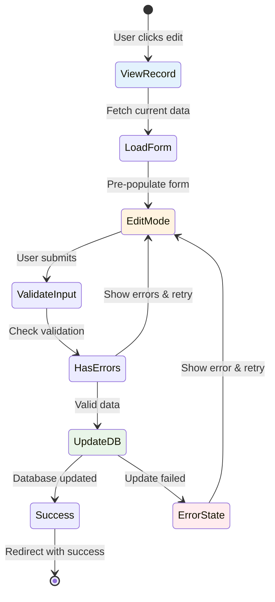
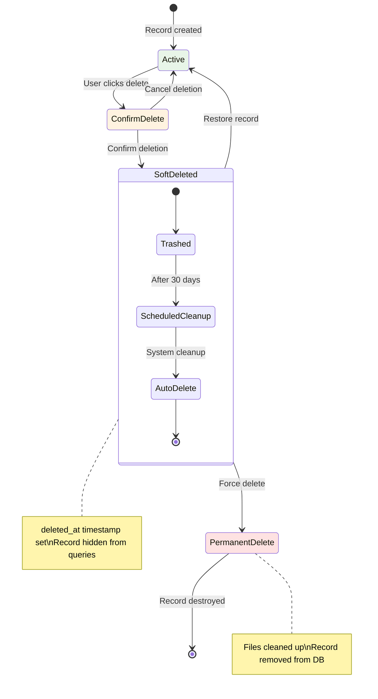
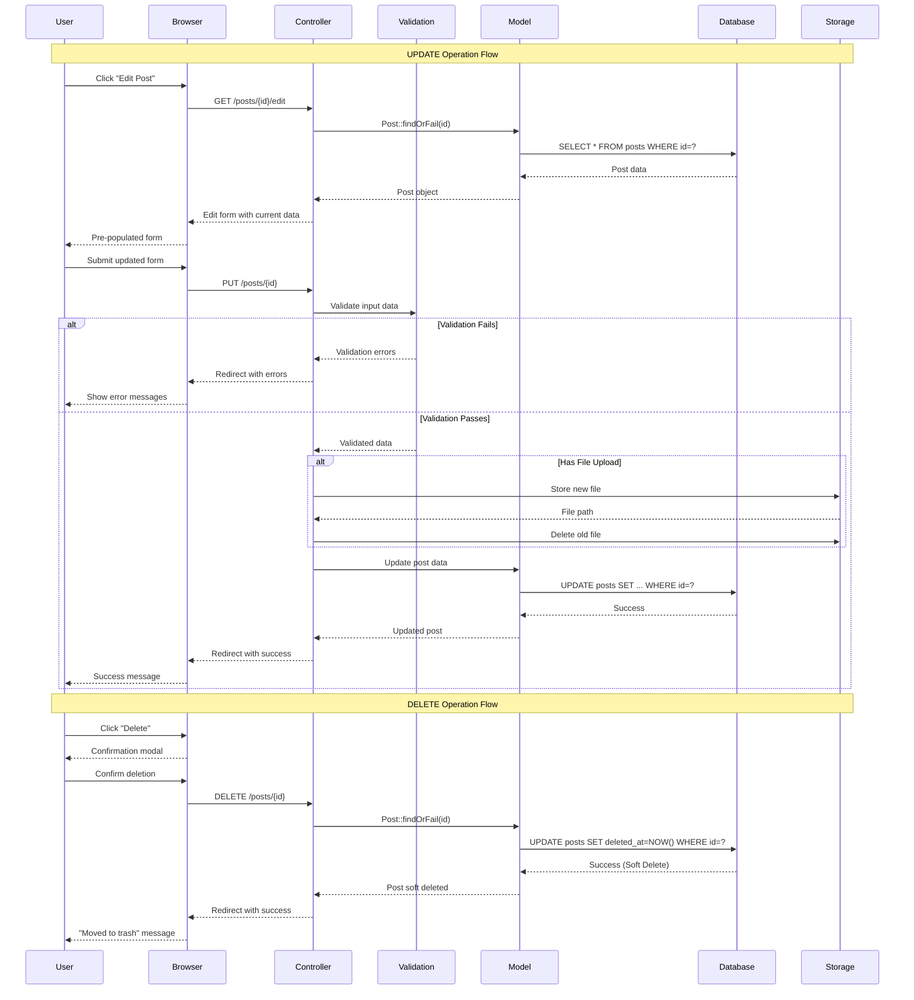

<style>
.scrollable-code {
  max-height: 400px;
  overflow-y: auto;
  font-size: 12px;
}

.compact-code {
  font-size: 11px;
  line-height: 1.2;
}

.large-code {
  font-size: 10px;
  line-height: 1.1;
  max-height: 450px;
  overflow-y: auto;
}

.code-highlight {
  background: linear-gradient(90deg, #fef3c7, #fde68a);
  border-left: 4px solid #f59e0b;
  padding: 1rem;
  border-radius: 0.5rem;
}

.interactive-demo {
  border: 2px dashed #3b82f6;
  border-radius: 8px;
  padding: 1rem;
  background: linear-gradient(45deg, #eff6ff, #dbeafe);
}

.danger-zone {
  border: 2px dashed #ef4444;
  border-radius: 8px;
  padding: 1rem;
  background: linear-gradient(45deg, #fef2f2, #fee2e2);
}
</style>

# CRUD Operations
## Update & Delete Operations

<div class="pt-12">
  <span @click="$slidev.nav.next" class="px-2 py-1 rounded cursor-pointer" hover="bg-white bg-opacity-10">
    Cloud Computing Week 5 <carbon:arrow-right class="inline"></carbon:arrow-right>
  </span>
</div>

<div class="abs-br m-6 flex gap-2">
  <button @click="$slidev.nav.openInEditor()" title="Open in Editor" class="text-xl slidev-icon-btn opacity-50 !border-none !hover:text-white">
    <carbon:edit></carbon:edit>
  </button>
  <a href="https://github.com/slidevjs/slidev" target="_blank" alt="GitHub" title="Open in GitHub"
    class="text-xl slidev-icon-btn opacity-50 !border-none !hover:text-white">
    <carbon-logo-github></carbon-logo-github>
  </a>
</div>

<!--
Selamat datang di pertemuan kelima Cloud Computing.
Hari ini kita akan melengkapi CRUD operations dengan UPDATE dan DELETE functionality.
-->

---
layout: default
---

# Learning Objectives
## *Tujuan Pembelajaran Hari Ini*

<div class="grid grid-cols-1 gap-4 pt-4">

<v-click>

### ✏️ <span v-mark.circle.red="1">**Edit Functionality**</span>
<v-motion
  :initial="{ x: -50, opacity: 0 }"
  :enter="{ x: 0, opacity: 1 }"
  :duration="600">
Membangun sistem editing yang intuitive dengan pre-populated forms
</v-motion>

</v-click>

<v-click>

### 🗑️ <span v-mark.highlight.yellow="2">**Delete Operations**</span>
<v-motion
  :initial="{ x: 50, opacity: 0 }"
  :enter="{ x: 0, opacity: 1 }"
  :duration="600"
  :delay="200">
Implementasi deletion yang aman dengan confirmation dan soft deletes
</v-motion>

</v-click>

<v-click>

### ✅ <span v-mark.underline.blue="3">**Data Validation**</span>
<v-motion
  :initial="{ y: 30, opacity: 0 }"
  :enter="{ y: 0, opacity: 1 }"
  :duration="600"
  :delay="400">
Advanced validation untuk update operations dan data integrity
</v-motion>

</v-click>

<v-click>

### ⚠️ <span v-mark.strikethrough.green="4">**Error Handling**</span>
<v-motion
  :initial="{ scale: 0.8, opacity: 0 }"
  :enter="{ scale: 1, opacity: 1 }"
  :duration="600"
  :delay="600">
Robust error handling dengan user-friendly feedback dan recovery
</v-motion>

</v-click>

</div>

<v-click>

<div class="absolute bottom-4 right-4">
  <v-motion
    :initial="{ rotate: 0, scale: 0 }"
    :enter="{ rotate: 360, scale: 1 }"
    :duration="800"
    :delay="800">
    <div class="flex items-center gap-2 bg-orange-50 px-4 py-2 rounded-lg shadow-lg">
      <carbon:task class="text-orange-600"></carbon:task>
      <span class="text-sm text-orange-800 font-semibold">Complete CRUD</span>
    </div>
  </v-motion>
</div>

</v-click>

<!--
Hari ini kita akan melengkapi CRUD operations dengan UPDATE dan DELETE.
Focus pada safety, validation, dan user experience yang excellent.
-->

---
layout: center
class: text-center
---

# CRUD Operations Recap
## *Complete Data Management*

<v-click>

<div class="grid grid-cols-4 gap-6 pt-8">
  
  <v-motion
    :initial="{ y: 50, opacity: 0, scale: 0.8 }"
    :enter="{ y: 0, opacity: 1, scale: 1 }"
    :duration="600">
  <div class="text-center cursor-pointer transition-all hover:scale-110">
    <div class="text-4xl mb-4 text-blue-600 opacity-50">📝</div>
    <h3 class="text-lg font-bold mb-2 opacity-50">CREATE</h3>
    <p class="text-sm text-gray-500">✅ Completed</p>
  </div>
  </v-motion>
  
  <v-motion
    :initial="{ y: 50, opacity: 0, scale: 0.8 }"
    :enter="{ y: 0, opacity: 1, scale: 1 }"
    :duration="600"
    :delay="200">
  <div class="text-center cursor-pointer transition-all hover:scale-110">
    <div class="text-4xl mb-4 text-green-600 opacity-50">👁️</div>
    <h3 class="text-lg font-bold mb-2 opacity-50">READ</h3>
    <p class="text-sm text-gray-500">✅ Completed</p>
  </div>
  </v-motion>
  
  <v-motion
    :initial="{ y: 50, opacity: 0, scale: 0.8 }"
    :enter="{ y: 0, opacity: 1, scale: 1 }"
    :duration="600"
    :delay="400">
  <div class="text-center cursor-pointer transition-all hover:scale-110 hover:shadow-lg">
    <div class="text-4xl mb-4 text-orange-600">✏️</div>
    <h3 class="text-lg font-bold mb-2"><span v-mark.highlight.orange="2">UPDATE</span></h3>
    <p class="text-sm text-orange-600 font-semibold">🎯 Today's Focus</p>
  </div>
  </v-motion>
  
  <v-motion
    :initial="{ y: 50, opacity: 0, scale: 0.8 }"
    :enter="{ y: 0, opacity: 1, scale: 1 }"
    :duration="600"
    :delay="600">
  <div class="text-center cursor-pointer transition-all hover:scale-110 hover:shadow-lg">
    <div class="text-4xl mb-4 text-red-600">🗑️</div>
    <h3 class="text-lg font-bold mb-2"><span v-mark.highlight.red="3">DELETE</span></h3>
    <p class="text-sm text-red-600 font-semibold">🎯 Today's Focus</p>
  </div>
  </v-motion>
  
</div>

</v-click>

<v-click>

<v-motion
  :initial="{ scale: 0, opacity: 0 }"
  :enter="{ scale: 1, opacity: 1 }"
  :duration="800"
  :delay="1000">
<div class="mt-8 text-xl text-gray-700">
  Completing the <span v-mark.circle.purple="4">**CRUD Circle**</span> 🔄
</div>
</v-motion>

</v-click>

<!--
Kita sudah menguasai CREATE dan READ minggu lalu.
Hari ini focus pada UPDATE dan DELETE untuk melengkapi CRUD operations.
-->

---
layout: two-cols
---

# Update Operations Workflow
## *Understanding Update Lifecycle*
<v-click>

### <span v-mark.circle.orange="1">**Update Process Steps**</span>
<v-motion
  :initial="{ x: -30, opacity: 0 }"
  :enter="{ x: 0, opacity: 1 }"
  :duration="500">

1. **Fetch Current Data** - Retrieve existing record
2. **Pre-populate Form** - Show current values
3. **User Edits** - Make changes
4. **Validate Input** - Check new data
5. **Update Database** - Save changes
6. **Confirm Success** - User feedback

</v-motion>

</v-click>

<v-click>

### <span v-mark.highlight.blue="2">**Key Considerations**</span>
<v-motion
  :initial="{ x: -30, opacity: 0 }"
  :enter="{ x: 0, opacity: 1 }"
  :duration="500"
  :delay="300">

- **Authorization** - User owns data?
- **Validation** - Unique constraints
- **File Handling** - Replace vs keep
- **Error Recovery** - Handle failures

</v-motion>

</v-click>

::right::

<v-click>

<div class="text-center">
<v-motion
  :initial="{ x: 50, opacity: 0, rotate: 10 }"
  :enter="{ x: 0, opacity: 1, rotate: 0 }"
  :duration="800"
  :delay="600">

<div style="transform: scale(0.8); transform-origin: center;">



</div>

</v-motion>
</div>

</v-click>

<!--
Update operations workflow yang comprehensive dengan state management.
Setiap step punya considerations dan error handling yang spesifik.
-->

---
layout: center
---

# Update Operations
## *Editing Existing Data*

<v-click>

<div class="grid grid-cols-3 gap-8 pt-8">
  
  <v-motion
    :initial="{ rotateX: -90, opacity: 0 }"
    :enter="{ rotateX: 0, opacity: 1 }"
    :duration="800">
  <div class="text-center p-6 bg-blue-50 rounded-xl hover:shadow-lg transition-all cursor-pointer hover:scale-105">
    <div class="text-5xl mb-4">📋</div>
    <h3 class="text-xl font-bold mb-2"><span v-mark.highlight.blue="1">Pre-populate Forms</span></h3>
    <p class="text-gray-600">Display current data for editing</p>
  </div>
  </v-motion>
  
  <v-motion
    :initial="{ rotateX: -90, opacity: 0 }"
    :enter="{ rotateX: 0, opacity: 1 }"
    :duration="800"
    :delay="300">
  <div class="text-center p-6 bg-green-50 rounded-xl hover:shadow-lg transition-all cursor-pointer hover:scale-105">
    <div class="text-5xl mb-4">✅</div>
    <h3 class="text-xl font-bold mb-2"><span v-mark.highlight.green="2">Validation</span></h3>
    <p class="text-gray-600">Ensure data integrity during updates</p>
  </div>
  </v-motion>
  
  <v-motion
    :initial="{ rotateX: -90, opacity: 0 }"
    :enter="{ rotateX: 0, opacity: 1 }"
    :duration="800"
    :delay="600">
  <div class="text-center p-6 bg-orange-50 rounded-xl hover:shadow-lg transition-all cursor-pointer hover:scale-105">
    <div class="text-5xl mb-4">💾</div>
    <h3 class="text-xl font-bold mb-2"><span v-mark.highlight.orange="3">Update Storage</span></h3>
    <p class="text-gray-600">Safely persist changes to database</p>
  </div>
  </v-motion>
  
</div>

</v-click>

<!--
Update operations melibatkan tiga komponen utama untuk editing experience yang smooth.
-->

---
layout: default
---

# Update Controller Implementation
## *Backend Update Logic Evolution*

<div class="large-code">

````md magic-move {lines: true, at: 1}
```php {1-15|5-8|10-13|all}
<?php
// Basic Update Methods
class PostController extends Controller
{
    public function edit($id)
    {
        $post = Post::findOrFail($id);
        return view('posts.edit', compact('post'));
    }
    
    public function update(Request $request, $id)
    {
        $post = Post::findOrFail($id);
        $post->update($request->all());
        
        return redirect('/posts');
    }
}
```

```php {1-25|5-10|12-22|all}
<?php
// Update with Validation & Categories
class PostController extends Controller
{
    public function edit($id)
    {
        $post = Post::findOrFail($id);
        $categories = Category::all();
        
        return view('posts.edit', compact('post', 'categories'));
    }
    
    public function update(Request $request, $id)
    {
        $post = Post::findOrFail($id);
        
        $validated = $request->validate([
            'title' => 'required|min:5|max:255',
            'content' => 'required|min:10',
            'category_id' => 'required|exists:categories,id'
        ]);
        
        $post->update($validated);
        
        return redirect('/posts')->with('success', 'Post updated!');
    }
}
```

```php {1-45|5-11|13-25|27-35|37-43|all}
<?php
// Advanced with Authorization, Files & Error Handling
class PostController extends Controller
{
    public function edit($id)
    {
        $post = Post::findOrFail($id);
        $this->authorize('update', $post);
        
        return view('posts.edit', [
            'post' => $post,
            'categories' => Category::select('id', 'name')->get()
        ]);
    }
    
    public function update(Request $request, $id)
    {
        $post = Post::findOrFail($id);
        $this->authorize('update', $post);
        
        $validated = $request->validate([
            'title' => 'required|min:5|max:255|unique:posts,title,' . $id,
            'content' => 'required|min:10',
            'category_id' => 'required|exists:categories,id',
            'featured_image' => 'nullable|image|max:2048',
            'status' => 'required|in:draft,published'
        ]);
        
        DB::beginTransaction();
        try {
            // Handle file replacement
            if ($request->hasFile('featured_image')) {
                if ($post->featured_image) {
                    Storage::delete('public/' . $post->featured_image);
                }
                $validated['featured_image'] = $request->file('featured_image')
                    ->store('posts', 'public');
            }
            
            $post->update($validated);
            DB::commit();
            
            return redirect()
                ->route('posts.show', $post)
                ->with('success', 'Post updated successfully!');
                
        } catch (Exception $e) {
            DB::rollBack();
            Log::error('Post update failed', [
                'post_id' => $id,
                'user_id' => auth()->id(),
                'error' => $e->getMessage()
            ]);
            
            return back()
                ->withInput()
                ->with('error', 'Failed to update post. Please try again.');
        }
    }
}
```
````

</div>

<v-clicks>

<div class="absolute bottom-4 left-4 flex gap-2">
  <div class="bg-orange-100 text-orange-800 px-3 py-2 rounded text-sm font-semibold shadow-md">
    <carbon:warning class="inline mr-1"></carbon:warning> 
    Always authorize first!
  </div>
  <div class="bg-blue-100 text-blue-800 px-3 py-2 rounded text-sm font-semibold shadow-md">
    <carbon:data-base class="inline mr-1"></carbon:data-base> 
    Use transactions!
  </div>
</div>

</v-clicks>

<!--
Update controller development dengan progressive complexity.
Authorization, validation, file handling, dan error recovery adalah essential.
-->

---
layout: two-cols
class: gap-4
---

# Edit Form Implementation
## *Pre-populated User Interface*

<div class="scrollable-code">

````md magic-move {lines: true, at: 1}
```html {1-8|2-3|5-6|all}
<!-- Basic Edit Form -->
<form method="POST" action="/posts/{{ $post->id }}">
    @method('PUT')
    @csrf
    
    <input type="text" name="title" value="{{ $post->title }}" required>
    <textarea name="content" required>{{ $post->content }}</textarea>
    
    <button type="submit">Update Post</button>
</form>
```

```html {1-22|5-8|10-17|19-21|all}
<!-- Enhanced with Validation & Error Display -->
<form method="POST" action="/posts/{{ $post->id }}">
    @method('PUT')
    @csrf
    
    <div class="form-group">
        <label for="title">Title</label>
        <input type="text" name="title" 
               value="{{ old('title', $post->title) }}"
               class="form-control @error('title') is-invalid @enderror" required>
        @error('title')
            <div class="invalid-feedback">{{ $message }}</div>
        @enderror
    </div>
    
    <div class="form-group">
        <label for="category_id">Category</label>
        <select name="category_id" class="form-control" required>
            @foreach($categories as $category)
                <option value="{{ $category->id }}" 
                        {{ old('category_id', $post->category_id) == $category->id ? 'selected' : '' }}>
                    {{ $category->name }}
                </option>
            @endforeach
        </select>
    </div>
    
    <div class="form-group">
        <label for="content">Content</label>
        <textarea name="content" class="form-control" rows="6" required>{{ old('content', $post->content) }}</textarea>
    </div>
    
    <button type="submit" class="btn btn-primary">Update Post</button>
    <a href="/posts/{{ $post->id }}" class="btn btn-secondary">Cancel</a>
</form>
```

```html {1-60|8-15|17-25|27-35|37-45|47-55|all}
<!-- Complete with Image Update & Real-time Validation -->
<form method="POST" action="/posts/{{ $post->id }}" 
      enctype="multipart/form-data" 
      class="space-y-6 p-6 bg-white rounded-lg shadow-lg"
      x-data="editForm()">
    @method('PUT')
    @csrf
    
    <!-- Title with Character Counter -->
    <div class="form-group">
        <label for="title" class="block text-sm font-medium text-gray-700">Title</label>
        <input type="text" name="title" 
               value="{{ old('title', $post->title) }}"
               class="w-full px-3 py-2 border rounded-md focus:ring-2 focus:ring-blue-500 @error('title') border-red-500 @enderror"
               x-model="form.title"
               maxlength="255" required>
        <div class="flex justify-between mt-1">
            @error('title')
                <span class="text-red-500 text-sm">{{ $message }}</span>
            @else
                <span class="text-gray-500 text-sm">Enter a descriptive title</span>
            @enderror
            <span class="text-sm text-gray-400" x-text="255 - form.title.length + ' characters remaining'"></span>
        </div>
    </div>
    
    <!-- Category Selection -->
    <div class="form-group">
        <label for="category_id" class="block text-sm font-medium text-gray-700">Category</label>
        <select name="category_id" class="w-full px-3 py-2 border rounded-md focus:ring-2 focus:ring-blue-500" required>
            <option value="">Select Category</option>
            @foreach($categories as $category)
                <option value="{{ $category->id }}" 
                        {{ old('category_id', $post->category_id) == $category->id ? 'selected' : '' }}>
                    {{ $category->name }}
                </option>
            @endforeach
        </select>
        @error('category_id')
            <span class="text-red-500 text-sm mt-1">{{ $message }}</span>
        @enderror
    </div>
    
    <!-- Current Image Display & New Upload -->
    <div class="form-group">
        <label class="block text-sm font-medium text-gray-700 mb-2">Featured Image</label>
        
        @if($post->featured_image)
            <div class="current-image mb-4 p-4 bg-gray-50 rounded-lg">
                featured_image) }}" 
                     alt="Current image" 
                     class="max-w-xs h-auto rounded shadow-md">
                <p class="text-sm text-gray-600 mt-2">Current image</p>
                <div class="mt-2">
                    <label class="inline-flex items-center">
                        <input type="checkbox" name="remove_image" value="1" class="form-checkbox">
                        <span class="ml-2 text-sm text-red-600">Remove current image</span>
                    </label>
                </div>
            </div>
        @endif
        
        <input type="file" name="featured_image" accept="image/*" 
               class="block w-full text-sm text-gray-500 file:mr-4 file:py-2 file:px-4 file:rounded-full file:border-0 file:text-sm file:font-semibold file:bg-blue-50 file:text-blue-700 hover:file:bg-blue-100"
               x-on:change="previewImage($event)">
        <div class="mt-2">
            <div id="image-preview" class="hidden">
                
                <p class="text-sm text-gray-600 mt-1">New image preview</p>
            </div>
        </div>
        @error('featured_image')
            <span class="text-red-500 text-sm mt-1">{{ $message }}</span>
        @enderror
        <small class="text-gray-500">Leave empty to keep current image. Max size: 2MB</small>
    </div>
    
    <!-- Content Editor -->
    <div class="form-group">
        <label for="content" class="block text-sm font-medium text-gray-700">Content</label>
        <textarea name="content" rows="8" 
                  class="w-full px-3 py-2 border rounded-md focus:ring-2 focus:ring-blue-500 @error('content') border-red-500 @enderror"
                  x-model="form.content" required>{{ old('content', $post->content) }}</textarea>
        <div class="flex justify-between mt-1">
            @error('content')
                <span class="text-red-500 text-sm">{{ $message }}</span>
            @else
                <span class="text-gray-500 text-sm">Write your post content here</span>
            @enderror
            <span class="text-sm text-gray-400" x-text="form.content.length + ' characters'"></span>
        </div>
    </div>
    
    <!-- Status Selection -->
    <div class="form-group">
        <label class="block text-sm font-medium text-gray-700 mb-2">Status</label>
        <div class="flex gap-4">
            <label class="inline-flex items-center">
                <input type="radio" name="status" value="draft" 
                       {{ old('status', $post->status) == 'draft' ? 'checked' : '' }}
                       class="form-radio text-blue-600">
                <span class="ml-2">Draft</span>
            </label>
            <label class="inline-flex items-center">
                <input type="radio" name="status" value="published" 
                       {{ old('status', $post->status) == 'published' ? 'checked' : '' }}
                       class="form-radio text-blue-600">
                <span class="ml-2">Published</span>
            </label>
        </div>
    </div>
    
    <!-- Action Buttons -->
    <div class="flex gap-3 pt-4">
        <button type="submit" 
                class="bg-blue-600 text-white px-6 py-2 rounded-md hover:bg-blue-700 focus:ring-2 focus:ring-blue-500 disabled:opacity-50"
                x-bind:disabled="!isFormValid()"
                x-text="isFormValid() ? 'Update Post' : 'Please fill all fields'">
            Update Post
        </button>
        <a href="{{ route('posts.show', $post) }}" 
           class="bg-gray-300 text-gray-700 px-6 py-2 rounded-md hover:bg-gray-400">
            Cancel
        </a>
        <button type="button" 
                class="bg-red-600 text-white px-4 py-2 rounded-md hover:bg-red-700"
                onclick="resetForm()">
            Reset
        </button>
    </div>
</form>

<script>
function editForm() {
    return {
        form: {
            title: '{{ old('title', $post->title) }}',
            content: '{{ old('content', $post->content) }}'
        },
        
        isFormValid() {
            return this.form.title.length >= 5 && this.form.content.length >= 10;
        },
        
        previewImage(event) {
            const file = event.target.files[0];
            if (file) {
                const reader = new FileReader();
                reader.onload = function(e) {
                    const preview = document.getElementById('image-preview');
                    const img = preview.querySelector('img');
                    img.src = e.target.result;
                    preview.classList.remove('hidden');
                };
                reader.readAsDataURL(file);
            }
        }
    }
}

function resetForm() {
    if (confirm('Reset form to original values?')) {
        location.reload();
    }
}
</script>
```
````

</div>

::right::

<v-click>

<div class="interactive-demo space-y-4">
  <h4 class="font-bold">🎨 Advanced Form Features:</h4>
  
  <v-clicks>
  
  - **Smart Pre-population** dengan `old()` helper
  - **Real-time Validation** dengan Alpine.js
  - **Image Preview** untuk better UX
  - **Character Counters** untuk limits
  - **Status Management** dengan radio buttons
  - **Form Reset** functionality
  - **Conditional Validation** feedback
  
  </v-clicks>
</div>

</v-click>

<v-click>

<v-motion
  :initial="{ y: 20, opacity: 0 }"
  :enter="{ y: 0, opacity: 1 }"
  :duration="500"
  :delay="1500">

<div class="code-highlight mt-4">
  <strong>💡 Pro Tip:</strong> Kombinasikan server-side validation dengan client-side enhancements untuk UX terbaik!
</div>

</v-motion>

</v-click>

<!--
Edit form development dengan advanced features dan real-time validation.
Pre-population, error handling, dan interactive elements untuk user experience yang excellent.
-->

---
layout: two-cols
---

# Update Validation Strategies
## *Advanced Data Integrity*

<v-click>

### <span v-mark.circle.red="1">**Unique Field Updates**</span>
<v-motion
  :initial="{ x: -20, opacity: 0 }"
  :enter="{ x: 0, opacity: 1 }"
  :duration="500">

```php
// Exclude current record from unique check
'email' => 'required|email|unique:users,email,' . $id

// Using Rule class for more control
'slug' => Rule::unique('posts')->ignore($post->id)
```

</v-motion>

</v-click>

<v-click>

### <span v-mark.highlight.blue="2">**Conditional Validation**</span>
<v-motion
  :initial="{ x: -20, opacity: 0 }"
  :enter="{ x: 0, opacity: 1 }"
  :duration="500"
  :delay="300">

```php
'password' => 'nullable|min:8|confirmed',
'new_password' => 'required_with:current_password|min:8',
'featured_image' => 'nullable|image|max:2048'
```

</v-motion>

</v-click>

<v-click>

### <span v-mark.underline.green="3">**File Update Logic**</span>
<v-motion
  :initial="{ x: -20, opacity: 0 }"
  :enter="{ x: 0, opacity: 1 }"
  :duration="500"
  :delay="600">

```php
// Smart file replacement
if ($request->hasFile('image')) {
    // Delete old, store new
} elseif ($request->remove_image) {
    // Remove existing file
}
```

</v-motion>

</v-click>

::right::

<v-click>

<v-motion
  :initial="{ y: 30, opacity: 0, scale: 0.9 }"
  :enter="{ y: 0, opacity: 1, scale: 1 }"
  :duration="700"
  :delay="900">

<div class="compact-code">

```php
<?php
// Advanced Update Request Validation
class UpdatePostRequest extends FormRequest
{
    public function authorize()
    {
        $post = $this->route('post');
        return $this->user()->can('update', $post);
    }
    
    public function rules()
    {
        $postId = $this->route('post')->id;
        
        return [
            'title' => [
                'required',
                'string',
                'min:5',
                'max:255',
                Rule::unique('posts')->ignore($postId)
            ],
            'content' => 'required|string|min:10',
            'category_id' => 'required|exists:categories,id',
            'featured_image' => 'nullable|image|mimes:jpeg,png,jpg,webp|max:2048',
            'status' => 'required|in:draft,published',
            'remove_image' => 'nullable|boolean',
            'tags' => 'nullable|array|max:5',
            'tags.*' => 'string|max:50|exists:tags,name'
        ];
    }
    
    public function messages()
    {
        return [
            'title.unique' => 'A post with this title already exists.',
            'title.min' => 'Title must be at least 5 characters.',
            'featured_image.max' => 'Image must be less than 2MB.',
            'featured_image.mimes' => 'Only JPEG, PNG, JPG & WebP images allowed.',
            'tags.max' => 'Maximum 5 tags allowed.',
            'content.min' => 'Content must be at least 10 characters.'
        ];
    }
    
    public function withValidator($validator)
    {
        $validator->after(function ($validator) {
            if ($this->remove_image && $this->hasFile('featured_image')) {
                $validator->errors()->add(
                    'featured_image',
                    'Cannot remove and upload image simultaneously.'
                );
            }
        });
    }
    
    protected function prepareForValidation()
    {
        // Clean and prepare data
        $this->merge([
            'slug' => Str::slug($this->title),
            'remove_image' => $this->boolean('remove_image'),
        ]);
    }
}

// Usage in Controller
public function update(UpdatePostRequest $request, Post $post)
{
    $validated = $request->validated();
    
    // Handle image logic
    if ($request->remove_image && $post->featured_image) {
        Storage::delete('public/' . $post->featured_image);
        $validated['featured_image'] = null;
    } elseif ($request->hasFile('featured_image')) {
        if ($post->featured_image) {
            Storage::delete('public/' . $post->featured_image);
        }
        $validated['featured_image'] = $request
            ->file('featured_image')
            ->store('posts', 'public');
    }
    
    $post->update($validated);
    
    return redirect()
        ->route('posts.show', $post)
        ->with('success', 'Post updated successfully!');
}
```

</div>

</v-motion>

</v-click>

<!--
Advanced validation techniques dengan custom rules dan conditional logic.
Form Request classes untuk clean separation of concerns dan reusability.
-->

---
layout: center
---

# Delete Operations
## *Safe Data Removal Strategies*

<v-click>

<div class="grid grid-cols-3 gap-8 pt-8">
  
  <v-motion
    :initial="{ scale: 0, rotate: -10 }"
    :enter="{ scale: 1, rotate: 0 }"
    :duration="800">
  <div class="text-center p-8 bg-red-50 rounded-xl hover:shadow-lg transition-all cursor-pointer">
    <div class="text-5xl mb-4">⚠️</div>
    <h3 class="text-xl font-bold mb-2"><span v-mark.highlight.red="1">Confirmation</span></h3>
    <p class="text-gray-600">User confirmation before deletion</p>
  </div>
  </v-motion>
  
  <v-motion
    :initial="{ scale: 0, rotate: 10 }"
    :enter="{ scale: 1, rotate: 0 }"
    :duration="800"
    :delay="300">
  <div class="text-center p-8 bg-orange-50 rounded-xl hover:shadow-lg transition-all cursor-pointer">
    <div class="text-5xl mb-4">🗑️</div>
    <h3 class="text-xl font-bold mb-2"><span v-mark.highlight.orange="2">Soft Deletes</span></h3>
    <p class="text-gray-600">Recoverable deletion strategy</p>
  </div>
  </v-motion>
  
  <v-motion
    :initial="{ scale: 0, rotate: -5 }"
    :enter="{ scale: 1, rotate: 0 }"
    :duration="800"
    :delay="600">
  <div class="text-center p-8 bg-blue-50 rounded-xl hover:shadow-lg transition-all cursor-pointer">
    <div class="text-5xl mb-4">🔗</div>
    <h3 class="text-xl font-bold mb-2"><span v-mark.highlight.blue="3">Cascade Handling</span></h3>
    <p class="text-gray-600">Related data management</p>
  </div>
  </v-motion>
  
</div>

</v-click>

<!--
Delete operations memerlukan special consideration untuk safety dan data integrity.
Three main strategies untuk safe deletion.
-->

---
layout: two-cols
---

# Delete Lifecycle Workflow
## *Understanding Deletion Process*

<v-click>

### <span v-mark.circle.red="1">**Soft Delete Benefits**</span>
<v-motion
  :initial="{ x: -30, opacity: 0 }"
  :enter="{ x: 0, opacity: 1 }"
  :duration="500">

- **Data Recovery** - Restore accidentally deleted items
- **Audit Trail** - Keep deletion history
- **Related Data** - Maintain referential integrity
- **User Experience** - Undo functionality

</v-motion>

</v-click>

<v-click>

### <span v-mark.highlight.orange="2">**Implementation Steps**</span>
<v-motion
  :initial="{ x: -30, opacity: 0 }"
  :enter="{ x: 0, opacity: 1 }"
  :duration="500"
  :delay="300">

1. **Add `deleted_at` column** to migration
2. **Use `SoftDeletes` trait** in model
3. **Handle UI states** (active/trashed)
4. **Provide restore** functionality

</v-motion>

</v-click>

::right::

<v-click>

<div class="flex justify-center items-center h-full">
<v-motion
  :initial="{ x: 50, opacity: 0, scale: 0.9 }"
  :enter="{ x: 0, opacity: 1, scale: 1 }"
  :duration="800"
  :delay="600">

<div style="transform: scale(0.85); transform-origin: center;">



</div>

</v-motion>
</div>

</v-click>

<!--
Soft delete lifecycle yang comprehensive dengan state management.
Recovery options dan automatic cleanup untuk data management yang optimal.
-->

---
layout: default
---

# Delete Controller Implementation
## *Progressive Safety Measures*

<div class="large-code">

````md magic-move {lines: true, at: 1}
```php {1-12|5-9|all}
<?php
// Basic Delete (Not Recommended!)
class PostController extends Controller
{
    public function destroy($id)
    {
        $post = Post::findOrFail($id);
        $post->delete();
        
        return redirect('/posts')
               ->with('success', 'Post deleted!');
    }
}
```

```php {1-25|5-12|14-23|all}
<?php
// Delete with Authorization & File Cleanup
class PostController extends Controller
{
    public function destroy($id)
    {
        $post = Post::findOrFail($id);
        $this->authorize('delete', $post);
        
        // Delete associated files
        if ($post->featured_image) {
            Storage::delete('public/' . $post->featured_image);
        }
        
        $post->delete();
        
        return redirect('/posts')->with('success', 'Post deleted!');
    }
}
```

```php {1-65|5-9|11-19|21-33|35-47|49-63|all}
<?php
// Complete Soft Delete with Recovery Options
class PostController extends Controller
{
    public function destroy(Post $post)
    {
        $this->authorize('delete', $post);
        
        $post->delete(); // Soft delete
        
        return redirect('/posts')
               ->with('success', 'Post moved to trash! You can restore it within 30 days.');
    }
    
    public function forceDestroy($id)
    {
        $post = Post::withTrashed()->findOrFail($id);
        $this->authorize('forceDelete', $post);
        
        DB::beginTransaction();
        try {
            // Clean up associated files
            if ($post->featured_image) {
                Storage::delete('public/' . $post->featured_image);
            }
            
            // Clean up related data
            $post->comments()->forceDelete();
            $post->likes()->delete();
            $post->tags()->detach();
            
            // Permanently delete the post
            $post->forceDelete();
            
            DB::commit();
            
            return redirect('/posts/trash')
                   ->with('success', 'Post deleted permanently!');
                   
        } catch (Exception $e) {
            DB::rollBack();
            Log::error('Force delete failed', [
                'post_id' => $id,
                'error' => $e->getMessage()
            ]);
            
            return back()->with('error', 'Failed to delete post permanently.');
        }
    }
    
    public function restore($id)
    {
        $post = Post::withTrashed()->findOrFail($id);
        $this->authorize('restore', $post);
        
        $post->restore();
        
        return redirect('/posts')
               ->with('success', 'Post restored successfully!');
    }
    
    public function trash(Request $request)
    {
        $posts = Post::onlyTrashed()
            ->with(['user:id,name', 'category:id,name'])
            ->when($request->search, fn($q, $search) => $q->search($search))
            ->latest('deleted_at')
            ->paginate(10);
            
        return view('posts.trash', compact('posts'));
    }
    
    public function bulkRestore(Request $request)
    {
        $postIds = $request->input('selected', []);
        
        Post::withTrashed()
            ->whereIn('id', $postIds)
            ->restore();
            
        return back()->with('success', count($postIds) . ' posts restored!');
    }
    
    public function emptyTrash()
    {
        $this->authorize('emptyTrash', Post::class);
        
        $trashedPosts = Post::onlyTrashed()->get();
        
        foreach ($trashedPosts as $post) {
            if ($post->featured_image) {
                Storage::delete('public/' . $post->featured_image);
            }
        }
        
        Post::onlyTrashed()->forceDelete();
        
        return back()->with('success', 'Trash emptied successfully!');
    }
}
```
````

</div>

<v-clicks>

<div class="absolute bottom-4 right-4 flex gap-2">
  <div class="bg-red-100 text-red-800 px-3 py-2 rounded text-sm font-semibold shadow-md">
    <carbon:trash-can class="inline mr-1"></carbon:trash-can> 
    Soft deletes recommended!
  </div>
  <div class="bg-orange-100 text-orange-800 px-3 py-2 rounded text-sm font-semibold shadow-md">
    <carbon:undo class="inline mr-1"></carbon:undo> 
    Recovery options!
  </div>
</div>

</v-clicks>

<!--
Delete controller development dengan comprehensive safety measures.
Soft deletes, recovery options, dan bulk operations untuk complete deletion management.
-->

---
layout: two-cols
---

# Soft Deletes Setup
## *Model & Migration Configuration*

<v-click>

### <span v-mark.circle.blue="1">**Migration Setup**</span>
<v-motion
  :initial="{ x: -20, opacity: 0 }"
  :enter="{ x: 0, opacity: 1 }"
  :duration="500">

```php
// In migration file
public function up()
{
    Schema::table('posts', function (Blueprint $table) {
        $table->softDeletes(); // Adds deleted_at
        // Or manually: $table->timestamp('deleted_at')->nullable();
    });
}
```

</v-motion>

</v-click>

<v-click>

### <span v-mark.highlight.green="2">**Model Configuration**</span>
<v-motion
  :initial="{ x: -20, opacity: 0 }"
  :enter="{ x: 0, opacity: 1 }"
  :duration="500"
  :delay="300">

```php
use Illuminate\Database\Eloquent\SoftDeletes;

class Post extends Model
{
    use SoftDeletes;
    
    protected $dates = ['deleted_at'];
    
    // Query scopes work automatically
}
```

</v-motion>

</v-click>

<v-click>

### <span v-mark.underline.orange="3">**Query Examples**</span>
<v-motion
  :initial="{ x: -20, opacity: 0 }"
  :enter="{ x: 0, opacity: 1 }"
  :duration="500"
  :delay="600">

```php
// Include soft deleted
Post::withTrashed()->get();

// Only soft deleted  
Post::onlyTrashed()->get();

// Restore specific record
$post->restore();
```

</v-motion>

</v-click>

::right::

<v-click>

<v-motion
  :initial="{ y: 30, opacity: 0 }"
  :enter="{ y: 0, opacity: 1 }"
  :duration="600"
  :delay="900">

<div class="compact-code">

```php
<?php
// Complete Soft Delete Model Implementation
class Post extends Model
{
    use SoftDeletes;
    
    protected $fillable = [
        'title', 'content', 'user_id', 'category_id', 
        'featured_image', 'status'
    ];
    
    protected $dates = ['deleted_at'];
    
    // Relationships still work with soft deletes
    public function user()
    {
        return $this->belongsTo(User::class);
    }
    
    public function category()
    {
        return $this->belongsTo(Category::class);
    }
    
    public function comments()
    {
        return $this->hasMany(Comment::class);
    }
    
    // Custom scopes for trash management
    public function scopeTrash($query)
    {
        return $query->onlyTrashed();
    }
    
    public function scopeRecentlyDeleted($query, $days = 7)
    {
        return $query->onlyTrashed()
                    ->where('deleted_at', '>=', now()->subDays($days));
    }
    
    // Model events for cleanup automation
    protected static function boot()
    {
        parent::boot();
        
        // Before soft delete
        static::deleting(function ($post) {
            // Soft delete related comments
            $post->comments()->delete();
        });
        
        // Before permanent delete
        static::forceDeleting(function ($post) {
            // Clean up files permanently
            if ($post->featured_image) {
                Storage::delete('public/' . $post->featured_image);
            }
            
            // Force delete comments
            $post->comments()->forceDelete();
            
            // Detach relationships
            $post->tags()->detach();
        });
        
        // After restore
        static::restored(function ($post) {
            // Restore related comments
            $post->comments()->restore();
        });
    }
    
    // Helper methods
    public function isTrashed()
    {
        return $this->trashed();
    }
    
    public function daysSinceDeleted()
    {
        return $this->deleted_at 
            ? $this->deleted_at->diffInDays(now()) 
            : null;
    }
    
    public function canBeRestored()
    {
        return $this->trashed() && $this->daysSinceDeleted() <= 30;
    }
}
```

</div>

</v-motion>

</v-click>

<!--
Complete soft delete implementation dengan model events dan helper methods.
Automatic cleanup dan relationship management untuk data integrity.
-->

---
layout: default
---

# Delete Confirmation UI
## *User-Friendly Safety Interface*

<div class="scrollable-code">

````md magic-move {lines: true, at: 1}
```html {1-10|7|all}
<!-- Basic Delete Button (Not Recommended) -->
<form method="POST" action="/posts/{{ $post->id }}" style="display: inline;">
    @method('DELETE')
    @csrf
    <button type="submit" class="btn btn-danger" 
            onclick="return confirm('Are you sure?')">
        Delete
    </button>
</form>
```

```html {1-30|3-5|7-26|all}
<!-- Enhanced Delete with Modal Confirmation -->
<button type="button" 
        class="btn btn-danger btn-sm" 
        data-bs-toggle="modal" 
        data-bs-target="#deleteModal{{ $post->id }}">
    <i class="fas fa-trash"></i> Move to Trash
</button>

<!-- Delete Confirmation Modal -->
<div class="modal fade" id="deleteModal{{ $post->id }}" tabindex="-1">
    <div class="modal-dialog">
        <div class="modal-content">
            <div class="modal-header bg-warning">
                <h5 class="modal-title">
                    <i class="fas fa-exclamation-triangle"></i> Confirm Deletion
                </h5>
                <button type="button" class="btn-close" data-bs-dismiss="modal"></button>
            </div>
            <div class="modal-body">
                <p class="mb-3">Are you sure you want to delete <strong>"{{ $post->title }}"</strong>?</p>
                <div class="alert alert-info mb-0">
                    <i class="fas fa-info-circle"></i> 
                    This post will be moved to trash and can be restored within 30 days.
                </div>
            </div>
            <div class="modal-footer">
                <button type="button" class="btn btn-secondary" data-bs-dismiss="modal">Cancel</button>
                <form method="POST" action="/posts/{{ $post->id }}" style="display: inline;">
                    @method('DELETE')
                    @csrf
                    <button type="submit" class="btn btn-warning">
                        <i class="fas fa-trash"></i> Move to Trash
                    </button>
                </form>
            </div>
        </div>
    </div>
</div>
```

```html {1-100|3-15|17-50|52-85|87-98|all}
<!-- Complete with Soft Delete Management -->
<div class="post-actions d-flex gap-2 align-items-center">
    <!-- Edit Button -->
    <a href="{{ route('posts.edit', $post) }}" class="btn btn-outline-primary btn-sm">
        <i class="fas fa-edit"></i> Edit
    </a>
    
    <!-- Conditional Delete/Restore Buttons -->
    @if($post->trashed())
        <!-- Restore Button -->
        <form method="POST" action="{{ route('posts.restore', $post) }}" style="display: inline;">
            @csrf
            <button type="submit" class="btn btn-success btn-sm">
                <i class="fas fa-undo"></i> Restore
            </button>
        </form>
        
        <!-- Permanent Delete Button -->
        <button type="button" 
                class="btn btn-danger btn-sm" 
                data-bs-toggle="modal" 
                data-bs-target="#permanentDeleteModal{{ $post->id }}">
            <i class="fas fa-times"></i> Delete Permanently
        </button>
    @else
        <!-- Move to Trash Button -->
        <button type="button" 
                class="btn btn-outline-warning btn-sm" 
                data-bs-toggle="modal" 
                data-bs-target="#trashModal{{ $post->id }}">
            <i class="fas fa-trash"></i> Move to Trash
        </button>
    @endif
    
    <!-- Post Status Indicator -->
    @if($post->trashed())
        <span class="badge bg-warning">
            <i class="fas fa-trash"></i> 
            Trashed {{ $post->deleted_at->diffForHumans() }}
        </span>
    @endif
</div>

<!-- Move to Trash Modal -->
<div class="modal fade" id="trashModal{{ $post->id }}" tabindex="-1">
    <div class="modal-dialog">
        <div class="modal-content">
            <div class="modal-header bg-warning text-dark">
                <h5 class="modal-title">
                    <i class="fas fa-trash"></i> Move to Trash
                </h5>
                <button type="button" class="btn-close" data-bs-dismiss="modal"></button>
            </div>
            <div class="modal-body">
                <p class="mb-3">Move <strong>"{{ Str::limit($post->title, 50) }}"</strong> to trash?</p>
                
                <div class="alert alert-info">
                    <i class="fas fa-info-circle"></i> 
                    <strong>Don't worry!</strong> You can restore this post from the trash within 30 days.
                </div>
                
                <div class="form-check">
                    <input class="form-check-input" type="checkbox" id="confirmTrash{{ $post->id }}">
                    <label class="form-check-label" for="confirmTrash{{ $post->id }}">
                        I understand this post will be moved to trash
                    </label>
                </div>
            </div>
            <div class="modal-footer">
                <button type="button" class="btn btn-secondary" data-bs-dismiss="modal">Cancel</button>
                <form method="POST" action="{{ route('posts.destroy', $post) }}" style="display: inline;">
                    @method('DELETE')
                    @csrf
                    <button type="submit" 
                            class="btn btn-warning" 
                            id="trashBtn{{ $post->id }}" 
                            disabled>
                        <i class="fas fa-trash"></i> Move to Trash
                    </button>
                </form>
            </div>
        </div>
    </div>
</div>

<!-- Permanent Delete Modal -->
<div class="modal fade" id="permanentDeleteModal{{ $post->id }}" tabindex="-1">
    <div class="modal-dialog">
        <div class="modal-content border-danger">
            <div class="modal-header bg-danger text-white">
                <h5 class="modal-title">
                    <i class="fas fa-exclamation-triangle"></i> Permanent Deletion
                </h5>
                <button type="button" class="btn-close btn-close-white" data-bs-dismiss="modal"></button>
            </div>
            <div class="modal-body">
                <div class="alert alert-danger">
                    <i class="fas fa-exclamation-triangle"></i>
                    <strong>Warning!</strong> This action cannot be undone.
                </div>
                
                <p class="mb-3">Permanently delete <strong>"{{ Str::limit($post->title, 50) }}"</strong>?</p>
                
                <ul class="text-muted small">
                    <li>All associated files will be deleted</li>
                    <li>All comments will be permanently removed</li>
                    <li>This action cannot be reversed</li>
                </ul>
                
                <div class="form-group mt-3">
                    <label for="confirmDelete{{ $post->id }}" class="form-label small">
                        Type <strong>DELETE</strong> to confirm:
                    </label>
                    <input type="text" 
                           class="form-control" 
                           id="confirmDelete{{ $post->id }}" 
                           placeholder="Type DELETE">
                </div>
            </div>
            <div class="modal-footer">
                <button type="button" class="btn btn-secondary" data-bs-dismiss="modal">Cancel</button>
                <form method="POST" action="{{ route('posts.force-destroy', $post) }}" style="display: inline;">
                    @method('DELETE')
                    @csrf
                    <button type="submit" 
                            class="btn btn-danger" 
                            id="permanentBtn{{ $post->id }}" 
                            disabled>
                        <i class="fas fa-times"></i> Delete Permanently
                    </button>
                </form>
            </div>
        </div>
    </div>
</div>

<script>
// Enhanced confirmation logic
document.addEventListener('DOMContentLoaded', function() {
    // Trash confirmation
    const trashCheckbox = document.getElementById('confirmTrash{{ $post->id }}');
    const trashBtn = document.getElementById('trashBtn{{ $post->id }}');
    
    if (trashCheckbox && trashBtn) {
        trashCheckbox.addEventListener('change', function() {
            trashBtn.disabled = !this.checked;
        });
    }
    
    // Permanent delete confirmation
    const deleteInput = document.getElementById('confirmDelete{{ $post->id }}');
    const permanentBtn = document.getElementById('permanentBtn{{ $post->id }}');
    
    if (deleteInput && permanentBtn) {
        deleteInput.addEventListener('input', function() {
            permanentBtn.disabled = this.value.toUpperCase() !== 'DELETE';
        });
    }
});
</script>
```
````

</div>

<!--
Delete UI development dengan comprehensive safety measures.
Progressive confirmation levels dan clear user feedback untuk different deletion types.
-->

---
layout: two-cols
---

# Error Handling & Recovery
## *Robust Failure Management*

<v-click>

### <span v-mark.circle.red="1">**Database Errors**</span>
<v-motion
  :initial="{ x: -20, opacity: 0 }"
  :enter="{ x: 0, opacity: 1 }"
  :duration="500">

```php
try {
    $post->delete();
} catch (QueryException $e) {
    if ($e->getCode() === '23000') {
        return back()->with('error', 
            'Cannot delete: Related data exists');
    }
    throw $e;
}
```

</v-motion>

</v-click>

<v-click>

### <span v-mark.highlight.blue="2">**File Operation Errors**</span>
<v-motion
  :initial="{ x: -20, opacity: 0 }"
  :enter="{ x: 0, opacity: 1 }"
  :duration="500"
  :delay="300">

```php
try {
    Storage::delete($post->featured_image);
} catch (Exception $e) {
    Log::warning('File deletion failed', [
        'file' => $post->featured_image,
        'error' => $e->getMessage()
    ]);
    // Continue with database operations
}
```

</v-motion>

</v-click>

<v-click>

### <span v-mark.underline.green="3">**Transaction Recovery**</span>
<v-motion
  :initial="{ x: -20, opacity: 0 }"
  :enter="{ x: 0, opacity: 1 }"
  :duration="500"
  :delay="600">

```php
DB::beginTransaction();
try {
    $this->performUpdate($post, $data);
    DB::commit();
} catch (Exception $e) {
    DB::rollBack();
    Log::error('Update failed', compact('e'));
    return back()->withInput()
                 ->with('error', 'Update failed');
}
```

</v-motion>

</v-click>

::right::

<v-click>

<v-motion
  :initial="{ x: 50, opacity: 0 }"
  :enter="{ x: 0, opacity: 1 }"
  :duration="600"
  :delay="900">

<div class="compact-code">

```php
<?php
// Comprehensive Error Handling Service
class PostUpdateService
{
    public function updatePost(Post $post, array $data, $file = null)
    {
        DB::beginTransaction();
        
        try {
            // Validate business rules
            $this->validateBusinessRules($post, $data);
            
            // Handle file operations first
            $oldImage = $post->featured_image;
            if ($file) {
                $data['featured_image'] = $this->handleFileUpload($file);
            }
            
            // Update the post
            $post->update($data);
            
            // Clean up old file after successful update
            if ($file && $oldImage) {
                $this->deleteFile($oldImage);
            }
            
            DB::commit();
            
            return [
                'success' => true,
                'message' => 'Post updated successfully!',
                'post' => $post->fresh()
            ];
            
        } catch (ValidationException $e) {
            DB::rollBack();
            return [
                'success' => false,
                'errors' => $e->errors(),
                'message' => 'Validation failed'
            ];
            
        } catch (FileException $e) {
            DB::rollBack();
            Log::error('File operation failed', [
                'post_id' => $post->id,
                'error' => $e->getMessage()
            ]);
            
            return [
                'success' => false,
                'message' => 'File upload failed. Please try again.'
            ];
            
        } catch (Exception $e) {
            DB::rollBack();
            Log::error('Post update failed', [
                'post_id' => $post->id,
                'data' => $data,
                'error' => $e->getMessage(),
                'trace' => $e->getTraceAsString()
            ]);
            
            return [
                'success' => false,
                'message' => 'Update failed. Please contact support if this persists.'
            ];
        }
    }
    
    private function validateBusinessRules(Post $post, array $data)
    {
        // Custom business logic validation
        if ($post->status === 'published' && $data['status'] === 'draft') {
            if ($post->published_at < now()->subDays(7)) {
                throw new ValidationException('Cannot unpublish posts older than 7 days');
            }
        }
    }
    
    private function handleFileUpload($file)
    {
        $filename = time() . '_' . $file->getClientOriginalName();
        return $file->storeAs('posts', $filename, 'public');
    }
    
    private function deleteFile($filename)
    {
        try {
            Storage::disk('public')->delete($filename);
        } catch (Exception $e) {
            // Log but don't fail the operation
            Log::warning('Old file deletion failed', [
                'file' => $filename,
                'error' => $e->getMessage()
            ]);
        }
    }
}

// Usage in Controller
public function update(UpdatePostRequest $request, Post $post)
{
    $this->authorize('update', $post);
    
    $service = new PostUpdateService();
    $result = $service->updatePost(
        $post,
        $request->validated(),
        $request->file('featured_image')
    );
    
    if ($result['success']) {
        return redirect()
            ->route('posts.show', $result['post'])
            ->with('success', $result['message']);
    }
    
    return back()
        ->withInput()
        ->withErrors($result['errors'] ?? [])
        ->with('error', $result['message']);
}
```

</div>

</v-motion>

</v-click>

<!--
Comprehensive error handling dengan service classes dan proper logging.
Transaction management dan graceful degradation untuk robust operations.
-->

---
layout: center
---

# Advanced CRUD Features
## *Enterprise-Level Enhancements*

<v-click>

<div class="grid grid-cols-3 gap-8 pt-8">
  
  <v-motion
    :initial="{ rotateY: -90, opacity: 0 }"
    :enter="{ rotateY: 0, opacity: 1 }"
    :duration="800">
  <div class="text-center p-6 bg-purple-50 rounded-xl hover:shadow-lg transition-all cursor-pointer hover:scale-105">
    <div class="text-5xl mb-4">📋</div>
    <h3 class="text-xl font-bold mb-2"><span v-mark.highlight.blue="1">Bulk Operations</span></h3>
    <p class="text-gray-600">Multiple record management</p>
  </div>
  </v-motion>
  
  <v-motion
    :initial="{ rotateY: -90, opacity: 0 }"
    :enter="{ rotateY: 0, opacity: 1 }"
    :duration="800"
    :delay="300">
  <div class="text-center p-6 bg-green-50 rounded-xl hover:shadow-lg transition-all cursor-pointer hover:scale-105">
    <div class="text-5xl mb-4">📝</div>
    <h3 class="text-xl font-bold mb-2"><span v-mark.highlight.green="2">Audit Trail</span></h3>
    <p class="text-gray-600">Track changes and history</p>
  </div>
  </v-motion>
  
  <v-motion
    :initial="{ rotateY: -90, opacity: 0 }"
    :enter="{ rotateY: 0, opacity: 1 }"
    :duration="800"
    :delay="600">
  <div class="text-center p-6 bg-orange-50 rounded-xl hover:shadow-lg transition-all cursor-pointer hover:scale-105">
    <div class="text-5xl mb-4">🔄</div>
    <h3 class="text-xl font-bold mb-2"><span v-mark.highlight.orange="3">Version Control</span></h3>
    <p class="text-gray-600">Content versioning system</p>
  </div>
  </v-motion>
  
</div>

</v-click>

<!--
Advanced features untuk enterprise applications dengan comprehensive data management.
-->

---
layout: default
---

# Bulk Operations Implementation
## *Efficient Multi-Record Management*

<div class="large-code">

````md magic-move {lines: true, at: 1}
```html {1-15|5-7|9-13|all}
<!-- Bulk Selection Interface -->
<form method="POST" action="{{ route('posts.bulk-action') }}" id="bulkForm">
    @csrf
    
    <div class="bulk-controls mb-3 d-none" id="bulkControls">
        <input type="checkbox" id="select-all" class="form-check-input"> 
        <label for="select-all">Select All</label>
        
        <select name="bulk_action" class="form-select d-inline-block w-auto mx-3">
            <option value="">Choose Action</option>
            <option value="delete">Move to Trash</option>
            <option value="restore">Restore</option>
            <option value="publish">Publish</option>
            <option value="draft">Mark as Draft</option>
        </select>
        
        <button type="submit" class="btn btn-primary btn-sm">Apply</button>
    </div>
    
    @foreach($posts as $post)
        <div class="post-item border p-3 mb-2">
            <div class="form-check d-inline-block">
                <input type="checkbox" name="selected[]" value="{{ $post->id }}" 
                       class="form-check-input post-checkbox">
            </div>
            <h5 class="d-inline ms-2">{{ $post->title }}</h5>
            <span class="badge bg-{{ $post->status === 'published' ? 'success' : 'secondary' }}">
                {{ ucfirst($post->status) }}
            </span>
        </div>
    @endforeach
</form>
```

```php {1-40|5-10|12-25|27-37|all}
<?php
// Bulk Operations Controller
class PostController extends Controller
{
    public function bulkAction(Request $request)
    {
        $selectedIds = $request->input('selected', []);
        $action = $request->input('bulk_action');
        
        if (empty($selectedIds) || empty($action)) {
            return back()->with('error', 'No posts selected or action specified.');
        }
        
        // Authorize each post for the action
        $posts = Post::whereIn('id', $selectedIds)->get();
        foreach ($posts as $post) {
            $this->authorize($action, $post);
        }
        
        $result = $this->performBulkAction($posts, $action);
        
        return back()->with($result['type'], $result['message']);
    }
    
    private function performBulkAction($posts, $action)
    {
        $count = $posts->count();
        
        switch ($action) {
            case 'delete':
                $posts->each->delete();
                return ['type' => 'success', 'message' => "{$count} posts moved to trash."];
                
            case 'restore':
                Post::whereIn('id', $posts->pluck('id'))->restore();
                return ['type' => 'success', 'message' => "{$count} posts restored."];
                
            case 'publish':
                $posts->each->update(['status' => 'published', 'published_at' => now()]);
                return ['type' => 'success', 'message' => "{$count} posts published."];
                
            case 'draft':
                $posts->each->update(['status' => 'draft', 'published_at' => null]);
                return ['type' => 'success', 'message' => "{$count} posts marked as draft."];
                
            default:
                return ['type' => 'error', 'message' => 'Invalid action specified.'];
        }
    }
}
```
````

</div>

<v-click>

<div class="absolute bottom-4 right-4">
  <div class="bg-purple-100 text-purple-800 px-3 py-2 rounded text-sm font-semibold shadow-md">
    <carbon:checkmark-outline class="inline mr-1"></carbon:checkmark-outline> 
    Bulk operations boost productivity!
  </div>
</div>

</v-click>

<!--
Bulk operations implementation untuk efficiency dalam managing multiple records.
Authorization checking dan proper user feedback untuk safe bulk operations.
-->

---
layout: two-cols
---

# Route Organization & Testing
## *Complete CRUD Architecture*

<v-click>

### <span v-mark.circle.blue="1">**RESTful Routes**</span>
<v-motion
  :initial="{ x: -20, opacity: 0 }"
  :enter="{ x: 0, opacity: 1 }"
  :duration="500">

```php
// Standard resource routes
Route::resource('posts', PostController::class);

// Custom routes for soft deletes
Route::post('posts/{post}/restore', 'restore')->name('posts.restore');
Route::delete('posts/{post}/force', 'forceDestroy')->name('posts.force-destroy');
```

</v-motion>

</v-click>

<v-click>

### <span v-mark.highlight.green="2">**Testing CRUD Operations**</span>
<v-motion
  :initial="{ x: -20, opacity: 0 }"
  :enter="{ x: 0, opacity: 1 }"
  :duration="500"
  :delay="300">

```php
public function test_user_can_update_own_post()
{
    $user = User::factory()->create();
    $post = Post::factory()->create(['user_id' => $user->id]);
    
    $response = $this->actingAs($user)->put("/posts/{$post->id}", [
        'title' => 'Updated Title',
        'content' => 'Updated content'
    ]);
    
    $response->assertRedirect();
    $this->assertDatabaseHas('posts', [
        'id' => $post->id,
        'title' => 'Updated Title'
    ]);
}
```

</v-motion>

</v-click>

::right::

<v-click>

<v-motion
  :initial="{ x: 50, opacity: 0 }"
  :enter="{ x: 0, opacity: 1 }"
  :duration="600"
  :delay="600">

<div class="compact-code">

```php
<?php
// Complete Route Setup
Route::middleware(['auth'])->group(function () {
    // Standard CRUD routes
    Route::resource('posts', PostController::class);
    
    // Trash management
    Route::prefix('posts')->name('posts.')->group(function () {
        Route::get('trash', [PostController::class, 'trash'])->name('trash');
        Route::post('{post}/restore', [PostController::class, 'restore'])->name('restore');
        Route::delete('{post}/force', [PostController::class, 'forceDestroy'])->name('force-destroy');
        
        // Bulk operations
        Route::post('bulk-action', [PostController::class, 'bulkAction'])->name('bulk-action');
        Route::post('bulk-restore', [PostController::class, 'bulkRestore'])->name('bulk-restore');
        Route::delete('empty-trash', [PostController::class, 'emptyTrash'])->name('empty-trash');
    });
});

// Comprehensive Test Suite
class PostCrudTest extends TestCase
{
    use RefreshDatabase;
    
    public function test_user_can_soft_delete_post()
    {
        $user = User::factory()->create();
        $post = Post::factory()->create(['user_id' => $user->id]);
        
        $response = $this->actingAs($user)->delete("/posts/{$post->id}");
        
        $response->assertRedirect('/posts');
        $this->assertSoftDeleted('posts', ['id' => $post->id]);
    }
    
    public function test_user_can_restore_deleted_post()
    {
        $user = User::factory()->create();
        $post = Post::factory()->create(['user_id' => $user->id]);
        $post->delete();
        
        $response = $this->actingAs($user)->post("/posts/{$post->id}/restore");
        
        $response->assertRedirect('/posts');
        $this->assertDatabaseHas('posts', [
            'id' => $post->id,
            'deleted_at' => null
        ]);
    }
    
    public function test_unauthorized_user_cannot_update_post()
    {
        $user1 = User::factory()->create();
        $user2 = User::factory()->create();
        $post = Post::factory()->create(['user_id' => $user1->id]);
        
        $response = $this->actingAs($user2)->put("/posts/{$post->id}", [
            'title' => 'Hacked Title'
        ]);
        
        $response->assertStatus(403);
    }
    
    public function test_validation_prevents_invalid_updates()
    {
        $user = User::factory()->create();
        $post = Post::factory()->create(['user_id' => $user->id]);
        
        $response = $this->actingAs($user)->put("/posts/{$post->id}", [
            'title' => '', // Invalid: empty title
            'content' => 'Valid content'
        ]);
        
        $response->assertSessionHasErrors(['title']);
    }
}
```

</div>

</v-motion>

</v-click>

<!--
Complete route organization dan comprehensive testing untuk CRUD operations.
Testing authorization, validation, dan business logic untuk robust applications.
-->

---
layout: center
---

# CRUD Operations Sequence
## *Complete Interaction Flow*

<v-click>

<div class="flex justify-center items-center h-full">
<v-motion
  :initial="{ scale: 0.8, opacity: 0 }"
  :enter="{ scale: 1, opacity: 1 }"
  :duration="1000">

<div style="transform: scale(0.7); transform-origin: center;">



</div>

</v-motion>
</div>

</v-click>

<!--
Complete sequence diagram showing interaction flow untuk UPDATE dan DELETE operations.
Comprehensive flow dengan validation, file handling, dan error scenarios.
-->

---
layout: center
---

# Best Practices Summary
## *CRUD Operations Excellence*

<div class="grid grid-cols-2 gap-8 pt-8">

<v-click>

<v-motion
  :initial="{ x: -50, opacity: 0, rotateY: -20 }"
  :enter="{ x: 0, opacity: 1, rotateY: 0 }"
  :duration="800">
<div class="bg-orange-50 p-6 rounded-lg border-l-4 border-orange-500 hover:shadow-lg transition-all">
  <div class="text-3xl mb-4">✏️</div>
  <h3 class="font-bold mb-3"><span v-mark.highlight.orange="1">UPDATE Operations</span></h3>
  <ul class="text-sm space-y-2">
    <li>• <strong>Pre-populate forms</strong> dengan current data</li>
    <li>• <strong>Handle unique validation</strong> correctly</li>
    <li>• <strong>Implement smart file replacement</strong> logic</li>
    <li>• <strong>Always authorize</strong> before updating</li>
    <li>• <strong>Use transactions</strong> for data consistency</li>
  </ul>
</div>
</v-motion>

</v-click>

<v-click>

<v-motion
  :initial="{ x: 50, opacity: 0, rotateY: 20 }"
  :enter="{ x: 0, opacity: 1, rotateY: 0 }"
  :duration="800"
  :delay="200">
<div class="bg-red-50 p-6 rounded-lg border-l-4 border-red-500 hover:shadow-lg transition-all">
  <div class="text-3xl mb-4">🗑️</div>
  <h3 class="font-bold mb-3"><span v-mark.highlight.red="2">DELETE Operations</span></h3>
  <ul class="text-sm space-y-2">
    <li>• <strong>Use soft deletes</strong> untuk safety</li>
    <li>• <strong>Implement confirmation dialogs</strong></li>
    <li>• <strong>Handle file cleanup</strong> properly</li>
    <li>• <strong>Consider cascade implications</strong></li>
    <li>• <strong>Provide restore functionality</strong></li>
  </ul>
</div>
</v-motion>

</v-click>

<v-click>

<v-motion
  :initial="{ y: 50, opacity: 0, scale: 0.9 }"
  :enter="{ y: 0, opacity: 1, scale: 1 }"
  :duration="800"
  :delay="400">
<div class="bg-blue-50 p-6 rounded-lg border-l-4 border-blue-500 hover:shadow-lg transition-all">
  <div class="text-3xl mb-4">✅</div>
  <h3 class="font-bold mb-3"><span v-mark.highlight.blue="3">Data Validation</span></h3>
  <ul class="text-sm space-y-2">
    <li>• <strong>Use Form Request classes</strong></li>
    <li>• <strong>Implement conditional validation</strong></li>
    <li>• <strong>Handle unique constraints</strong> correctly</li>
    <li>• <strong>Provide clear error messages</strong></li>
    <li>• <strong>Validate business rules</strong></li>
  </ul>
</div>
</v-motion>

</v-click>

<v-click>

<v-motion
  :initial="{ y: 50, opacity: 0, scale: 0.9 }"
  :enter="{ y: 0, opacity: 1, scale: 1 }"
  :duration="800"
  :delay="600">
<div class="bg-green-50 p-6 rounded-lg border-l-4 border-green-500 hover:shadow-lg transition-all">
  <div class="text-3xl mb-4">⚠️</div>
  <h3 class="font-bold mb-3"><span v-mark.highlight.green="4">Error Handling</span></h3>
  <ul class="text-sm space-y-2">
    <li>• <strong>Use database transactions</strong></li>
    <li>• <strong>Log errors</strong> for debugging</li>
    <li>• <strong>Provide user-friendly messages</strong></li>
    <li>• <strong>Implement proper rollback</strong> logic</li>
    <li>• <strong>Handle file operation failures</strong></li>
  </ul>
</div>
</v-motion>

</v-click>

</div>

<!--
Comprehensive best practices summary untuk UPDATE dan DELETE operations.
Covering semua aspects dari security sampai user experience.
-->

---
layout: center
---

# Complete CRUD Journey
## *From Novice to Expert*

<v-click>

<div class="text-center">
  <v-motion
    :initial="{ scale: 0, rotate: -180 }"
    :enter="{ scale: 1, rotate: 0 }"
    :duration="1000">
  <div class="text-7xl mb-6">🎯</div>
  </v-motion>
  
  <div class="text-2xl text-gray-700 mb-8">
    <span v-mark.highlight.blue="1">CREATE</span> → 
    <span v-mark.highlight.green="2">READ</span> → 
    <span v-mark.highlight.orange="3">UPDATE</span> → 
    <span v-mark.highlight.red="4">DELETE</span>
  </div>
  
  <v-motion
    :initial="{ scale: 0, opacity: 0 }"
    :enter="{ scale: 1, opacity: 1 }"
    :duration="800"
    :delay="500">
  <div class="text-3xl font-bold mb-8">
    = <span v-mark.circle.purple="5">**Complete Web Application**</span> 🚀
  </div>
  </v-motion>
</div>

</v-click>

<v-click>

<div class="mt-8 grid grid-cols-4 gap-4 max-w-3xl mx-auto">
  <v-motion
    :initial="{ y: 50, opacity: 0 }"
    :enter="{ y: 0, opacity: 1 }"
    :duration="600"
    :delay="800">
  <div class="bg-blue-100 p-4 rounded-lg text-center hover:shadow-lg transition-all">
    <div class="text-lg font-bold text-blue-800">Week 4</div>
    <div class="text-sm text-blue-600">Create & Read</div>
    <div class="text-xs text-blue-500 mt-1">Foundation</div>
  </div>
  </v-motion>
  
  <v-motion
    :initial="{ y: 50, opacity: 0 }"
    :enter="{ y: 0, opacity: 1 }"
    :duration="600"
    :delay="1000">
  <div class="bg-orange-100 p-4 rounded-lg text-center hover:shadow-lg transition-all">
    <div class="text-lg font-bold text-orange-800">Week 5</div>
    <div class="text-sm text-orange-600">Update & Delete</div>
    <div class="text-xs text-orange-500 mt-1">Completion</div>
  </div>
  </v-motion>
  
  <v-motion
    :initial="{ y: 50, opacity: 0 }"
    :enter="{ y: 0, opacity: 1 }"
    :duration="600"
    :delay="1200">
  <div class="bg-purple-100 p-4 rounded-lg text-center hover:shadow-lg transition-all">
    <div class="text-lg font-bold text-purple-800">Result</div>
    <div class="text-sm text-purple-600">Full CRUD App</div>
    <div class="text-xs text-purple-500 mt-1">Production Ready</div>
  </div>
  </v-motion>
  
  <v-motion
    :initial="{ y: 50, opacity: 0 }"
    :enter="{ y: 0, opacity: 1 }"
    :duration="600"
    :delay="1400">
  <div class="bg-green-100 p-4 rounded-lg text-center hover:shadow-lg transition-all">
    <div class="text-lg font-bold text-green-800">Next</div>
    <div class="text-sm text-green-600">Advanced Features</div>
    <div class="text-xs text-green-500 mt-1">Scaling Up</div>
  </div>
  </v-motion>
</div>

</v-click>

<v-click>

<v-motion
  :initial="{ scale: 0, opacity: 0 }"
  :enter="{ scale: 1, opacity: 1 }"
  :duration="800"
  :delay="1600">
<div class="mt-8 text-center">
  <div class="inline-block bg-gradient-to-r from-blue-500 via-purple-500 to-pink-600 text-white px-8 py-4 rounded-full shadow-lg">
    <span class="font-semibold text-lg">You are now a CRUD Master! 🏆</span>
  </div>
</div>
</v-motion>

</v-click>

<!--
Complete CRUD journey achievement! From basic concepts to advanced implementations.
Ready untuk advanced topics seperti API development, caching, dan performance optimization.
-->

---
layout: center
class: text-center
---

# Questions & Discussion
## *Let's Master CRUD Together!*

<div class="pt-8">
  <v-motion
    :initial="{ scale: 0, rotate: -360 }"
    :enter="{ scale: 1, rotate: 0 }"
    :duration="1200">
  <div class="text-6xl mb-8">❓</div>
  </v-motion>
  
  <div class="text-xl text-gray-600 mb-8">
    Ada pertanyaan tentang <span v-mark.highlight.orange="1">Edit Functionality</span>, 
    <span v-mark.highlight.red="2">Delete Operations</span>, 
    <span v-mark.highlight.blue="3">Data Validation</span>, 
    atau <span v-mark.highlight.green="4">Error Handling</span>?
  </div>
  
  <v-click>
  
  <div class="mt-8 text-center">
    <div class="inline-block bg-gradient-to-r from-blue-500 via-purple-500 to-pink-600 text-white px-8 py-4 rounded-full shadow-lg">
      <span class="font-semibold text-lg">Let's discuss and learn together! 💬</span>
    </div>
  </div>
  
  </v-click>

</div>
