# SIM Tugas Akhir / SITASI 
by Prodi Sistem Informasi

---
layout: center
---

# Masalah Tanpa SIM TA / Sitasi

```mermaid {theme: 'base', scale: 0.5}
flowchart LR
   A[📝 Mahasiswa Perlu Form TA] --> B[🖨️ Print Formulir Manual]
   B --> C{🔍 Mengisi Form}
   
   C --> D[❌ MASALAH 1:<br/>Ada Typo]
   C --> E[❌ MASALAH 2:<br/>Form Hilang]
   C --> F[❌ MASALAH 3:<br/>Waktu Tidak Efisien]
   C --> I[❌ MASALAH 4:<br/>Kecurangan/<br/>Pemalsuan TTD]
   C --> J[❌ MASALAH 5:<br/>Lupa Deadline<br/>Revisi 20 Hari]
   
   D --> G[😤 Mahasiswa Frustasi]
   E --> G
   F --> G
   I --> G
   J --> G
   
   G --> H[🎓 Terhambat Kelulusan]
   
 style A fill:#e1f5fe,stroke:#1565c0,stroke-width:2px,color:#000
   style B fill:#fff3e0,stroke:#ef6c00,stroke-width:2px,color:#000
   style C fill:#f3e5f5,stroke:#7b1fa2,stroke-width:2px,color:#000
   style D fill:#ffebee,stroke:#d32f2f,stroke-width:2px,color:#000
   style E fill:#ffebee,stroke:#d32f2f,stroke-width:2px,color:#000
   style F fill:#ffebee,stroke:#d32f2f,stroke-width:2px,color:#000
   style I fill:#ffebee,stroke:#d32f2f,stroke-width:2px,color:#000
   style J fill:#ffebee,stroke:#d32f2f,stroke-width:2px,color:#000
   style G fill:#fce4ec,stroke:#c2185b,stroke-width:2px,color:#000
   style H fill:#f3e5f5,stroke:#7b1fa2,stroke-width:2px,color:#000
   
   linkStyle default stroke:#333,stroke-width:3px
   linkStyle 0 stroke:#1565c0,stroke-width:3px
   linkStyle 1 stroke:#ef6c00,stroke-width:3px
   linkStyle 2 stroke:#d32f2f,stroke-width:3px
   linkStyle 3 stroke:#d32f2f,stroke-width:3px
   linkStyle 4 stroke:#d32f2f,stroke-width:3px
   linkStyle 5 stroke:#d32f2f,stroke-width:3px
   linkStyle 6 stroke:#d32f2f,stroke-width:3px
   linkStyle 7 stroke:#c2185b,stroke-width:3px
   linkStyle 8 stroke:#c2185b,stroke-width:3px
   linkStyle 9 stroke:#c2185b,stroke-width:3px
   linkStyle 10 stroke:#c2185b,stroke-width:3px
   linkStyle 11 stroke:#c2185b,stroke-width:3px
   linkStyle 12 stroke:#7b1fa2,stroke-width:3px
```

---
layout: center
---

# Solusi dengan SIM TA / SITASI

```mermaid {theme: 'base', scale: 0.5}
flowchart LR
    A[📝 Mahasiswa Perlu Form TA] --> B[💻 Akses Sistem Digital]
    B --> C[📋 Isi Form Online]
    
    C --> D[✅ SOLUSI 1:<br/>Auto Validation<br/>Tidak Ada Typo]
    C --> E[✅ SOLUSI 2:<br/>Data Tersimpan Aman<br/>Tidak Hilang]
    C --> F[✅ SOLUSI 3:<br/>Proses Cepat<br/>Waktu Efisien]
    C --> I[✅ SOLUSI 4:<br/>TTD Digital by Sistem<br/>Tidak Bisa Dipalsukan]
    C --> J[✅ SOLUSI 5:<br/>Auto Hitung Deadline<br/>Notifikasi Otomatis]
    
    D --> G[🎯 Fokus Progress]
    E --> G
    F --> G
    I --> G
    J --> G
    
    G --> H[📈 Bimbingan Optimal]
    
    style A fill:#e1f5fe,stroke:#1565c0,stroke-width:2px,color:#000
    style B fill:#e8f5e8,stroke:#2e7d32,stroke-width:2px,color:#000
    style C fill:#fff3e0,stroke:#ef6c00,stroke-width:2px,color:#000
    style D fill:#e8f5e8,stroke:#388e3c,stroke-width:2px,color:#000
    style E fill:#e8f5e8,stroke:#388e3c,stroke-width:2px,color:#000
    style F fill:#e8f5e8,stroke:#388e3c,stroke-width:2px,color:#000
    style I fill:#e8f5e8,stroke:#388e3c,stroke-width:2px,color:#000
    style J fill:#e8f5e8,stroke:#388e3c,stroke-width:2px,color:#000
    style G fill:#f0f8ff,stroke:#1976d2,stroke-width:2px,color:#000
    style H fill:#e6ffe6,stroke:#4caf50,stroke-width:2px,color:#000
    
    linkStyle default stroke:#333,stroke-width:3px
    linkStyle 0 stroke:#1565c0,stroke-width:3px
    linkStyle 1 stroke:#2e7d32,stroke-width:3px
    linkStyle 2 stroke:#388e3c,stroke-width:3px
    linkStyle 3 stroke:#388e3c,stroke-width:3px
    linkStyle 4 stroke:#388e3c,stroke-width:3px
    linkStyle 5 stroke:#388e3c,stroke-width:3px
    linkStyle 6 stroke:#388e3c,stroke-width:3px
    linkStyle 7 stroke:#1976d2,stroke-width:3px
    linkStyle 8 stroke:#1976d2,stroke-width:3px
    linkStyle 9 stroke:#1976d2,stroke-width:3px
    linkStyle 10 stroke:#1976d2,stroke-width:3px
    linkStyle 11 stroke:#1976d2,stroke-width:3px
    linkStyle 12 stroke:#4caf50,stroke-width:3px
```

  

---
layout: center
---

---
layout: center
---

---
layout: center
---

---
layout: center
---

---
layout: center
---

---
layout: center
---

 <!-- Satu marker besar di tengah -->
 

  

---
layout: center
---

---
layout: center
---

---
layout: center
---

---
layout: center
---

 
 
 <!-- Satu marker besar di tengah -->
 

